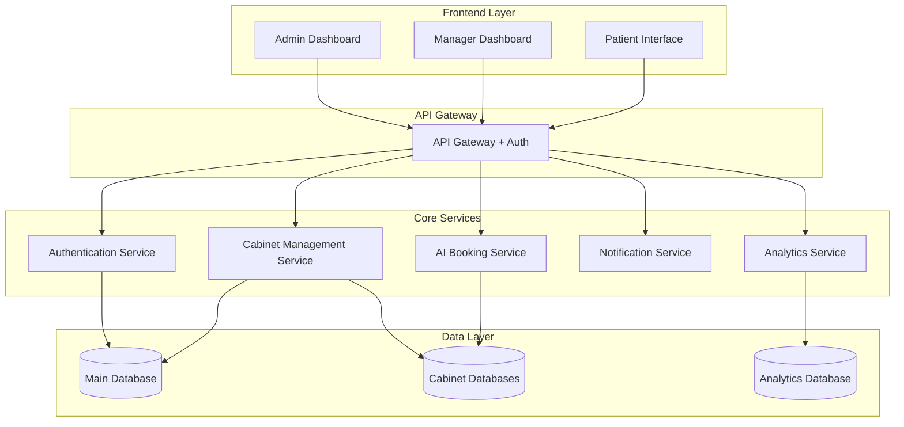
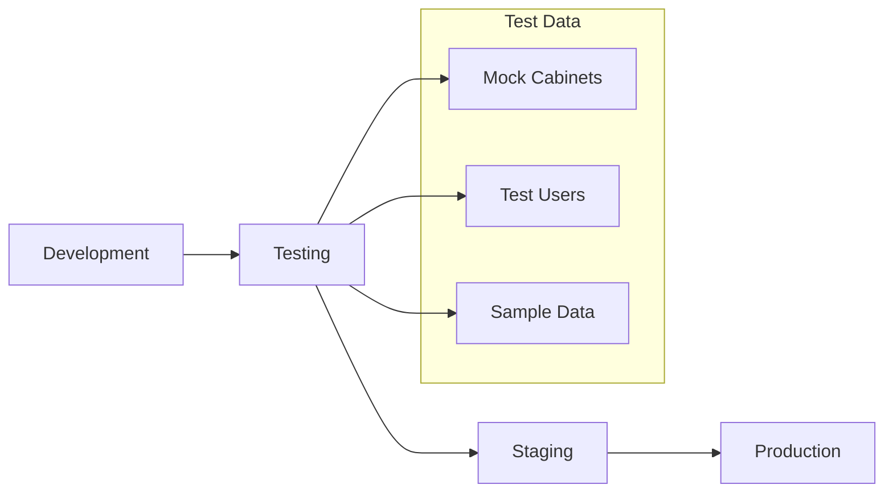

# Design Document - Nova Plateforme Interne

## Overview

Nova sera transformée en une plateforme de gestion interne multi-tenant permettant de gérer un réseau de cabinets dentaires depuis une interface centralisée. L'architecture supportera la scalabilité, la sécurité des données, et l'autonomie opérationnelle de chaque cabinet tout en maintenant une supervision globale.

## Architecture

### Architecture Globale



### Architecture Multi-Tenant

La plateforme utilisera une approche hybride :
- **Database per tenant** pour les données opérationnelles des cabinets (isolation complète)
- **Shared database** pour les métadonnées, configuration globale et analytics consolidées
- **Shared application** avec isolation logique par tenant

## Components and Interfaces

### 1. Admin Dashboard (Super Admin)

**Composants principaux :**
- **Cabinet Overview Grid** : Vue d'ensemble de tous les cabinets avec KPIs
- **Cabinet Detail View** : Analyse approfondie d'un cabinet spécifique
- **Deployment Wizard** : Assistant de déploiement pour nouveaux cabinets
- **User Management Panel** : Gestion des utilisateurs et droits d'accès
- **Global Settings** : Configuration des paramètres globaux
- **Comparative Analytics** : Analyses comparatives entre cabinets

**Interfaces clés :**
```typescript
interface AdminDashboard {
  getCabinetsOverview(): CabinetOverview[]
  getCabinetDetails(cabinetId: string): CabinetDetails
  deployNewCabinet(config: CabinetConfig): DeploymentResult
  manageUsers(action: UserAction): UserResult
  getComparativeAnalytics(period: DateRange): AnalyticsData
}
```

### 2. Manager Dashboard (Cabinet Level)

**Composants principaux :**
- **Cabinet Performance Dashboard** : KPIs spécifiques au cabinet
- **Appointment Management** : Gestion des rendez-vous et planning
- **Patient Management** : Gestion des patients du cabinet
- **Team Management** : Gestion de l'équipe locale
- **Local Settings** : Paramètres spécifiques au cabinet

**Interfaces clés :**
```typescript
interface ManagerDashboard {
  getCabinetPerformance(cabinetId: string): PerformanceData
  getAppointments(cabinetId: string, filters: AppointmentFilters): Appointment[]
  getPatients(cabinetId: string, filters: PatientFilters): Patient[]
  updateLocalSettings(cabinetId: string, settings: LocalSettings): void
}
```

### 3. AI Booking Service

**Composants principaux :**
- **Intent Recognition** : Compréhension des demandes patients
- **Cabinet Router** : Routage intelligent vers le bon cabinet
- **Availability Engine** : Gestion des créneaux disponibles
- **Booking Processor** : Traitement des réservations
- **Multi-Cabinet Fallback** : Proposition d'alternatives dans le réseau

**Interfaces clés :**
```typescript
interface AIBookingService {
  processPatientRequest(request: PatientRequest): BookingResponse
  findAvailableSlots(criteria: BookingCriteria): AvailableSlot[]
  routeToOptimalCabinet(location: Location, serviceType: ServiceType): Cabinet
  bookAppointment(booking: BookingRequest): BookingConfirmation
}
```

### 4. Cabinet Management Service

**Composants principaux :**
- **Cabinet Provisioning** : Création et configuration de nouveaux cabinets
- **Configuration Manager** : Gestion des paramètres globaux et locaux
- **Integration Manager** : Gestion des intégrations avec les systèmes existants
- **Health Monitor** : Surveillance de l'état des cabinets

**Interfaces clés :**
```typescript
interface CabinetManagementService {
  createCabinet(config: CabinetConfig): Cabinet
  updateCabinetConfig(cabinetId: string, config: Partial<CabinetConfig>): void
  getCabinetHealth(cabinetId: string): HealthStatus
  manageIntegrations(cabinetId: string, integrations: Integration[]): void
}
```

## Data Models

### Core Entities

```typescript
interface Cabinet {
  id: string
  name: string
  address: Address
  phone: string
  email: string
  timezone: string
  settings: CabinetSettings
  status: CabinetStatus
  createdAt: Date
  updatedAt: Date
}

interface User {
  id: string
  email: string
  role: UserRole
  permissions: Permission[]
  assignedCabinets: string[]
  profile: UserProfile
  isActive: boolean
}

interface Appointment {
  id: string
  cabinetId: string
  patientId: string
  practitionerId: string
  serviceType: ServiceType
  scheduledAt: Date
  duration: number
  status: AppointmentStatus
  notes?: string
}

interface Patient {
  id: string
  cabinetId: string
  firstName: string
  lastName: string
  email: string
  phone: string
  dateOfBirth: Date
  medicalHistory: MedicalRecord[]
  preferences: PatientPreferences
}
```

### Configuration Models

```typescript
interface CabinetConfig {
  general: GeneralConfig
  booking: BookingConfig
  notifications: NotificationConfig
  integrations: IntegrationConfig
  branding: BrandingConfig
}

interface GlobalSettings {
  defaultBookingRules: BookingRules
  notificationTemplates: NotificationTemplate[]
  securityPolicies: SecurityPolicy[]
  analyticsConfig: AnalyticsConfig
}
```

## Error Handling

### Error Categories

1. **Authentication Errors** : Gestion des erreurs d'authentification et d'autorisation
2. **Cabinet Access Errors** : Erreurs d'accès aux données de cabinet
3. **Booking Errors** : Erreurs lors de la prise de rendez-vous
4. **Integration Errors** : Erreurs d'intégration avec les systèmes externes
5. **System Errors** : Erreurs système et de performance

### Error Handling Strategy

```typescript
interface ErrorHandler {
  handleAuthError(error: AuthError): ErrorResponse
  handleCabinetAccessError(error: AccessError): ErrorResponse
  handleBookingError(error: BookingError): ErrorResponse
  handleIntegrationError(error: IntegrationError): ErrorResponse
  handleSystemError(error: SystemError): ErrorResponse
}
```

### Fallback Mechanisms

- **Circuit Breaker Pattern** pour les services externes
- **Graceful Degradation** en cas de panne partielle
- **Retry Logic** avec backoff exponentiel
- **Fallback Data** pour maintenir l'expérience utilisateur

## Testing Strategy

### Unit Testing
- **Services** : Tests unitaires pour chaque service métier
- **Components** : Tests des composants React avec Jest et Testing Library
- **Utilities** : Tests des fonctions utilitaires et helpers
- **Coverage Target** : 90% minimum

### Integration Testing
- **API Endpoints** : Tests d'intégration des APIs
- **Database Operations** : Tests des opérations CRUD
- **External Integrations** : Tests avec mocks des services externes
- **Multi-tenant Isolation** : Tests d'isolation des données entre cabinets

### End-to-End Testing
- **User Journeys** : Tests des parcours utilisateur complets
- **Cross-Cabinet Scenarios** : Tests des fonctionnalités multi-cabinets
- **Performance Testing** : Tests de charge et de performance
- **Security Testing** : Tests de sécurité et d'autorisation

### Testing Environment Strategy



## Security Considerations

### Authentication & Authorization
- **JWT-based Authentication** avec refresh tokens
- **Role-Based Access Control (RBAC)** avec permissions granulaires
- **Multi-Factor Authentication** pour les comptes administrateurs
- **Session Management** avec timeout automatique

### Data Protection
- **Encryption at Rest** pour toutes les données sensibles
- **Encryption in Transit** avec TLS 1.3
- **Data Anonymization** pour les analytics
- **GDPR Compliance** avec outils de gestion des consentements

### Tenant Isolation
- **Database-level Isolation** pour les données opérationnelles
- **Application-level Filtering** avec validation systématique
- **API Gateway Filtering** pour prévenir les accès croisés
- **Audit Logging** de tous les accès aux données

## Performance Optimization

### Caching Strategy
- **Redis Cache** pour les données fréquemment accédées
- **CDN** pour les assets statiques
- **Database Query Optimization** avec indexation appropriée
- **API Response Caching** avec invalidation intelligente

### Scalability
- **Horizontal Scaling** des services avec load balancing
- **Database Sharding** par cabinet pour les gros volumes
- **Async Processing** pour les tâches longues
- **Event-Driven Architecture** pour le découplage

### Monitoring & Observability
- **Application Performance Monitoring (APM)**
- **Real-time Alerting** sur les métriques critiques
- **Distributed Tracing** pour le debugging
- **Business Metrics Dashboard** pour le suivi opérationnel