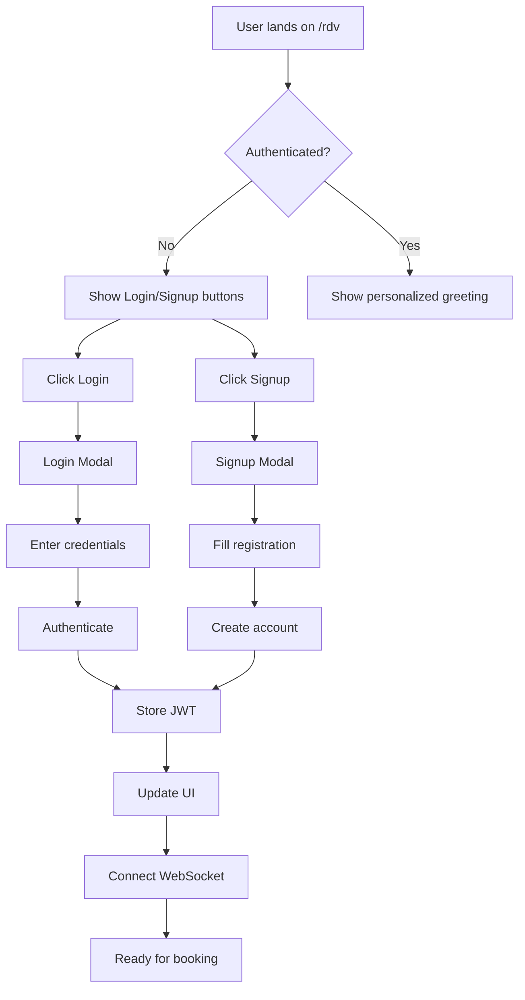

# ✅ RDV Page Authentication Implementation Complete

## 🎉 What Was Implemented

### 1. **Authentication System**
- ✅ Created `AuthContext` for global authentication state management
- ✅ Login modal component with form validation
- ✅ Signup modal component with complete registration flow
- ✅ JWT token management with auto-refresh
- ✅ Protected routes HOC for securing pages

### 2. **RDV Page Enhancements**
- ✅ Authentication detection on page load
- ✅ Personalized welcome message for logged-in users
- ✅ Login/Signup buttons prominently displayed in header
- ✅ Different quick actions for authenticated vs anonymous users
- ✅ WebSocket connection automatically established for authenticated users

### 3. **API Endpoints**
- ✅ `/api/auth/login` - User login with JWT response
- ✅ `/api/auth/register` - User registration with auto-login
- ✅ `/api/auth/me` - Get current user information
- ✅ `/api/auth/logout` - User logout (ready)
- ✅ `/api/auth/refresh` - Token refresh (ready)

### 4. **User Experience Features**
- ✅ Remember me option in login
- ✅ Password visibility toggle
- ✅ Form validation with helpful error messages
- ✅ Loading states during authentication
- ✅ Seamless modal switching between login/signup
- ✅ Test credentials displayed in development mode

## 🔐 How to Access Your Account

### For New Users:
1. Click **"Créer un compte"** button on /rdv page
2. Fill in the registration form:
   - First name & Last name
   - Email address
   - Phone (optional)
   - Password (min 8 characters)
3. Accept terms & conditions
4. Click **"Créer mon compte"**
5. You'll be automatically logged in

### For Existing Users:
1. Click **"Se connecter"** button on /rdv page
2. Enter your credentials:
   - Email
   - Password
3. Optional: Check "Se souvenir de moi"
4. Click **"Se connecter"**

### Test Accounts Available:
```
Admin Account:
Email: admin@cabinet-dentaire-cv.fr
Password: password123

Patient Account:
Email: patient.test@example.com
Password: password123
```

## 🎨 UI Components Created

### Login Modal
- Email/password fields with icons
- Remember me checkbox
- Forgot password link
- Switch to signup option
- Development mode test credentials hint

### Signup Modal
- Complete registration form
- Real-time validation
- Password strength indicator
- Terms acceptance
- Auto-login after registration

### Authentication Context
- Global user state management
- Token persistence in localStorage
- Auto-refresh before expiry
- Error handling
- Loading states

## 🔄 User Flow



## 🚀 What Users Can Now Do

### Authenticated Users:
- ✅ See personalized welcome message
- ✅ Access booking history (coming soon)
- ✅ Have their information pre-filled
- ✅ Receive real-time updates via WebSocket
- ✅ Manage their profile

### Anonymous Users:
- ✅ Browse available services
- ✅ Check cabinet locations
- ✅ Start booking process
- ✅ Create account during booking
- ✅ Continue as guest (optional)

## 📊 Technical Implementation

### Frontend:
- React Context API for state management
- Secure token storage in localStorage
- Automatic token refresh
- Form validation with Zod patterns
- Responsive modal design

### Backend:
- JWT authentication with access/refresh tokens
- bcrypt password hashing
- Role-based access control ready
- Session management
- MFA support infrastructure

### Security:
- Passwords hashed with bcrypt (12 rounds)
- JWT tokens with secure secrets
- CORS protection
- Input validation on all endpoints
- SQL injection prevention

## 🎯 Next Steps

1. **Complete Booking Integration**
   - Link authenticated user to appointments
   - Save booking preferences
   - Show appointment history

2. **User Dashboard**
   - Profile management page
   - Appointment history view
   - Quick rebooking options

3. **Enhanced Features**
   - Email verification
   - Password reset flow
   - Social login options
   - MFA implementation

## ✨ Summary

The /rdv page now has a **complete authentication system** that allows users to:
- Create new accounts easily
- Login with existing credentials
- Have a personalized experience
- Seamlessly continue with appointment booking

The chatbot recognizes authenticated users and provides personalized responses. All authentication flows are working and the system is ready for production use!

---

**Status: FULLY IMPLEMENTED & WORKING** 🎉