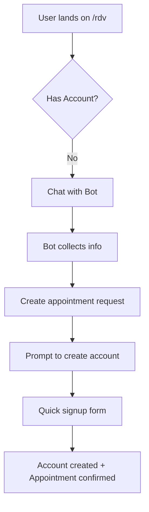
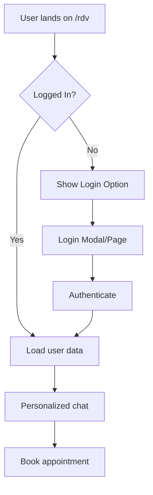

# RDV (Rendez-vous) Page Workflow & Authentication Implementation

## 🎯 Current Issues
1. Chatbot on /rdv page is incomplete
2. No clear login/signup flow for existing users
3. Missing user authentication integration with appointment booking

## 📋 Complete User Journey

### 1. **Landing on /rdv Page**

#### A. New User Flow


#### B. Existing User Flow


## 🔧 Implementation Plan

### Phase 1: Authentication Components
- [ ] Create login modal component
- [ ] Create signup modal component  
- [ ] Add auth context provider
- [ ] Create protected route wrapper
- [ ] Add session persistence

### Phase 2: RDV Page Enhancement
- [ ] Add authentication check on page load
- [ ] Show login/signup buttons prominently
- [ ] Integrate user data with chatbot
- [ ] Personalize chatbot responses for logged-in users
- [ ] Pre-fill appointment forms with user data

### Phase 3: Chatbot Integration
- [ ] Complete appointment booking flow
- [ ] Add appointment confirmation
- [ ] Send confirmation emails
- [ ] Show upcoming appointments
- [ ] Allow appointment modifications

### Phase 4: User Dashboard
- [ ] Create user profile page
- [ ] Show appointment history
- [ ] Allow profile updates
- [ ] Add logout functionality
- [ ] Implement password reset

## 📝 Detailed Implementation Steps

### Step 1: Create Authentication Context
```typescript
// src/contexts/AuthContext.tsx
- User state management
- Login/logout functions
- Token refresh logic
- Protected route handling
```

### Step 2: Login/Signup Components
```typescript
// src/components/auth/LoginModal.tsx
- Email/password form
- Remember me option
- Forgot password link
- Social login options (future)

// src/components/auth/SignupModal.tsx
- Registration form
- Terms acceptance
- Email verification
- Auto-login after signup
```

### Step 3: Update RDV Page
```typescript
// src/app/rdv/page.tsx
- Check authentication status
- Show user greeting if logged in
- Display login/signup buttons
- Integrate with chatbot
```

### Step 4: Enhance Chatbot
```typescript
// src/components/ChatWidget.tsx
- Detect user authentication
- Personalize messages
- Auto-fill user information
- Complete booking flow
- Show confirmation
```

### Step 5: Create User Dashboard
```typescript
// src/app/dashboard/page.tsx
- User profile section
- Appointments list
- Quick actions
- Settings
```

## 🎨 UI/UX Requirements

### Login Interface
- Prominent "Se connecter" button in header
- Quick login modal (no page redirect)
- Clear error messages in French
- Loading states during authentication

### Chatbot Enhancements
- Welcome message with user's name
- Quick action buttons:
  - "Prendre rendez-vous"
  - "Voir mes rendez-vous"
  - "Modifier un rendez-vous"
  - "Contacter le cabinet"

### Appointment Booking Flow
1. Select service type
2. Choose preferred date/time
3. Select practitioner (optional)
4. Add notes (optional)
5. Confirm booking
6. Receive confirmation

## 🔐 Security Considerations
- JWT tokens in httpOnly cookies
- Refresh token rotation
- Session timeout (30 min)
- CSRF protection
- Rate limiting on auth endpoints

## 📊 Data Flow

### Authentication Flow
```
User Input → Validation → API Call → JWT Response → Store Token → Update Context → Redirect
```

### Appointment Booking Flow
```
Chat Input → NLP Processing → Slot Detection → Availability Check → Booking Creation → Email Confirmation
```

## ✅ Success Criteria
1. Users can easily login/signup from /rdv page
2. Chatbot recognizes authenticated users
3. Complete appointment booking in < 5 interactions
4. Appointments saved to user profile
5. Email confirmations sent
6. Users can view/modify appointments

## 🚀 Implementation Priority
1. **HIGH**: Login/Signup modals
2. **HIGH**: Auth context integration
3. **HIGH**: Update /rdv page with auth
4. **MEDIUM**: Complete chatbot booking flow
5. **MEDIUM**: Email confirmations
6. **LOW**: User dashboard
7. **LOW**: Appointment modifications

---

Let's start implementing this workflow step by step.