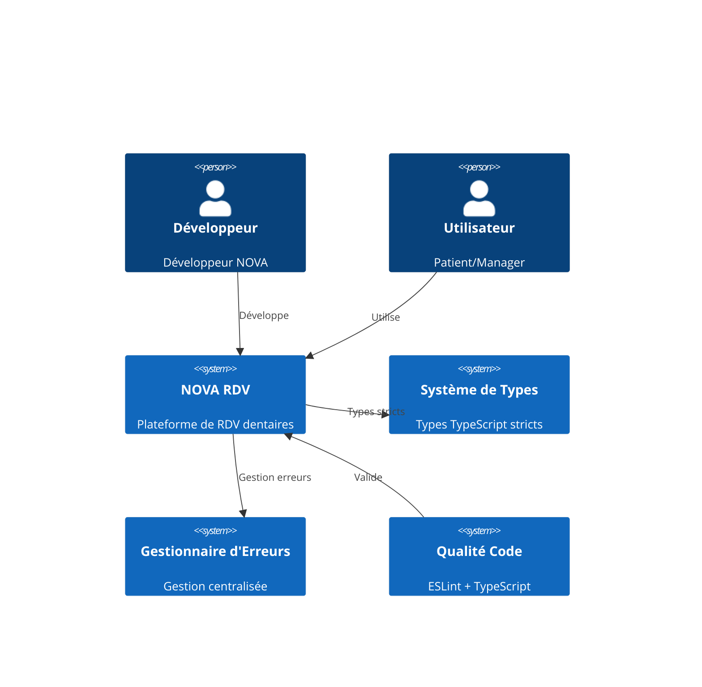
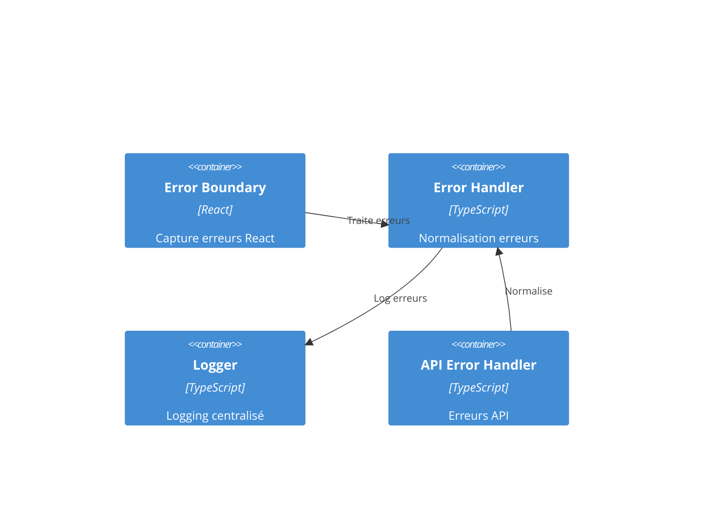
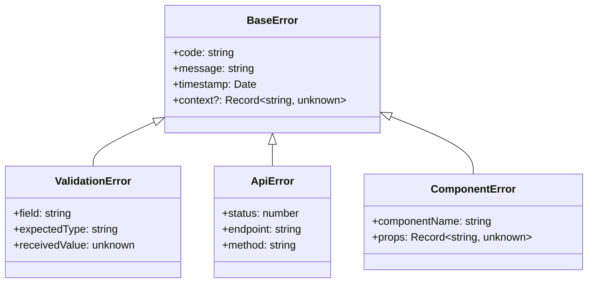

# NOVA RDV - Architecture de Correction des Erreurs TypeScript et ESLint

## Résumé Exécutif

Cette architecture définit une approche systématique pour résoudre les problèmes de build et ESLint dans NOVA RDV. L'objectif est d'éliminer tous les types `any` et `unknown` non typés, d'implémenter une gestion d'erreur centralisée, et d'établir des patterns de qualité de code durables.

## Vue d'ensemble du Système

### Contexte Actuel

Le projet NOVA RDV présente plusieurs défis de qualité de code :
- **65+ occurrences** de types `any` dans le codebase
- **25+ occurrences** de types `unknown` mal gérés
- Gestion d'erreur inconsistante entre composants
- Violations ESLint dans les hooks React et formulaires
- Manque de types stricts pour les APIs externes

### Architecture Cible



## Architecture des Composants

### 1. Système de Types Centralisé

```typescript
// src/types/core.ts
export interface ApiResponse<T = unknown> {
  success: boolean;
  data?: T;
  error?: ErrorDetails;
  metadata?: ResponseMetadata;
}

export interface ErrorDetails {
  code: string;
  message: string;
  field?: string;
  context?: Record<string, unknown>;
}

export interface ResponseMetadata {
  timestamp: string;
  requestId: string;
  version: string;
}
```

### 2. Gestionnaire d'Erreurs Global



### 3. Patterns de Validation

```typescript
// Pattern de validation strict
export const validateAppointmentData = (data: unknown): AppointmentData => {
  const schema = z.object({
    patientId: z.string().uuid(),
    practitionerId: z.string().uuid(),
    startTime: z.string().datetime(),
    duration: z.number().min(15).max(180),
    type: z.enum(['consultation', 'soin', 'urgence'])
  });
  
  return schema.parse(data);
};
```

## Stack Technologique

### Outils de Qualité de Code

| Composant | Version | Configuration |
|-----------|---------|---------------|
| TypeScript | 5.x | Strict mode, no implicit any |
| ESLint | 9.x | Next.js + TypeScript rules |
| Zod | 3.x | Runtime validation |
| Vitest | 3.x | Testing avec types |

### Configuration TypeScript

```json
{
  "compilerOptions": {
    "strict": true,
    "noImplicitAny": true,
    "noImplicitReturns": true,
    "noImplicitThis": true,
    "noUncheckedIndexedAccess": true,
    "exactOptionalPropertyTypes": true
  }
}
```

## Conception des Erreurs

### Hiérarchie d'Erreurs



### Gestionnaire Global

```typescript
export class ErrorManager {
  private static instance: ErrorManager;
  
  public static getInstance(): ErrorManager {
    if (!ErrorManager.instance) {
      ErrorManager.instance = new ErrorManager();
    }
    return ErrorManager.instance;
  }
  
  public handleError(error: unknown, context?: ErrorContext): NormalizedError {
    return this.normalizeError(error, context);
  }
  
  private normalizeError(error: unknown, context?: ErrorContext): NormalizedError {
    // Logique de normalisation
  }
}
```

## Architecture des Données

### Modèles de Base

```typescript
// src/types/entities.ts
export interface Patient {
  id: string;
  email: string;
  firstName: string;
  lastName: string;
  phone: string;
  createdAt: Date;
  updatedAt: Date;
}

export interface Appointment {
  id: string;
  patientId: string;
  practitionerId: string;
  cabinetId: string;
  startTime: Date;
  endTime: Date;
  status: AppointmentStatus;
  type: AppointmentType;
  notes?: string;
}

export type AppointmentStatus = 'scheduled' | 'confirmed' | 'cancelled' | 'completed';
export type AppointmentType = 'consultation' | 'soin' | 'urgence' | 'controle';
```

### Validation Runtime

```typescript
// src/lib/validation/schemas.ts
export const PatientSchema = z.object({
  id: z.string().uuid(),
  email: z.string().email(),
  firstName: z.string().min(2).max(50),
  lastName: z.string().min(2).max(50),
  phone: z.string().regex(/^\+213[567]\d{8}$/),
  createdAt: z.date(),
  updatedAt: z.date()
});

export type Patient = z.infer<typeof PatientSchema>;
```

## Sécurité et Performance

### Validation d'Entrée

- Validation Zod sur toutes les API
- Sanitisation des données utilisateur
- Validation des types à l'exécution

### Gestion Mémoire

- Types stricts pour éviter les fuites
- Cleanup automatique des listeners
- Gestion des états async avec AbortController

## Monitoring et Observabilité

### Métriques de Qualité

```typescript
interface QualityMetrics {
  typeErrors: number;
  eslintWarnings: number;
  testCoverage: number;
  buildTime: number;
}
```

### Alertes

- Build failures
- Type errors en développement
- Performance dégradée
- Couverture de tests insuffisante

## Déploiement

### Stratégie de Déploiement

1. **Phase 1**: Migration types `any` vers types stricts
2. **Phase 2**: Implémentation gestionnaire d'erreurs
3. **Phase 3**: Correction violations ESLint
4. **Phase 4**: Tests et validation

### Environnements

- **Development**: Types stricts, erreurs bloquantes
- **Staging**: Validation complète, monitoring
- **Production**: Gestion gracieuse des erreurs

## Décisions Architecturales (ADRs)

### ADR-001: Remplacement des Types Any

**Statut**: Accepté
**Contexte**: 65+ occurrences de `any` dans le codebase
**Décision**: Migration vers types stricts avec Zod
**Conséquences**: 
- Code plus robuste
- Meilleure expérience développeur
- Détection précoce des erreurs

### ADR-002: Gestionnaire d'Erreurs Centralisé

**Statut**: Accepté
**Contexte**: Gestion d'erreur inconsistante
**Décision**: Implémentation d'un gestionnaire global
**Conséquences**:
- Normalisation des erreurs
- Logging centralisé
- UX cohérente

### ADR-003: Configuration ESLint Stricte

**Statut**: Accepté
**Contexte**: Violations ESLint répétées
**Décision**: Configuration stricte avec règles personnalisées
**Conséquences**:
- Qualité de code améliorée
- Standards de développement
- Réduction des bugs

## Outils et Automatisation

### Scripts de Migration

```bash
# Détection des types any
npm run type-check:any

# Correction automatique ESLint
npm run lint:fix

# Validation complète
npm run validate:all
```

### Hooks Git

- Pre-commit: ESLint + TypeScript check
- Pre-push: Tests + build
- CI/CD: Validation complète

## Maintenance et Évolution

### Principes

- **Type Safety First**: Toujours privilégier les types stricts
- **Error Transparency**: Erreurs claires et actionnables
- **Code Quality**: Standards élevés maintenus
- **Performance**: Optimisation continue

### Métriques de Succès

- 0 occurrence de `any` non justifié
- 0 violation ESLint bloquante
- 95%+ couverture de tests
- Build time < 30 secondes

Cette architecture fournit une base solide pour résoudre les problèmes de qualité de code de NOVA RDV tout en établissant des patterns durables pour le développement futur.