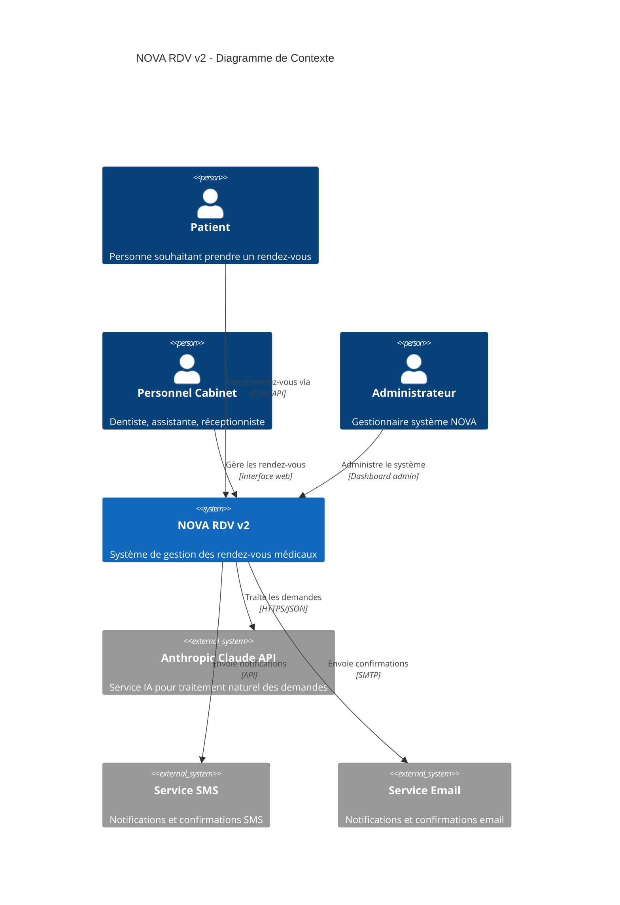
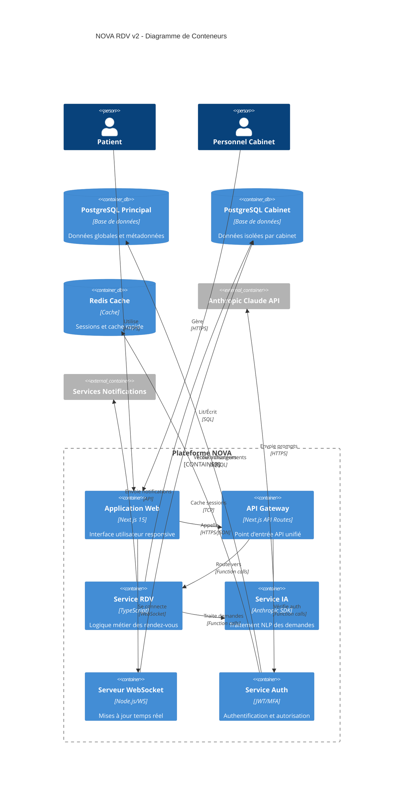
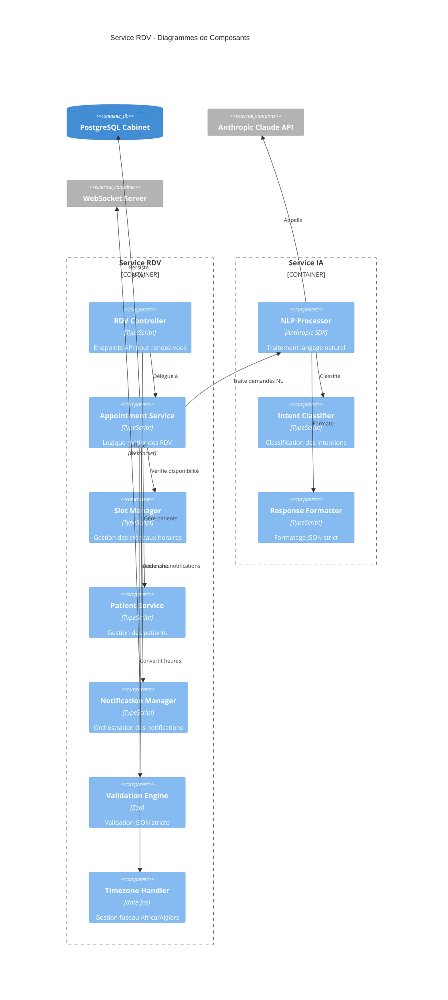
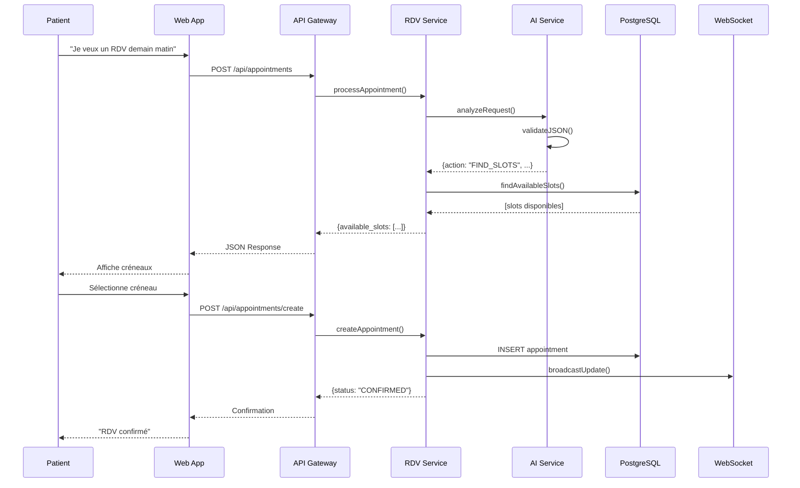
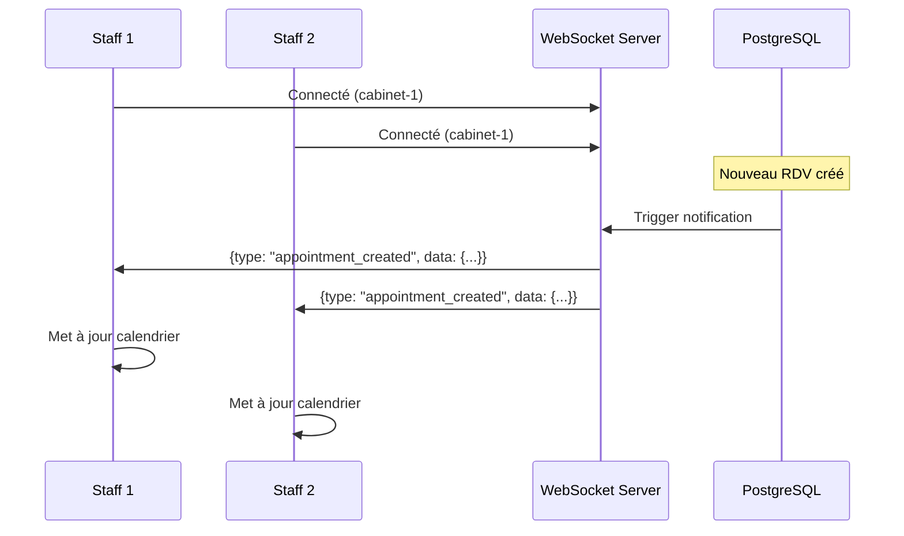

# NOVA RDV v2 - Architecture Système

## Vue d'ensemble

NOVA RDV v2 est un système de prise de rendez-vous médical conçu pour le cabinet dentaire situé à "Cité 109, Daboussy El Achour, Alger". Le système utilise le fuseau horaire "Africa/Algiers" (UTC+01, sans DST) et impose une validation JSON stricte à tous les niveaux.

## Contraintes Système

### Contraintes Fixes
- **Adresse clinique** : "Cité 109, Daboussy El Achour, Alger" (immutable)
- **Fuseau horaire** : "Africa/Algiers" (UTC+01, sans changement DST)
- **Format téléphone** : E.164 algérien (+213 uniquement)
- **Langue** : Français exclusivement pour les interactions utilisateur
- **Sortie** : JSON uniquement via Anthropic tool_choice avec schéma strict

### Types de Soins Supportés
- consultation
- urgence
- detartrage
- soin
- extraction
- prothese
- orthodontie
- chirurgie

### Actions RDV Disponibles
- FIND_SLOTS : Recherche de créneaux disponibles
- CREATE : Création de nouveau rendez-vous
- RESCHEDULE : Reprogrammation d'un rendez-vous existant
- CANCEL : Annulation de rendez-vous
- CONFIRMATION : Confirmation de rendez-vous
- NEED_INFO : Demande d'informations complémentaires

## Diagrammes C4

### 1. Diagramme de Contexte (C1)



### 2. Diagramme de Conteneurs (C2)



### 3. Diagramme de Composants - Service RDV (C3)



## Architecture Technique

### Isolation Multi-tenant

Le système utilise une architecture multi-tenant avec isolation stricte :

- **Base principale** (`nova_main`) : métadonnées globales, utilisateurs, cabinets
- **Bases cabinet** (`nova_cabinet_{id}`) : données isolées par cabinet
- **Contrôle d'accès** : RBAC avec validation par cabinet

### Gestion du Temps

- **Fuseau fixe** : Africa/Algiers (UTC+01)
- **Pas de DST** : Pas de changement d'heure saisonnier
- **Validation** : Tous les timestamps en ISO 8601
- **Conversion** : Automatique via `date-fns` avec timezone fixe

### Validation JSON Stricte

```typescript
// Schéma Zod pour validation RDV
const AppointmentRequestSchema = z.object({
  action: z.enum(["FIND_SLOTS", "CREATE", "RESCHEDULE", "CANCEL", "CONFIRMATION", "NEED_INFO"]),
  clinic_address: z.literal("Cité 109, Daboussy El Achour, Alger"),
  timezone: z.literal("Africa/Algiers"),
  patient: z.object({
    name: z.string().min(1).max(120),
    phone_e164: z.string().regex(/^\+213[567]\d{8}$/),
    email: z.string().email().optional(),
    patient_id: z.string().optional()
  }).optional(),
  slot: z.object({
    start_iso: z.string().datetime(),
    end_iso: z.string().datetime(),
    duration_minutes: z.number().min(15).max(180)
  }).optional(),
  care_type: z.enum(["consultation", "urgence", "detartrage", "soin", "extraction", "prothese", "orthodontie", "chirurgie"]).optional(),
  // ... autres champs
});
```

### Intégration Anthropic Claude

Le système utilise Claude 3.7 Sonnet avec `tool_choice` forcé pour garantir des réponses JSON uniquement :

```typescript
const response = await anthropic.messages.create({
  model: "claude-3-7-sonnet-20250219",
  system: APPOINTMENT_SYSTEM_PROMPT,
  tool_choice: { type: "tool", name: "rdv_json" },
  thinking: { type: "disabled" }, // Pas de raisonnement affiché
  messages: [{ role: "user", content: userPrompt }]
});
```

### WebSocket Temps Réel

- **Port** : 8080 (configuré)
- **Événements** : création, modification, annulation RDV
- **Authentification** : JWT token dans query params
- **Isolement** : Messages filtrés par cabinet

### Sécurité et RGPD

#### Chiffrement des Données
- **En transit** : TLS 1.3 pour toutes les communications
- **Au repos** : Chiffrement AES-256 pour données sensibles
- **Clés** : Rotation automatique via Azure Key Vault

#### Contrôle d'Accès
- **RBAC** : Rôles super_admin, admin, manager, staff
- **MFA** : TOTP obligatoire pour admins
- **Sessions** : JWT avec refresh tokens, expiration courte

#### Conformité RGPD
- **Consentement** : Collecte explicite et traçable
- **Portabilité** : Export JSON des données patient
- **Droit à l'oubli** : Pseudonymisation après suppression
- **Audit** : Logs détaillés de tous les accès

## Flux de Données

### 1. Prise de Rendez-vous



### 2. Mise à jour Temps Réel



## Patterns Architecturaux

### 1. CQRS (Command Query Responsibility Segregation)

- **Commands** : Créer, modifier, supprimer RDV
- **Queries** : Recherche créneaux, liste RDV, statistiques
- **Séparation** : Optimisation distincte lecture/écriture

### 2. Event Sourcing (partiel)

- **Événements** : appointment_created, appointment_updated, appointment_cancelled
- **Projections** : Vues matérialisées pour requêtes rapides
- **Audit** : Traçabilité complète des modifications

### 3. Circuit Breaker

```typescript
class AnthropicCircuitBreaker {
  private failures = 0;
  private lastFailure?: Date;
  private state: 'CLOSED' | 'OPEN' | 'HALF_OPEN' = 'CLOSED';

  async call<T>(fn: () => Promise<T>): Promise<T> {
    if (this.state === 'OPEN') {
      if (this.shouldAttemptReset()) {
        this.state = 'HALF_OPEN';
      } else {
        throw new Error('Circuit breaker is OPEN');
      }
    }

    try {
      const result = await fn();
      this.onSuccess();
      return result;
    } catch (error) {
      this.onFailure();
      throw error;
    }
  }
}
```

### 4. Repository Pattern

```typescript
interface AppointmentRepository {
  findById(id: string): Promise<Appointment | null>;
  findByFilters(filters: AppointmentFilters): Promise<Appointment[]>;
  save(appointment: Appointment): Promise<void>;
  delete(id: string): Promise<void>;
}

class PostgreSQLAppointmentRepository implements AppointmentRepository {
  constructor(private db: Database, private cabinetId: string) {}
  
  async findById(id: string): Promise<Appointment | null> {
    const query = `
      SELECT * FROM appointments 
      WHERE id = $1 AND cabinet_id = $2
    `;
    const result = await this.db.query(query, [id, this.cabinetId]);
    return result.rows[0] ? this.mapToAppointment(result.rows[0]) : null;
  }
}
```

## Monitoring et Observabilité

### Métriques Clés
- **Performance** : Temps de réponse API < 200ms (p95)
- **Disponibilité** : SLA 99.9% (8.76h downtime/an max)
- **IA** : Taux de compréhension > 95%, JSON valide > 99.9%
- **Concurrence** : Support 1000 utilisateurs simultanés

### Logs Structurés
```json
{
  "timestamp": "2025-08-15T10:30:00.000Z",
  "level": "INFO",
  "service": "rdv-service",
  "cabinet_id": "cabinet-123",
  "user_id": "user-456",
  "action": "appointment_created",
  "appointment_id": "apt-789",
  "patient_phone": "+213555123456",
  "duration_ms": 145,
  "timezone": "Africa/Algiers"
}
```

### Alertes
- **Erreurs IA** : > 5% taux d'erreur sur 5min
- **Base de données** : Connexions > 80% du pool
- **WebSocket** : > 100 déconnexions/min
- **Validation** : > 1% de JSON invalides

## Scalabilité

### Horizontal
- **API** : Load balancer avec sticky sessions
- **WebSocket** : Cluster avec Redis Pub/Sub
- **Base de données** : Read replicas pour requêtes
- **Cache** : Redis Cluster pour haute disponibilité

### Vertical
- **CPU** : Optimisations V8, worker threads pour IA
- **Mémoire** : Connection pooling, cache LRU
- **Réseau** : Compression gzip, CDN pour assets

### Limites Architecturales
- **Cabinets** : 1000 cabinets max par instance
- **Concurrence** : 50 RDV simultanés par cabinet
- **Données** : 100GB max par base cabinet
- **Rétention** : 7 ans données médicales (conformité)

## Plan de Déploiement

### Environnements
1. **Développement** : Local avec Docker Compose
2. **Test** : Azure Container Instances
3. **Staging** : Azure App Service (slot staging)
4. **Production** : Azure App Service avec Auto-scaling

### CI/CD Pipeline
```yaml
# .github/workflows/deploy.yml
- test: Vitest + Playwright E2E
- security: SAST avec CodeQL
- build: Docker multi-stage
- deploy: Blue-green avec health checks
- rollback: Automatique si health check échoue
```

### Migration de Données
```sql
-- Script migration v1 -> v2
ALTER TABLE appointments ADD COLUMN care_type VARCHAR(50);
UPDATE appointments SET care_type = 'consultation' WHERE care_type IS NULL;
ALTER TABLE appointments ALTER COLUMN care_type SET NOT NULL;

-- Index pour performances
CREATE INDEX CONCURRENTLY idx_appointments_care_type_scheduled 
ON appointments(care_type, scheduled_at) 
WHERE status IN ('scheduled', 'confirmed');
```

Cette architecture garantit un système robuste, sécurisé et conforme aux exigences métier du cabinet dentaire tout en respectant les contraintes techniques strictes imposées.