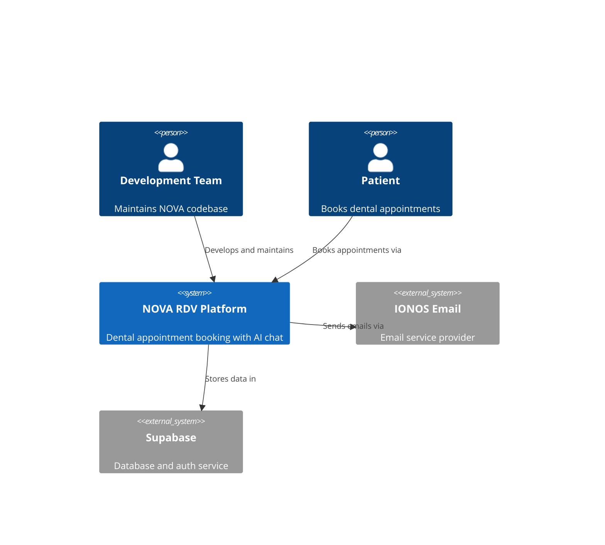
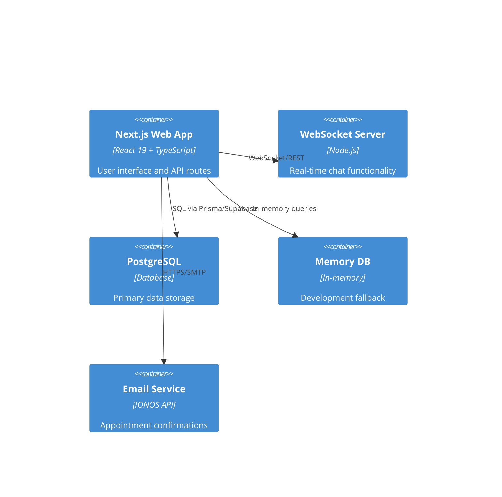
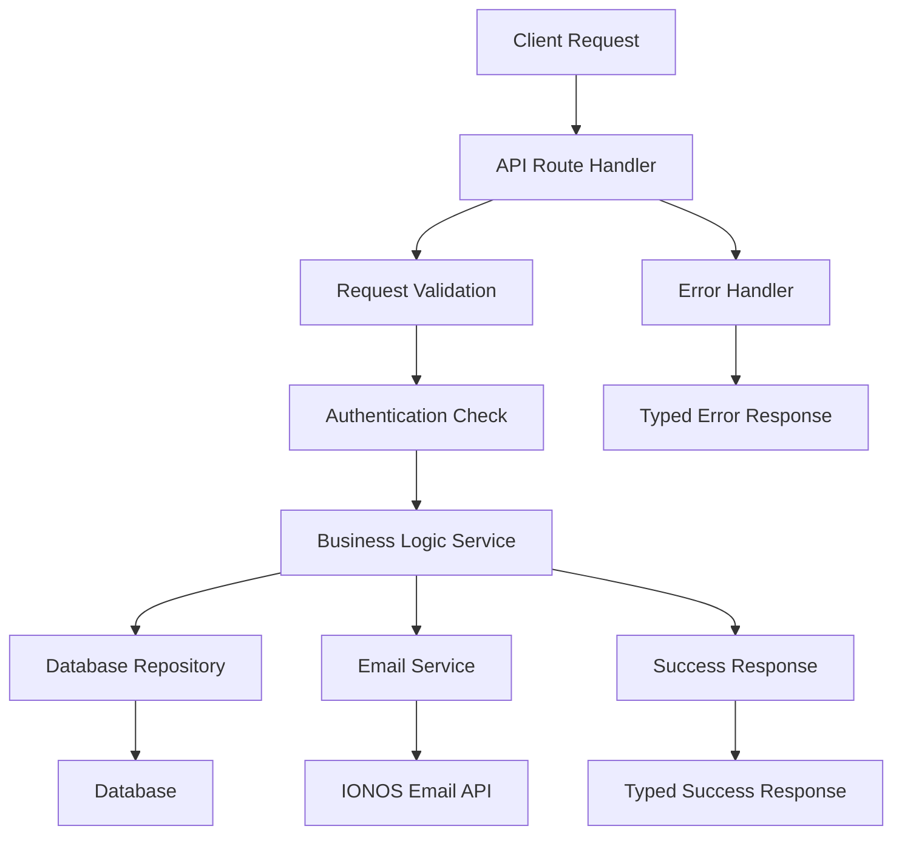

# NOVA RDV - System Architecture for Build & ESLint Issues Resolution

## Executive Summary

This document defines the technical architecture for resolving critical build failures and systematic ESLint warnings in the NOVA RDV dental appointment booking platform. The architecture emphasizes type safety, error handling patterns, and maintainable code standards while preserving backward compatibility.

## Architecture Overview

### System Context


### Container Diagram


## Problem Architecture Analysis

### Critical Issues Identified

#### 1. Type Safety Violations
- **Unknown Error Types**: TypeScript 4.4+ requires explicit type narrowing for catch blocks
- **Explicit Any Usage**: 30+ files using `any` instead of proper types
- **Missing Type Guards**: Unsafe property access on unknown types

#### 2. Code Quality Patterns
- **Unused Variables**: 50+ files with unused parameters and variables
- **Import Inconsistency**: Mix of `require()` and `import` statements
- **React Compliance**: Missing hook dependencies causing potential runtime issues

#### 3. Build System Issues
- **Compilation Failure**: Single blocking error preventing all builds
- **Development Experience**: 1000+ warnings obscuring real issues
- **CI/CD Impact**: Unreliable build pipeline blocking deployments

## Technology Stack Analysis

### Current Stack
- **Frontend**: Next.js 15.3.5 (App Router), React 19, TypeScript 5.x
- **Backend**: Next.js API Routes, Node.js 18+
- **Database**: PostgreSQL (primary), In-memory (fallback)
- **Authentication**: JWT with Supabase integration (partial)
- **Email**: IONOS service (partial implementation)
- **WebSocket**: Standalone server on port 8080
- **Testing**: Vitest, Playwright, Testing Library

### Architecture Constraints
- **Strict TypeScript**: Must maintain `strict: true` mode
- **ESLint Compliance**: Zero warnings requirement
- **Backward Compatibility**: API contracts must be preserved
- **French Language**: Primary language support maintained
- **Healthcare Compliance**: RGPD/GDPR requirements

## Core Architecture Components

### 1. Error Handling Layer

#### Error Type System
```typescript
// Core error types
export interface AppError {
  code: string
  message: string
  details?: Record<string, unknown>
  statusCode?: number
}

export interface ErrorResponse {
  success: false
  message: string
  error: string
  details?: Record<string, unknown>
}

export interface SuccessResponse<T = unknown> {
  success: true
  message: string
  data: T
}

export type ApiResponse<T = unknown> = SuccessResponse<T> | ErrorResponse
```

#### Safe Error Processing Utilities
```typescript
// Type-safe error message extraction
export function getErrorMessage(error: unknown): string {
  if (error instanceof Error) {
    return error.message
  }
  if (typeof error === 'string') {
    return error
  }
  if (error && typeof error === 'object' && 'message' in error) {
    const message = (error as { message: unknown }).message
    if (typeof message === 'string') {
      return message
    }
  }
  return 'Unknown error occurred'
}

// Type narrowing for database errors
export function isDatabaseError(error: unknown): error is { message: string; code?: string } {
  return error !== null &&
         typeof error === 'object' &&
         'message' in error &&
         typeof (error as { message: unknown }).message === 'string'
}
```

### 2. Type System Architecture

#### Domain Types Structure
```
src/types/
├── api/                 # API request/response types
│   ├── appointment.ts   # Appointment API types
│   ├── auth.ts         # Authentication types
│   └── common.ts       # Shared API types
├── domain/             # Business domain types
│   ├── appointment.ts  # Appointment business logic
│   ├── patient.ts      # Patient information
│   └── cabinet.ts      # Cabinet/clinic types
├── infrastructure/     # Infrastructure types
│   ├── database.ts     # Database connection types
│   ├── email.ts        # Email service types
│   └── websocket.ts    # WebSocket types
└── utils/              # Utility types
    ├── result.ts       # Result<T, E> type
    ├── pagination.ts   # Pagination types
    └── validation.ts   # Validation types
```

#### Result Type Pattern
```typescript
// Safe operation results
export type Result<T, E = AppError> = 
  | { success: true; data: T }
  | { success: false; error: E }

// Usage in services
export async function createAppointment(data: CreateAppointmentRequest): Promise<Result<Appointment>> {
  try {
    // Business logic here
    return { success: true, data: appointment }
  } catch (error) {
    return { 
      success: false, 
      error: {
        code: 'APPOINTMENT_CREATION_FAILED',
        message: getErrorMessage(error)
      }
    }
  }
}
```

### 3. API Route Handler Architecture

#### Standard Pattern Implementation
```typescript
// Standard API route structure
export async function POST(request: Request): Promise<NextResponse<ApiResponse<AppointmentData>>> {
  try {
    // 1. Authentication & authorization
    const user = await authenticateRequest(request)
    if (!user.success) {
      return NextResponse.json(
        { success: false, message: 'Unauthorized', error: 'AUTH_REQUIRED' },
        { status: 401 }
      )
    }

    // 2. Request validation
    const validationResult = await validateRequest(request)
    if (!validationResult.success) {
      return NextResponse.json(
        { 
          success: false, 
          message: 'Invalid request', 
          error: 'VALIDATION_ERROR',
          details: validationResult.errors
        },
        { status: 400 }
      )
    }

    // 3. Business logic
    const result = await appointmentService.create(validationResult.data)
    if (!result.success) {
      return NextResponse.json(
        {
          success: false,
          message: result.error.message,
          error: result.error.code
        },
        { status: result.error.statusCode || 500 }
      )
    }

    // 4. Success response
    return NextResponse.json({
      success: true,
      message: 'Appointment created successfully',
      data: result.data
    })

  } catch (error) {
    // 5. Global error handling
    console.error('API Error:', error)
    return NextResponse.json(
      {
        success: false,
        message: 'Internal server error',
        error: 'INTERNAL_ERROR'
      },
      { status: 500 }
    )
  }
}
```

### 4. Code Quality Architecture

#### ESLint Compliance Patterns

##### Unused Variables Convention
```typescript
// Prefix unused parameters with underscore
export function handleEvent(_event: Event, data: EventData) {
  return processData(data)
}

// Remove truly unused variables
// BEFORE: const unused = getValue()
// AFTER: getValue() // if side effect needed, or remove entirely
```

##### Hook Dependencies Pattern
```typescript
// Correct hook dependencies
const { appointments, loading } = useAppointments({
  cabinetId,
  dateRange,
  status
})

useEffect(() => {
  if (!loading && appointments.length > 0) {
    updateAnalytics(appointments)
  }
}, [appointments, loading]) // Complete dependency list
```

##### JSX Entity Escaping
```typescript
// French content with proper escaping
export const Messages = {
  welcome: "Bienvenue sur NOVA RDV",
  appointment: "Votre rendez-vous est confirmé",
  error: "Une erreur s&apos;est produite"
}
```

### 5. Migration Architecture

#### Phase-Based Migration Strategy

##### Phase 1: Critical Error Resolution
- **Target**: Fix blocking TypeScript error
- **Pattern**: Implement safe error handling utility
- **Files**: `src/app/api/appointments/create/route.ts`
- **Timeline**: Day 1

##### Phase 2: Type Safety Migration
- **Target**: Replace all `any` types with proper types
- **Pattern**: Create domain-specific types and use type narrowing
- **Files**: 30+ files with explicit `any` usage
- **Timeline**: Days 2-3

##### Phase 3: Code Quality Compliance
- **Target**: Resolve all ESLint warnings
- **Pattern**: Apply systematic fixes with automated validation
- **Files**: 100+ files with various ESLint violations
- **Timeline**: Days 4-5

##### Phase 4: Validation & Documentation
- **Target**: Comprehensive testing and knowledge transfer
- **Pattern**: Quality gates and best practices documentation
- **Timeline**: Day 6

## Component Design

### Error Handling Utilities (`src/lib/utils/error-handling.ts`)
**Purpose**: Centralized type-safe error processing for the entire application
**Technology**: TypeScript with strict type guards
**Interfaces**: 
- Input: `unknown` error objects from catch blocks and API responses
- Output: Typed error objects with safe message extraction
**Dependencies**: None (pure utility functions)

### Type System (`src/types/`)
**Purpose**: Comprehensive type definitions replacing all `any` usage
**Technology**: TypeScript interfaces and utility types
**Interfaces**: 
- Input: Business domain requirements and API contracts
- Output: Strongly typed interfaces for all application entities
**Dependencies**: Zod for runtime validation

### API Response Handlers (`src/lib/api/`)
**Purpose**: Standardized API response patterns with type safety
**Technology**: Next.js API routes with TypeScript
**Interfaces**: 
- Input: HTTP requests with type validation
- Output: Standardized JSON responses with proper error handling
**Dependencies**: Next.js, Zod validation

### Validation Layer (`src/lib/validation/`)
**Purpose**: Input validation with proper error reporting
**Technology**: Zod schema validation
**Interfaces**: 
- Input: Raw request data and user inputs
- Output: Validated, typed data or detailed error reports
**Dependencies**: Zod, libphonenumber-js for phone validation

## Data Architecture

### Data Flow


### Error Response Schema
```typescript
// Standardized error response structure
interface ErrorResponse {
  success: false
  message: string        // User-friendly message (French for patients)
  error: string         // Error code for client handling
  details?: {           // Optional detailed validation errors
    field?: string
    code?: string
    expected?: string
  }
  timestamp?: string    // ISO timestamp for debugging
  requestId?: string    // Unique request identifier for support
}
```

## Security Architecture

### Error Information Disclosure Prevention
- **Patient Data Protection**: Error messages never contain patient information
- **Database Error Sanitization**: Raw database errors converted to safe public messages
- **Logging Strategy**: Detailed errors logged server-side, sanitized errors returned to client

### Type Safety Security
- **Input Validation**: All inputs validated against Zod schemas before processing
- **SQL Injection Prevention**: Parameterized queries via ORM/repository pattern
- **XSS Protection**: Proper JSX entity escaping for French content

## Performance Considerations

### Build Performance
- **Incremental Type Checking**: TypeScript strict mode optimized for development
- **ESLint Caching**: Proper ESLint configuration for fast incremental linting
- **Bundle Impact**: Type definitions have zero runtime impact

### Runtime Performance
- **Error Handling Overhead**: Minimal impact from type narrowing and safe error processing
- **Memory Usage**: Type guards and validation have negligible memory footprint
- **API Response Time**: Proper error handling improves rather than degrades response times

## Monitoring & Observability

### Error Tracking
- **Structured Logging**: Consistent error logging with proper context
- **Error Classification**: Categorized errors for better monitoring
- **Performance Metrics**: Build time and lint performance tracking

### Quality Metrics
- **Type Coverage**: Track TypeScript strict mode compliance
- **ESLint Compliance**: Zero warnings policy with monitoring
- **Test Coverage**: Maintain existing coverage during migration

## Deployment Architecture

### Build Pipeline Integration
```yaml
# CI/CD Quality Gates
stages:
  - name: "Type Check"
    command: "npm run type-check"
    failure_mode: "fail_fast"
  
  - name: "Lint Check"
    command: "npm run lint"
    failure_mode: "fail_fast"
  
  - name: "Test Suite"
    command: "npm test"
    failure_mode: "fail_fast"
  
  - name: "Build Application"
    command: "npm run build"
    failure_mode: "fail_fast"
```

### Environment Configuration
- **Development**: Strict TypeScript and ESLint enforcement
- **Staging**: Production-equivalent quality gates
- **Production**: Zero-tolerance for type errors and lint warnings

## Architectural Decisions (ADRs)

### ADR-001: Use Unknown Type with Type Guards Instead of Any
**Status**: Accepted
**Context**: TypeScript 4.4+ catch blocks return unknown, existing code uses any
**Decision**: Implement type guards and safe error extraction utilities
**Consequences**: Improved type safety, requires more verbose error handling code
**Alternatives Considered**: Disabling strict mode (rejected), using type assertions (rejected)

### ADR-002: Centralized Error Handling Utilities
**Status**: Accepted
**Context**: Error handling patterns are inconsistent across the codebase
**Decision**: Create reusable error handling utilities in `src/lib/utils/error-handling.ts`
**Consequences**: Consistent error patterns, requires refactoring existing code
**Alternatives Considered**: Local error handling (rejected), third-party library (overkill)

### ADR-003: Preserve Existing API Contracts
**Status**: Accepted
**Context**: External integrations may depend on current API response formats
**Decision**: Maintain backward compatibility while improving internal type safety
**Consequences**: Some type mapping required, no breaking changes for clients
**Alternatives Considered**: Breaking API changes (too risky), separate versioned APIs (complex)

### ADR-004: Zero ESLint Warnings Policy
**Status**: Accepted
**Context**: 1000+ warnings obscure real issues and degrade code quality
**Decision**: Fix all warnings through code changes, minimal configuration changes
**Consequences**: Significant upfront effort, long-term maintenance benefits
**Alternatives Considered**: Disabling rules (degrades quality), graduated approach (allows drift)

---

**Document Version**: 1.0  
**Last Updated**: 2025-08-15  
**Review Status**: Ready for technical review  
**Implementation Dependencies**: Requirements analysis complete, development team approval required