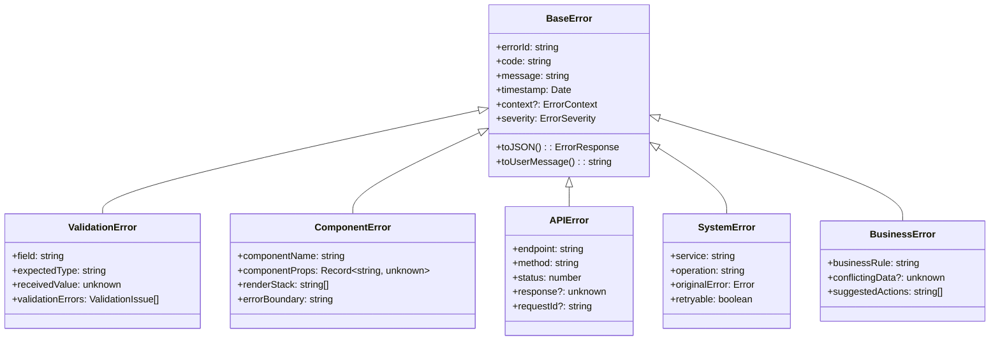

# Gestion d'Erreurs Centralisée - NOVA RDV

## Vue d'ensemble

Ce document définit l'architecture de gestion d'erreurs centralisée pour NOVA RDV, conçue pour remplacer la gestion d'erreur inconsistante actuelle par un système robuste, type-safe et user-friendly.

## Problèmes Actuels

### 1. Gestion Inconsistante

- **Types unknown mal gérés**: 25+ occurrences sans validation appropriée
- **Error boundaries manquants**: Composants React crashent sans récupération gracieuse
- **Messages d'erreur non localisés**: Expérience utilisateur incohérente
- **Logging fragmenté**: Difficile de tracer et debugger les erreurs

### 2. Impact sur l'Expérience Utilisateur

- **Crashes non gérés**: Application qui plante avec écrans blancs
- **Messages techniques**: Erreurs exposées directement à l'utilisateur
- **Pas de fallback**: Aucune récupération possible après erreur
- **Perte de contexte**: Utilisateur perd son travail en cours

## Architecture de Solution

### 1. Hiérarchie d'Erreurs



### 2. Gestionnaire Global

```typescript
// src/lib/errors/error-manager.ts

export interface ErrorContext {
  userId?: string;
  sessionId?: string;
  cabinetId?: string;
  component?: string;
  route?: string;
  userAgent?: string;
  timestamp: string;
  buildVersion: string;
  environment: 'development' | 'staging' | 'production';
}

export type ErrorSeverity = 'low' | 'medium' | 'high' | 'critical';

export interface ErrorResponse {
  error: true;
  errorId: string;
  code: string;
  message: string;
  severity: ErrorSeverity;
  timestamp: string;
  retryable?: boolean;
  actions?: ErrorAction[];
  context?: Record<string, unknown>;
}

export interface ErrorAction {
  type: 'retry' | 'refresh' | 'redirect' | 'contact_support';
  label: string;
  action: string;
  primary?: boolean;
}

export class ErrorManager {
  private static instance: ErrorManager;
  private errorQueue: QueuedError[] = [];
  private rateLimiter = new Map<string, number>();
  private subscribers: ErrorSubscriber[] = [];

  public static getInstance(): ErrorManager {
    if (!ErrorManager.instance) {
      ErrorManager.instance = new ErrorManager();
    }
    return ErrorManager.instance;
  }

  public captureError(
    error: unknown,
    context?: Partial<ErrorContext>
  ): NormalizedError {
    const normalizedError = this.normalizeError(error, context);
    
    // Rate limiting pour éviter le spam
    if (this.isRateLimited(normalizedError.code)) {
      return normalizedError;
    }
    
    // Queue pour traitement async
    this.queueError(normalizedError);
    
    // Notification immédiate aux subscribers
    this.notifySubscribers(normalizedError);
    
    return normalizedError;
  }

  private normalizeError(
    error: unknown,
    context?: Partial<ErrorContext>
  ): NormalizedError {
    const fullContext: ErrorContext = {
      timestamp: new Date().toISOString(),
      buildVersion: process.env.NEXT_PUBLIC_BUILD_VERSION || 'unknown',
      environment: (process.env.NODE_ENV as any) || 'development',
      ...context
    };

    // Error déjà normalisée
    if (error instanceof BaseError) {
      return new NormalizedError(error, fullContext);
    }

    // TypeError - souvent lié aux types any/unknown
    if (error instanceof TypeError) {
      return this.handleTypeError(error, fullContext);
    }

    // Erreur de validation Zod
    if (this.isZodError(error)) {
      return this.handleZodError(error, fullContext);
    }

    // Erreur API/Fetch
    if (this.isFetchError(error)) {
      return this.handleFetchError(error, fullContext);
    }

    // Erreur React
    if (this.isReactError(error)) {
      return this.handleReactError(error, fullContext);
    }

    // Erreur générique
    return this.handleGenericError(error, fullContext);
  }

  private handleTypeError(error: TypeError, context: ErrorContext): NormalizedError {
    // Analyser le message pour identifier le problème
    const message = error.message.toLowerCase();
    
    if (message.includes('cannot read property') || message.includes('cannot read properties')) {
      return new NormalizedError(
        new ValidationError('PROPERTY_ACCESS_ERROR', {
          message: 'Tentative d\'accès à une propriété undefined',
          severity: 'medium',
          field: this.extractPropertyName(error.message),
          context
        })
      );
    }
    
    if (message.includes('is not a function')) {
      return new NormalizedError(
        new ComponentError('FUNCTION_CALL_ERROR', {
          message: 'Appel de fonction sur un type incorrect',
          severity: 'high',
          context
        })
      );
    }

    return new NormalizedError(
      new SystemError('TYPE_ERROR', {
        message: 'Erreur de type TypeScript',
        severity: 'medium',
        originalError: error,
        context
      })
    );
  }

  private handleZodError(error: any, context: ErrorContext): NormalizedError {
    const validationErrors = error.errors.map((issue: any) => ({
      field: issue.path.join('.'),
      code: issue.code,
      message: issue.message,
      expectedType: this.getExpectedType(issue),
      receivedValue: issue.received
    }));

    return new NormalizedError(
      new ValidationError('VALIDATION_ERROR', {
        message: 'Données invalides',
        severity: 'low',
        validationErrors,
        context
      })
    );
  }

  private handleFetchError(error: any, context: ErrorContext): NormalizedError {
    return new NormalizedError(
      new APIError('API_ERROR', {
        message: 'Erreur de communication API',
        severity: 'medium',
        endpoint: error.url || 'unknown',
        method: error.method || 'unknown',
        status: error.status || 0,
        context
      })
    );
  }

  private handleReactError(error: any, context: ErrorContext): NormalizedError {
    return new NormalizedError(
      new ComponentError('COMPONENT_ERROR', {
        message: 'Erreur de rendu React',
        severity: 'high',
        componentName: context.component || 'unknown',
        context
      })
    );
  }

  private handleGenericError(error: unknown, context: ErrorContext): NormalizedError {
    return new NormalizedError(
      new SystemError('UNKNOWN_ERROR', {
        message: 'Erreur système inconnue',
        severity: 'medium',
        originalError: error instanceof Error ? error : new Error(String(error)),
        context
      })
    );
  }

  // Rate limiting
  private isRateLimited(errorCode: string): boolean {
    const now = Date.now();
    const lastOccurrence = this.rateLimiter.get(errorCode) || 0;
    const timeDiff = now - lastOccurrence;
    
    // Limite: max 1 erreur du même type par 5 secondes
    if (timeDiff < 5000) {
      return true;
    }
    
    this.rateLimiter.set(errorCode, now);
    return false;
  }

  // Notification aux subscribers
  public subscribe(subscriber: ErrorSubscriber): void {
    this.subscribers.push(subscriber);
  }

  public unsubscribe(subscriber: ErrorSubscriber): void {
    const index = this.subscribers.indexOf(subscriber);
    if (index > -1) {
      this.subscribers.splice(index, 1);
    }
  }

  private notifySubscribers(error: NormalizedError): void {
    this.subscribers.forEach(subscriber => {
      try {
        subscriber.onError(error);
      } catch (e) {
        console.error('Error in error subscriber:', e);
      }
    });
  }

  // Queue processing
  private queueError(error: NormalizedError): void {
    this.errorQueue.push({
      error,
      timestamp: Date.now(),
      retryCount: 0
    });

    // Process queue asynchronously
    setTimeout(() => this.processQueue(), 0);
  }

  private async processQueue(): Promise<void> {
    while (this.errorQueue.length > 0) {
      const queuedError = this.errorQueue.shift();
      if (!queuedError) continue;

      try {
        await this.sendErrorToServer(queuedError.error);
        await this.updateMetrics(queuedError.error);
      } catch (e) {
        // Retry logic
        if (queuedError.retryCount < 3) {
          queuedError.retryCount++;
          this.errorQueue.push(queuedError);
        }
      }
    }
  }

  private async sendErrorToServer(error: NormalizedError): Promise<void> {
    // En production seulement
    if (error.context.environment !== 'production') {
      console.error('Error captured:', error.toJSON());
      return;
    }

    await fetch('/api/errors/report', {
      method: 'POST',
      headers: { 'Content-Type': 'application/json' },
      body: JSON.stringify(error.toJSON())
    });
  }

  private async updateMetrics(error: NormalizedError): Promise<void> {
    // Mise à jour des métriques de qualité
    const metrics = {
      errorCode: error.code,
      severity: error.severity,
      component: error.context.component,
      timestamp: error.context.timestamp
    };

    // Envoyer aux métriques
    if (typeof window !== 'undefined' && window.gtag) {
      window.gtag('event', 'error_captured', metrics);
    }
  }
}

export interface ErrorSubscriber {
  onError(error: NormalizedError): void;
}

interface QueuedError {
  error: NormalizedError;
  timestamp: number;
  retryCount: number;
}

export class NormalizedError {
  public readonly errorId: string;
  public readonly code: string;
  public readonly message: string;
  public readonly severity: ErrorSeverity;
  public readonly timestamp: string;
  public readonly context: ErrorContext;
  public readonly retryable: boolean;
  public readonly actions: ErrorAction[];

  constructor(baseError: BaseError, context?: ErrorContext) {
    this.errorId = baseError.errorId;
    this.code = baseError.code;
    this.message = baseError.message;
    this.severity = baseError.severity;
    this.timestamp = baseError.timestamp.toISOString();
    this.context = context || baseError.context;
    this.retryable = baseError.retryable || false;
    this.actions = this.generateActions();
  }

  private generateActions(): ErrorAction[] {
    const actions: ErrorAction[] = [];

    // Actions basées sur le type d'erreur
    switch (this.severity) {
      case 'low':
        actions.push({
          type: 'retry',
          label: 'Réessayer',
          action: 'retry',
          primary: true
        });
        break;
      
      case 'medium':
        actions.push(
          {
            type: 'retry',
            label: 'Réessayer',
            action: 'retry'
          },
          {
            type: 'refresh',
            label: 'Actualiser la page',
            action: 'refresh',
            primary: true
          }
        );
        break;
      
      case 'high':
      case 'critical':
        actions.push(
          {
            type: 'refresh',
            label: 'Actualiser la page',
            action: 'refresh'
          },
          {
            type: 'contact_support',
            label: 'Contacter le support',
            action: 'contact',
            primary: true
          }
        );
        break;
    }

    return actions;
  }

  public toJSON(): ErrorResponse {
    return {
      error: true,
      errorId: this.errorId,
      code: this.code,
      message: this.getUserMessage(),
      severity: this.severity,
      timestamp: this.timestamp,
      retryable: this.retryable,
      actions: this.actions,
      context: this.getPublicContext()
    };
  }

  public getUserMessage(): string {
    // Messages localisés basés sur le code d'erreur
    const userMessages: Record<string, string> = {
      'VALIDATION_ERROR': 'Les informations saisies ne sont pas valides. Veuillez vérifier vos données.',
      'PROPERTY_ACCESS_ERROR': 'Une erreur technique s\'est produite. Veuillez réessayer.',
      'FUNCTION_CALL_ERROR': 'Une erreur technique s\'est produite. Veuillez actualiser la page.',
      'COMPONENT_ERROR': 'Une erreur d\'affichage s\'est produite. Veuillez actualiser la page.',
      'API_ERROR': 'Problème de connexion au serveur. Vérifiez votre connexion Internet.',
      'TYPE_ERROR': 'Une erreur technique s\'est produite. Nos équipes ont été notifiées.',
      'UNKNOWN_ERROR': 'Une erreur inattendue s\'est produite. Veuillez réessayer.'
    };

    return userMessages[this.code] || 'Une erreur s\'est produite. Veuillez réessayer.';
  }

  private getPublicContext(): Record<string, unknown> {
    // Filtrer les informations sensibles
    const { userId, sessionId, ...publicContext } = this.context;
    return {
      ...publicContext,
      hasUserId: !!userId,
      hasSessionId: !!sessionId
    };
  }
}
```

## Error Boundaries React

### 1. Error Boundary Global

```typescript
// src/components/error-boundary/GlobalErrorBoundary.tsx

import React, { Component, ReactNode } from 'react';
import { ErrorManager } from '@/lib/errors/error-manager';
import { ErrorFallback } from './ErrorFallback';

interface Props {
  children: ReactNode;
  fallback?: ComponentType<ErrorFallbackProps>;
  onError?: (error: Error, errorInfo: ErrorInfo) => void;
}

interface State {
  hasError: boolean;
  error?: NormalizedError;
}

export class GlobalErrorBoundary extends Component<Props, State> {
  private errorManager = ErrorManager.getInstance();

  constructor(props: Props) {
    super(props);
    this.state = { hasError: false };
  }

  static getDerivedStateFromError(error: Error): State {
    return {
      hasError: true
    };
  }

  componentDidCatch(error: Error, errorInfo: ErrorInfo) {
    // Capturer l'erreur avec le gestionnaire global
    const normalizedError = this.errorManager.captureError(error, {
      component: 'ErrorBoundary',
      route: window?.location?.pathname,
      componentStack: errorInfo.componentStack
    });

    this.setState({ error: normalizedError });

    // Callback optionnel
    this.props.onError?.(error, errorInfo);
  }

  private handleRetry = () => {
    this.setState({ hasError: false, error: undefined });
  };

  private handleRefresh = () => {
    window.location.reload();
  };

  private handleContactSupport = () => {
    window.open('mailto:support@nova-rdv.dz?subject=Erreur Application&body=' + 
                encodeURIComponent(`ID Erreur: ${this.state.error?.errorId}`));
  };

  render() {
    if (this.state.hasError && this.state.error) {
      const FallbackComponent = this.props.fallback || ErrorFallback;
      
      return (
        <FallbackComponent
          error={this.state.error}
          onRetry={this.handleRetry}
          onRefresh={this.handleRefresh}
          onContactSupport={this.handleContactSupport}
        />
      );
    }

    return this.props.children;
  }
}

// Types pour le fallback
export interface ErrorFallbackProps {
  error: NormalizedError;
  onRetry: () => void;
  onRefresh: () => void;
  onContactSupport: () => void;
}
```

### 2. Error Fallback UI

```typescript
// src/components/error-boundary/ErrorFallback.tsx

import React from 'react';
import { AlertTriangle, RefreshCw, Mail, RotateCcw } from 'lucide-react';
import { ErrorFallbackProps } from './GlobalErrorBoundary';

export const ErrorFallback: React.FC<ErrorFallbackProps> = ({
  error,
  onRetry,
  onRefresh,
  onContactSupport
}) => {
  const getSeverityColor = (severity: string) => {
    switch (severity) {
      case 'low': return 'text-yellow-600 bg-yellow-50 border-yellow-200';
      case 'medium': return 'text-orange-600 bg-orange-50 border-orange-200';
      case 'high': return 'text-red-600 bg-red-50 border-red-200';
      case 'critical': return 'text-red-800 bg-red-100 border-red-300';
      default: return 'text-gray-600 bg-gray-50 border-gray-200';
    }
  };

  const getSeverityIcon = (severity: string) => {
    return <AlertTriangle className="w-6 h-6" />;
  };

  return (
    <div className="min-h-screen flex items-center justify-center bg-gray-50 py-12 px-4 sm:px-6 lg:px-8">
      <div className="max-w-md w-full space-y-8">
        <div className="text-center">
          <div className={`mx-auto flex items-center justify-center h-12 w-12 rounded-full ${getSeverityColor(error.severity)}`}>
            {getSeverityIcon(error.severity)}
          </div>
          <h2 className="mt-6 text-2xl font-bold text-gray-900">
            Oups ! Une erreur s'est produite
          </h2>
          <p className="mt-2 text-sm text-gray-600">
            {error.getUserMessage()}
          </p>
        </div>

        <div className="bg-white shadow rounded-lg p-6">
          <div className="space-y-4">
            {/* ID d'erreur pour le support */}
            <div className="text-xs text-gray-500 font-mono">
              ID: {error.errorId}
            </div>

            {/* Actions disponibles */}
            <div className="space-y-3">
              {error.actions.map((action, index) => {
                const handleClick = () => {
                  switch (action.type) {
                    case 'retry': onRetry(); break;
                    case 'refresh': onRefresh(); break;
                    case 'contact_support': onContactSupport(); break;
                  }
                };

                const getActionIcon = (type: string) => {
                  switch (type) {
                    case 'retry': return <RotateCcw className="w-4 h-4" />;
                    case 'refresh': return <RefreshCw className="w-4 h-4" />;
                    case 'contact_support': return <Mail className="w-4 h-4" />;
                    default: return null;
                  }
                };

                return (
                  <button
                    key={index}
                    onClick={handleClick}
                    className={`w-full flex items-center justify-center px-4 py-2 border rounded-md text-sm font-medium transition-colors ${
                      action.primary
                        ? 'border-transparent text-white bg-blue-600 hover:bg-blue-700'
                        : 'border-gray-300 text-gray-700 bg-white hover:bg-gray-50'
                    }`}
                  >
                    {getActionIcon(action.type)}
                    <span className="ml-2">{action.label}</span>
                  </button>
                );
              })}
            </div>

            {/* Détails techniques en développement */}
            {process.env.NODE_ENV === 'development' && (
              <details className="mt-4">
                <summary className="text-sm text-gray-500 cursor-pointer">
                  Détails techniques
                </summary>
                <pre className="mt-2 text-xs text-gray-600 bg-gray-100 p-2 rounded overflow-auto">
                  {JSON.stringify(error.toJSON(), null, 2)}
                </pre>
              </details>
            )}
          </div>
        </div>

        {/* Navigation alternative */}
        <div className="text-center">
          <a
            href="/"
            className="text-blue-600 hover:text-blue-500 text-sm font-medium"
          >
            Retour à l'accueil
          </a>
        </div>
      </div>
    </div>
  );
};
```

## Hooks pour la Gestion d'Erreurs

### 1. Hook useErrorHandler

```typescript
// src/hooks/useErrorHandler.ts

import { useCallback, useContext } from 'react';
import { ErrorManager } from '@/lib/errors/error-manager';
import { useRouter } from 'next/navigation';
import { AuthContext } from '@/contexts/AuthContext';

export interface UseErrorHandlerOptions {
  component?: string;
  fallbackRoute?: string;
  silent?: boolean;
}

export const useErrorHandler = (options: UseErrorHandlerOptions = {}) => {
  const router = useRouter();
  const auth = useContext(AuthContext);
  const errorManager = ErrorManager.getInstance();

  const handleError = useCallback((
    error: unknown,
    context?: Record<string, unknown>
  ) => {
    const normalizedError = errorManager.captureError(error, {
      component: options.component,
      route: window?.location?.pathname,
      userId: auth?.user?.id,
      cabinetId: auth?.user?.cabinetId,
      ...context
    });

    // En mode silent, ne pas afficher d'UI d'erreur
    if (options.silent) {
      return normalizedError;
    }

    // Redirection pour certains types d'erreur
    if (normalizedError.code === 'UNAUTHORIZED' && options.fallbackRoute) {
      router.push(options.fallbackRoute);
    }

    return normalizedError;
  }, [errorManager, options, router, auth]);

  const handleAsyncError = useCallback(async <T>(
    asyncOperation: () => Promise<T>,
    context?: Record<string, unknown>
  ): Promise<T | null> => {
    try {
      return await asyncOperation();
    } catch (error) {
      handleError(error, context);
      return null;
    }
  }, [handleError]);

  return {
    handleError,
    handleAsyncError
  };
};
```

### 2. Hook useValidation

```typescript
// src/hooks/useValidation.ts

import { useCallback } from 'react';
import { z } from 'zod';
import { useErrorHandler } from './useErrorHandler';

export const useValidation = () => {
  const { handleError } = useErrorHandler({ silent: true });

  const validate = useCallback(<T>(
    schema: z.ZodSchema<T>,
    data: unknown,
    context?: Record<string, unknown>
  ): T | null => {
    try {
      return schema.parse(data);
    } catch (error) {
      handleError(error, {
        validationSchema: schema.constructor.name,
        ...context
      });
      return null;
    }
  }, [handleError]);

  const safeValidate = useCallback(<T>(
    schema: z.ZodSchema<T>,
    data: unknown
  ): { success: true; data: T } | { success: false; error: z.ZodError } => {
    const result = schema.safeParse(data);
    return result;
  }, []);

  return {
    validate,
    safeValidate
  };
};
```

## Intégration API Routes

### 1. Middleware d'Erreur

```typescript
// src/middleware/error-handler.ts

import { NextRequest, NextResponse } from 'next/server';
import { ErrorManager } from '@/lib/errors/error-manager';
import { Problems } from '@/lib/http/problem';

export function withErrorHandler(
  handler: (req: NextRequest) => Promise<NextResponse>
) {
  return async (req: NextRequest): Promise<NextResponse> => {
    try {
      return await handler(req);
    } catch (error) {
      const errorManager = ErrorManager.getInstance();
      
      const normalizedError = errorManager.captureError(error, {
        route: req.nextUrl.pathname,
        method: req.method,
        userAgent: req.headers.get('user-agent') || 'unknown'
      });

      // Conversion en Problem Details (RFC 7807)
      if (normalizedError.code === 'VALIDATION_ERROR') {
        return Problems.validationError([]).toResponse();
      }

      if (normalizedError.code === 'API_ERROR') {
        return Problems.serviceUnavailable().toResponse();
      }

      return Problems.internalServerError(
        normalizedError.getUserMessage()
      ).toResponse();
    }
  };
}
```

### 2. Exemple d'Usage dans API Route

```typescript
// src/app/api/patients/route.ts

import { NextRequest } from 'next/server';
import { withErrorHandler } from '@/middleware/error-handler';
import { CreatePatientSchema } from '@/types/validation/schemas';
import { useValidation } from '@/hooks/useValidation';

async function handlePOST(req: NextRequest) {
  const { validate } = useValidation();
  
  const body = await req.json();
  
  // Validation avec gestion d'erreur automatique
  const patientData = validate(CreatePatientSchema, body, {
    endpoint: '/api/patients',
    method: 'POST'
  });

  if (!patientData) {
    // L'erreur a déjà été capturée par useValidation
    throw new Error('Invalid patient data');
  }

  // Traitement normal...
  const patient = await createPatient(patientData);
  
  return NextResponse.json({
    success: true,
    data: patient
  });
}

export const POST = withErrorHandler(handlePOST);
```

## Monitoring et Métriques

### 1. Dashboard d'Erreurs

```typescript
// src/components/admin/ErrorDashboard.tsx

import React from 'react';
import { useQualityMetrics } from '@/hooks/useQualityMetrics';

export const ErrorDashboard: React.FC = () => {
  const { metrics, loading } = useQualityMetrics('day');

  if (loading) {
    return <div>Chargement des métriques...</div>;
  }

  return (
    <div className="grid grid-cols-1 md:grid-cols-2 lg:grid-cols-4 gap-6">
      {/* Erreurs TypeScript */}
      <div className="bg-white p-6 rounded-lg shadow">
        <h3 className="text-lg font-medium text-gray-900">Erreurs TypeScript</h3>
        <p className="text-3xl font-bold text-red-600 mt-2">
          {metrics?.typeErrors.count || 0}
        </p>
        <p className="text-sm text-gray-500 mt-1">
          Tendance: {metrics?.typeErrors.trend || 'stable'}
        </p>
      </div>

      {/* Erreurs de validation */}
      <div className="bg-white p-6 rounded-lg shadow">
        <h3 className="text-lg font-medium text-gray-900">Validation</h3>
        <p className="text-3xl font-bold text-yellow-600 mt-2">
          {metrics?.validationErrors?.count || 0}
        </p>
      </div>

      {/* Erreurs composants */}
      <div className="bg-white p-6 rounded-lg shadow">
        <h3 className="text-lg font-medium text-gray-900">Composants React</h3>
        <p className="text-3xl font-bold text-orange-600 mt-2">
          {metrics?.componentErrors?.count || 0}
        </p>
      </div>

      {/* Erreurs critiques */}
      <div className="bg-white p-6 rounded-lg shadow">
        <h3 className="text-lg font-medium text-gray-900">Critiques</h3>
        <p className="text-3xl font-bold text-red-800 mt-2">
          {metrics?.criticalErrors?.count || 0}
        </p>
      </div>
    </div>
  );
};
```

## Tests

### 1. Tests du Gestionnaire d'Erreurs

```typescript
// src/lib/errors/__tests__/error-manager.test.ts

import { describe, it, expect, beforeEach } from 'vitest';
import { ErrorManager } from '../error-manager';

describe('ErrorManager', () => {
  let errorManager: ErrorManager;

  beforeEach(() => {
    errorManager = ErrorManager.getInstance();
  });

  it('should normalize TypeError correctly', () => {
    const error = new TypeError("Cannot read property 'foo' of undefined");
    
    const normalized = errorManager.captureError(error, {
      component: 'TestComponent'
    });

    expect(normalized.code).toBe('PROPERTY_ACCESS_ERROR');
    expect(normalized.severity).toBe('medium');
    expect(normalized.context.component).toBe('TestComponent');
  });

  it('should handle Zod validation errors', () => {
    const zodError = {
      errors: [{
        path: ['email'],
        code: 'invalid_string',
        message: 'Invalid email format'
      }]
    };

    const normalized = errorManager.captureError(zodError);

    expect(normalized.code).toBe('VALIDATION_ERROR');
    expect(normalized.severity).toBe('low');
  });

  it('should rate limit duplicate errors', () => {
    const error = new Error('Test error');
    
    const first = errorManager.captureError(error);
    const second = errorManager.captureError(error);

    // Le second appel devrait être rate-limité
    expect(first.errorId).not.toBe(second.errorId);
  });
});
```

Cette architecture de gestion d'erreurs fournit une base robuste pour éliminer les crashes non gérés, améliorer l'expérience utilisateur et faciliter le debugging et la maintenance de NOVA RDV.