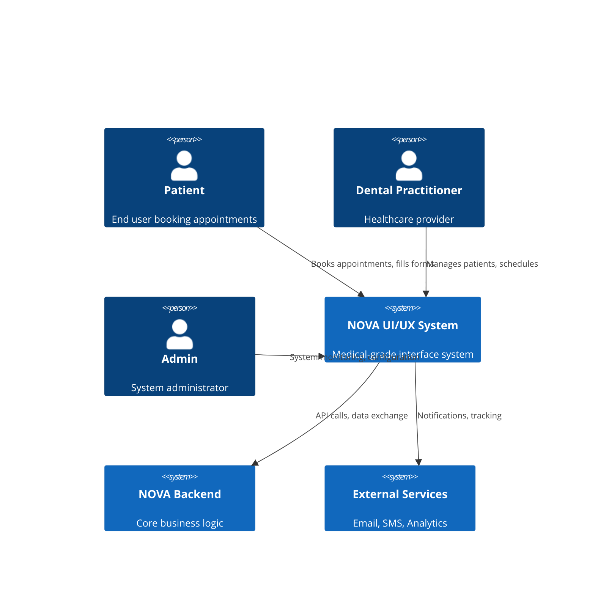
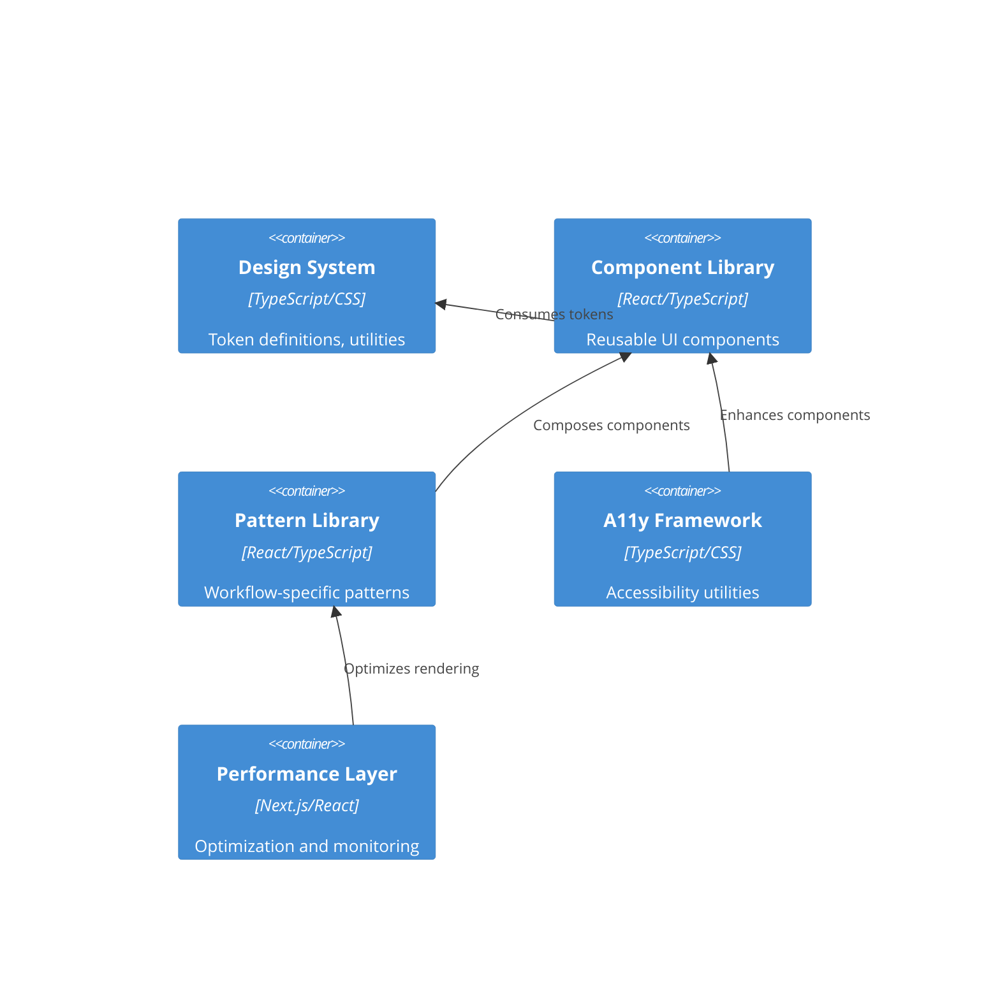
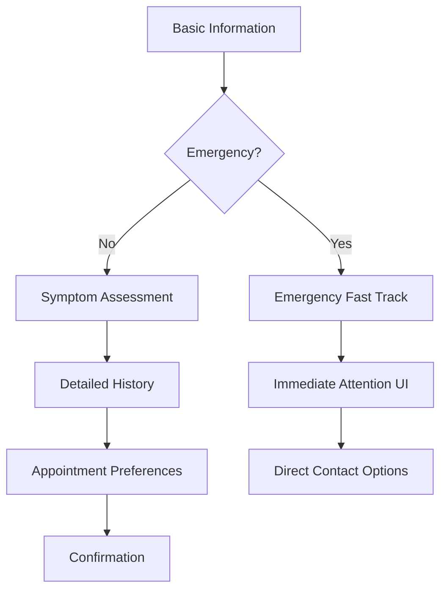

# NOVA Medical UI/UX System Architecture

## Executive Summary

The NOVA Medical UI/UX System is a comprehensive design architecture built specifically for healthcare applications, with emphasis on accessibility, trust, and clinical workflows. This system ensures WCAG 2.2 AA compliance, medical-grade security, and optimal performance for both patient-facing and clinical interfaces.

## Architecture Overview

### System Context



### Container Diagram



## Design Philosophy

### Medical-First Principles

1. **Trust Through Clarity**: Every interface element communicates professionalism and reliability
2. **Safety Through Validation**: All interactions include appropriate safeguards and confirmations
3. **Accessibility as Standard**: Medical interfaces must be inclusive for all abilities
4. **Privacy by Design**: User data protection is built into every component
5. **Performance for Care**: Fast, reliable interfaces support critical healthcare workflows

### Visual Identity

#### Brand Values Translation
- **Trust**: Deep blues, clean typography, consistent spacing
- **Care**: Soft secondary colors, gentle animations, empathetic microcopy
- **Innovation**: Modern gradients, subtle glass effects, progressive enhancement
- **Professionalism**: Structured layouts, clear hierarchy, medical terminology respect

## Technology Stack

### Frontend Architecture
- **Framework**: Next.js 15 (App Router) - Server-side rendering for performance
- **Language**: TypeScript 5.0+ - Type safety for medical data
- **Styling**: Tailwind CSS 4.0 + Custom Design System
- **State Management**: Zustand - Lightweight, medical data compliant
- **UI Components**: Custom library built on React 19
- **Animation**: Framer Motion (with reduced motion support)

### Development Tools
- **Testing**: Vitest + jest-axe for accessibility testing
- **Performance**: Lighthouse CI with medical app budgets
- **Accessibility**: axe-core automated testing
- **Type Checking**: TypeScript strict mode
- **Bundling**: Next.js optimized bundling

### Deployment Infrastructure
- **CDN**: Next.js Edge Network
- **Image Optimization**: Next.js Image component with WebP/AVIF
- **Font Loading**: Variable fonts with swap strategy
- **Caching**: Aggressive caching for static assets, careful caching for medical data

## Component Architecture

### Atomic Design Hierarchy

#### Atoms (Basic Elements)
```
tokens/
├── colors.ts          # Medical-grade color system
├── typography.ts      # Healthcare-optimized fonts
├── spacing.ts         # 4px/8px baseline grid
├── shadows.ts         # Subtle depth for trust
└── motion.ts          # Reduced motion compliant
```

#### Molecules (Simple Components)
```
components/ui/
├── Button.tsx         # Medical action buttons
├── Input.tsx          # Validated form inputs
├── Badge.tsx          # Status indicators
├── Spinner.tsx        # Loading states
└── Alert.tsx          # Medical notifications
```

#### Organisms (Complex Components)
```
components/medical/
├── PatientForm.tsx    # Progressive disclosure forms
├── AppointmentCard.tsx # Appointment scheduling
├── TrustIndicators.tsx # Certifications, security
├── EmergencyPanel.tsx  # Urgent care access
└── ConsentForm.tsx     # GDPR/medical consent
```

#### Templates (Page Layouts)
```
templates/
├── PatientDashboard.tsx   # Patient portal layout
├── PractitionerView.tsx   # Clinical interface
├── BookingFlow.tsx        # Appointment booking
└── EmergencyTriage.tsx    # Urgent care workflow
```

## Accessibility Architecture

### WCAG 2.2 AA Compliance Framework

#### Focus Management System
```typescript
interface FocusManager {
  trapFocus(container: HTMLElement): void;
  restoreFocus(previousElement?: HTMLElement): void;
  setFocusVisible(element: HTMLElement): void;
  announceTo ScreenReader(message: string, priority: 'polite' | 'assertive'): void;
}
```

#### Screen Reader Optimization
- **Landmark Structure**: Proper ARIA landmarks for navigation
- **Heading Hierarchy**: Logical h1-h6 structure
- **Live Regions**: Dynamic content announcements
- **Alternative Text**: Descriptive alt text for medical imagery
- **Form Labels**: Explicit label associations

#### Keyboard Navigation Framework
```css
/* Focus management classes */
.focus-trap { /* Modal focus containment */ }
.skip-link { /* Bypass navigation */ }
.focus-visible { /* Keyboard-only focus */ }
.roving-tabindex { /* Complex widget navigation */ }
```

#### Touch Target Specifications
- **Minimum Size**: 44px × 44px (iOS) / 48dp × 48dp (Android)
- **Spacing**: 8px minimum between targets
- **Hit Area**: Extends beyond visual boundaries
- **Feedback**: Immediate visual/haptic response

### Medical-Specific Accessibility

#### Emergency Accessibility Features
- **High Contrast Mode**: Automatic detection and adaptation
- **Large Text Support**: Scales to 200% without horizontal scrolling
- **Motor Impairment Support**: Extended click/tap timeout options
- **Cognitive Load Reduction**: Clear instructions, minimal steps

#### Multilingual Support
- **RTL Layout Support**: Arabic, Hebrew text direction
- **Font Fallbacks**: Language-specific font stacks
- **Cultural Adaptations**: Date formats, phone number patterns
- **Translation Context**: Medical terminology accuracy

## Performance Architecture

### Core Web Vitals Optimization

#### Largest Contentful Paint (LCP) ≤ 2.5s
```typescript
// Critical resource prioritization
const criticalResources = [
  'hero-image.webp',      // Above-fold imagery
  'design-system.css',    // Critical styles
  'app-shell.js'         // Interactive functionality
];

// Resource hints
<link rel="preload" href="/fonts/medical-ui.woff2" as="font" type="font/woff2" crossorigin />
<link rel="dns-prefetch" href="//api.nova-rdv.dz" />
```

#### First Input Delay (FID) ≤ 100ms
- **Code Splitting**: Route-based and component-based splitting
- **Lazy Loading**: Non-critical components loaded on interaction
- **Web Workers**: Heavy computations moved off main thread
- **Debounced Inputs**: Prevent excessive API calls

#### Cumulative Layout Shift (CLS) ≤ 0.1
```css
/* Reserved space for dynamic content */
.skeleton-appointment { min-height: 120px; }
.skeleton-form { min-height: 400px; }
.skeleton-header { height: 64px; }

/* Aspect ratio containers */
.aspect-video { aspect-ratio: 16 / 9; }
.aspect-square { aspect-ratio: 1 / 1; }
```

### Medical Data Performance

#### Secure Caching Strategy
```typescript
// Cache policies for medical data
const cacheStrategies = {
  publicAssets: 'max-age=31536000', // 1 year
  apiResponses: 'no-cache',         // No caching for medical data
  userPreferences: 'max-age=3600',  // 1 hour
  staticContent: 'max-age=86400'    // 24 hours
};
```

#### Progressive Enhancement
- **Basic HTML Forms**: Work without JavaScript
- **Enhanced Interactions**: JavaScript progressively adds features
- **Offline Capabilities**: Service worker for appointment booking drafts
- **Graceful Degradation**: Fallbacks for all enhanced features

## Medical Workflow Patterns

### Triage and Urgency Classification

#### Emergency Priority System
```typescript
interface EmergencyLevel {
  level: 'immediate' | 'urgent' | 'routine' | 'preventive';
  color: 'red' | 'orange' | 'blue' | 'green';
  responseTime: string;
  visualIndicators: {
    icon: string;
    animation?: 'pulse' | 'glow';
    sound?: boolean;
  };
}
```

#### Progressive Disclosure Forms


### Appointment Booking Flow

#### Multi-Step Form Pattern
1. **Contact Information**: Name, phone, email validation
2. **Health Screening**: Symptom checker, urgency assessment
3. **Provider Selection**: Practitioner choice, availability
4. **Time Selection**: Calendar interface, time slot picker
5. **Confirmation**: Review details, consent, booking confirmation

#### Trust Building Elements
- **Security Badges**: SSL, medical compliance certifications
- **Privacy Notices**: Clear data usage explanations
- **Professional Credentials**: Practitioner qualifications display
- **Social Proof**: Patient testimonials, ratings (anonymized)

### Patient Data Collection Patterns

#### GDPR-Compliant Consent Flow
```typescript
interface ConsentManager {
  showConsentModal(dataTypes: string[]): Promise<ConsentDecision>;
  updateConsent(category: string, granted: boolean): void;
  getConsentHistory(): ConsentRecord[];
  exportUserData(): PatientDataExport;
}
```

#### Medical History Forms
- **Conditional Logic**: Questions appear based on previous answers
- **Validation Rules**: Medical data format validation
- **Privacy Controls**: Granular data sharing preferences
- **Auto-Save**: Prevent data loss during form completion

## Visual Design System

### Medical Color Psychology

#### Primary Palette - Trust & Professionalism
- **Primary Blue**: #0066FF - Medical authority, trust
- **Secondary Teal**: #319795 - Health, care, innovation
- **Accent Purple**: #A855F7 - Premium medical services

#### Semantic Color System
```typescript
const medicalColors = {
  // Status indicators
  emergency: '#DC2626',     // Red - immediate attention
  urgent: '#F59E0B',        // Amber - needs attention
  routine: '#3B82F6',       // Blue - standard care
  success: '#22C55E',       // Green - completed/healthy
  
  // Clinical context
  symptom: '#EF4444',       // Red tint - health concerns
  medication: '#8B5CF6',    // Purple - prescriptions
  appointment: '#06B6D4',   // Cyan - scheduling
  result: '#10B981',        // Emerald - test results
};
```

### Typography for Healthcare

#### Font Selection Criteria
- **Readability**: High x-height for medical terminology
- **Accessibility**: Clear distinction between similar characters
- **Multilingual**: Support for French, Arabic, English
- **Performance**: Variable fonts for optimal loading

```css
/* Medical typography scale */
:root {
  --font-medical-display: 'Montserrat Variable', system-ui;
  --font-medical-body: 'Open Sans Variable', system-ui;
  --font-medical-mono: 'JetBrains Mono Variable', monospace;
  
  /* Fluid typography for accessibility */
  --text-medical-xs: clamp(0.75rem, 0.8vw, 0.875rem);   /* 12-14px */
  --text-medical-sm: clamp(0.875rem, 1vw, 1rem);        /* 14-16px */
  --text-medical-base: clamp(1rem, 1.2vw, 1.125rem);    /* 16-18px */
  --text-medical-lg: clamp(1.125rem, 1.4vw, 1.25rem);   /* 18-20px */
  --text-medical-xl: clamp(1.25rem, 1.6vw, 1.5rem);     /* 20-24px */
}
```

### Spacing and Layout

#### Medical Interface Grid
```css
/* 4px/8px baseline grid for medical precision */
:root {
  --space-medical-base: 4px;
  --space-medical-2x: 8px;
  --space-medical-3x: 12px;
  --space-medical-4x: 16px;
  --space-medical-6x: 24px;
  --space-medical-8x: 32px;
  --space-medical-12x: 48px;
  --space-medical-16x: 64px;
}

/* Medical form spacing */
.medical-form-group { margin-bottom: var(--space-medical-6x); }
.medical-form-field { margin-bottom: var(--space-medical-4x); }
.medical-button-group { gap: var(--space-medical-3x); }
```

## Security and Privacy Architecture

### Data Protection by Design

#### Component-Level Security
```typescript
interface SecureComponent {
  dataClassification: 'public' | 'internal' | 'confidential' | 'restricted';
  encryptionRequired: boolean;
  auditLogging: boolean;
  accessControl: string[];
}
```

#### Privacy-Preserving UI Patterns
- **Data Minimization**: Only collect necessary information
- **Consent Management**: Granular privacy controls
- **Data Portability**: Export functionality for patient data
- **Right to Deletion**: Secure data removal interfaces

### Medical Compliance Integration

#### HIPAA-Compliant Components
- **Audit Trails**: All medical data interactions logged
- **Access Controls**: Role-based UI visibility
- **Data Encryption**: Client-side encryption for sensitive fields
- **Session Management**: Automatic logout for inactive sessions

## Testing and Quality Assurance

### Automated Testing Strategy

#### Accessibility Testing Pipeline
```bash
# Component-level accessibility tests
npm run test:a11y:components

# Page-level accessibility audits
npm run test:a11y:pages

# User journey accessibility validation
npm run test:a11y:workflows
```

#### Medical Workflow Testing
- **User Journey Tests**: Complete appointment booking flows
- **Error Scenario Tests**: Medical data validation edge cases
- **Performance Tests**: Load testing for medical forms
- **Security Tests**: Penetration testing for patient data

### Manual Testing Protocols

#### Medical User Testing Scenarios
1. **Elderly Patient**: Large text, simplified navigation
2. **Motor Impairment**: Voice input, extended timeouts
3. **Visual Impairment**: Screen reader, high contrast
4. **Emergency Situation**: Fast path validation, minimal friction

#### Clinical Staff Testing
1. **High-Volume Usage**: Performance under load
2. **Multi-Tasking**: Context switching between patients
3. **Mobile Usage**: Tablet and phone interfaces
4. **Offline Scenarios**: Network interruption handling

## Deployment and Monitoring

### Production Deployment Strategy

#### Medical-Grade Monitoring
```typescript
const medicalMetrics = {
  // User experience metrics
  appointmentCompletionRate: number;
  formAbandonmentRate: number;
  accessibilityErrors: number;
  
  // Performance metrics
  criticalPathLatency: number;
  medicalDataLoadTime: number;
  emergencyPageLoadTime: number;
  
  // Security metrics
  failedAuthAttempts: number;
  dataExposureIncidents: number;
  privacyPolicyAcceptance: number;
};
```

#### Continuous Compliance Monitoring
- **WCAG Compliance**: Automated accessibility scanning
- **Performance Budgets**: Core Web Vitals monitoring
- **Security Scanning**: Vulnerability assessment
- **Privacy Audits**: Data handling compliance checks

### Error Handling and Recovery

#### Medical Error Patterns
```typescript
interface MedicalError {
  severity: 'critical' | 'high' | 'medium' | 'low';
  category: 'data' | 'network' | 'validation' | 'auth';
  userAction: 'retry' | 'contact' | 'alternative' | 'escalate';
  fallbackUI: string;
}
```

#### Graceful Degradation
- **Network Failures**: Offline form caching
- **API Failures**: Alternative contact methods
- **Browser Compatibility**: Progressive enhancement
- **Accessibility Failures**: High contrast fallbacks

## Future Evolution

### Planned Enhancements

#### Next-Generation Features
- **Voice Interfaces**: Accessibility through speech
- **AI-Powered Triage**: Intelligent symptom assessment
- **Biometric Integration**: Secure authentication methods
- **IoT Device Support**: Wearable health data integration

#### Technology Roadmap
- **React 19**: Concurrent features adoption
- **Next.js 16**: Advanced optimization features
- **CSS Container Queries**: Enhanced responsive design
- **Web Assembly**: High-performance medical calculations

### Scalability Considerations

#### Multi-Tenant Architecture
- **Brand Customization**: Practice-specific theming
- **Feature Flags**: Gradual feature rollouts
- **Regional Compliance**: Locale-specific regulations
- **Performance Isolation**: Tenant resource separation

## Conclusion

The NOVA Medical UI/UX System provides a comprehensive foundation for healthcare applications that prioritizes accessibility, performance, and user trust. This architecture ensures compliance with medical regulations while delivering exceptional user experiences across all device types and user abilities.

The system's modular design allows for continuous evolution and adaptation to emerging healthcare technology trends while maintaining the core principles of safety, accessibility, and performance that are essential in medical applications.

---

**Architecture Version**: 1.0  
**Last Updated**: 2025-08-15  
**Compliance**: WCAG 2.2 AA, GDPR, Healthcare Standards  
**Performance Target**: Core Web Vitals ≥ 90th percentile