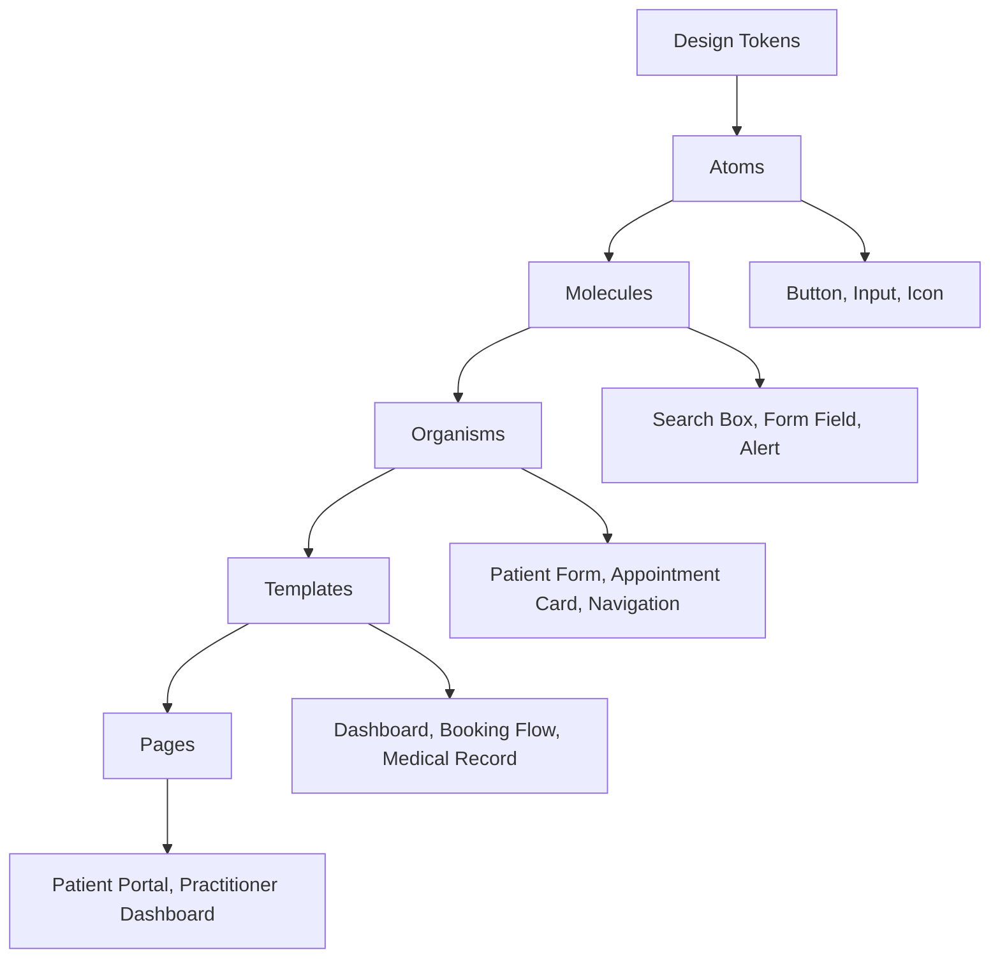

# NOVA Medical Component Library

## Overview

The NOVA Medical Component Library provides a comprehensive set of healthcare-optimized UI components designed for accessibility, performance, and medical workflow efficiency. All components follow WCAG 2.2 AA standards and are optimized for clinical environments.

## Component Architecture

### Atomic Design Methodology



## Foundational Components (Atoms)

### Button Component

#### Medical Button Variants
```typescript
interface MedicalButtonProps {
  variant: 'primary' | 'secondary' | 'emergency' | 'success' | 'warning' | 'ghost' | 'outline';
  size: 'sm' | 'md' | 'lg' | 'xl' | 'emergency';
  urgency?: 'low' | 'medium' | 'high' | 'critical';
  medical?: boolean;
  loading?: boolean;
  disabled?: boolean;
  children: React.ReactNode;
  onClick?: () => void;
}
```

#### Implementation
```tsx
// src/components/ui/Button.tsx
export const Button = ({
  variant = 'primary',
  size = 'md',
  urgency,
  medical = false,
  loading = false,
  disabled = false,
  children,
  ...props
}: MedicalButtonProps) => {
  const baseClasses = [
    'inline-flex items-center justify-center',
    'font-medium transition-all duration-200',
    'focus:outline-none focus-visible:ring-3 focus-visible:ring-primary-500',
    'touch-target', // Ensures 44px minimum
  ];

  const variants = {
    primary: 'bg-primary-500 text-white hover:bg-primary-600 active:bg-primary-700',
    secondary: 'bg-secondary-500 text-white hover:bg-secondary-600 active:bg-secondary-700',
    emergency: 'bg-emergency-500 text-white hover:bg-emergency-600 active:bg-emergency-700 animate-pulse-subtle',
    success: 'bg-success-500 text-white hover:bg-success-600 active:bg-success-700',
    warning: 'bg-warning-500 text-white hover:bg-warning-600 active:bg-warning-700',
    ghost: 'text-gray-700 hover:bg-gray-100 active:bg-gray-200',
    outline: 'border-2 border-primary-500 text-primary-500 hover:bg-primary-50 active:bg-primary-100',
  };

  const sizes = {
    sm: 'px-3 py-2 text-sm min-h-[36px]',
    md: 'px-4 py-3 text-base min-h-[44px]',
    lg: 'px-6 py-4 text-lg min-h-[48px]',
    xl: 'px-8 py-5 text-xl min-h-[56px]',
    emergency: 'px-8 py-6 text-xl min-h-[64px] font-bold',
  };

  return (
    <button
      className={cn(
        baseClasses,
        variants[variant],
        sizes[size],
        medical && 'font-medical-body',
        loading && 'pointer-events-none opacity-70',
        disabled && 'opacity-50 cursor-not-allowed'
      )}
      disabled={disabled || loading}
      aria-busy={loading}
      {...props}
    >
      {loading && <LoadingSpinner className="mr-2" size="sm" />}
      {children}
    </button>
  );
};
```

#### Medical-Specific Usage
```tsx
// Emergency action button
<Button variant="emergency" size="emergency" urgency="critical">
  🚨 Appeler urgences
</Button>

// Prescription confirmation
<Button variant="success" medical>
  ✓ Confirmer prescription
</Button>

// Appointment booking
<Button variant="primary" size="lg">
  Réserver rendez-vous
</Button>
```

### Input Components

#### Medical Text Input
```typescript
interface MedicalInputProps {
  label: string;
  type?: 'text' | 'email' | 'tel' | 'password' | 'url' | 'search';
  value?: string;
  placeholder?: string;
  required?: boolean;
  disabled?: boolean;
  error?: string;
  hint?: string;
  medical?: boolean;
  patientData?: boolean;
  autoComplete?: string;
  onChange?: (event: ChangeEvent<HTMLInputElement>) => void;
}
```

#### Implementation
```tsx
// src/components/ui/forms/Input.tsx
export const Input = ({
  label,
  type = 'text',
  value,
  placeholder,
  required = false,
  disabled = false,
  error,
  hint,
  medical = false,
  patientData = false,
  autoComplete,
  onChange,
  ...props
}: MedicalInputProps) => {
  const id = useId();
  const [focused, setFocused] = useState(false);

  return (
    <div className="medical-form-field">
      <label
        htmlFor={id}
        className={cn(
          'block text-sm font-medium mb-2',
          error ? 'text-error-600' : 'text-gray-700',
          medical && 'font-medical-body',
          required && "after:content-['*'] after:text-error-500 after:ml-1"
        )}
      >
        {label}
      </label>
      
      <div className="relative">
        <input
          id={id}
          type={type}
          value={value}
          placeholder={placeholder}
          required={required}
          disabled={disabled}
          autoComplete={autoComplete}
          onChange={onChange}
          onFocus={() => setFocused(true)}
          onBlur={() => setFocused(false)}
          className={cn(
            'w-full px-4 py-3 min-h-[44px]',
            'border-2 rounded-md transition-all duration-200',
            'focus:outline-none focus:ring-3 focus:ring-primary-500/20',
            'placeholder:text-gray-400',
            error 
              ? 'border-error-500 focus:border-error-500' 
              : focused
              ? 'border-primary-500'
              : 'border-gray-300 hover:border-gray-400',
            disabled && 'bg-gray-100 cursor-not-allowed opacity-60',
            medical && 'font-medical-body',
            patientData && 'bg-blue-50 border-blue-200'
          )}
          aria-invalid={!!error}
          aria-describedby={error ? `${id}-error` : hint ? `${id}-hint` : undefined}
          {...props}
        />
        
        {patientData && (
          <LockIcon className="absolute right-3 top-1/2 transform -translate-y-1/2 text-blue-500 w-5 h-5" />
        )}
      </div>
      
      {hint && !error && (
        <p id={`${id}-hint`} className="mt-1 text-sm text-gray-600">
          {hint}
        </p>
      )}
      
      {error && (
        <p id={`${id}-error`} className="mt-1 text-sm text-error-600 flex items-center gap-2" role="alert">
          <AlertCircleIcon className="w-4 h-4 flex-shrink-0" />
          {error}
        </p>
      )}
    </div>
  );
};
```

#### Specialized Medical Inputs

##### Phone Number Input (Algeria-specific)
```tsx
// src/components/ui/forms/TelInput.tsx
export const TelInput = ({ label, value, onChange, ...props }: TelInputProps) => {
  const [formattedValue, setFormattedValue] = useState('');
  const [isValid, setIsValid] = useState(false);

  const formatAlgerianNumber = (input: string) => {
    // Remove all non-digits
    const digits = input.replace(/\D/g, '');
    
    // Handle different input formats
    if (digits.startsWith('213')) {
      // International format
      return `+${digits.slice(0, 3)} ${digits.slice(3, 6)} ${digits.slice(6, 9)} ${digits.slice(9, 12)}`;
    } else if (digits.startsWith('0')) {
      // National format
      return `+213 ${digits.slice(1, 4)} ${digits.slice(4, 7)} ${digits.slice(7, 10)}`;
    }
    
    return input;
  };

  const validateAlgerianNumber = (number: string) => {
    const phoneRegex = /^\+213[567]\d{8}$/;
    return phoneRegex.test(number.replace(/\s/g, ''));
  };

  return (
    <Input
      label={label}
      type="tel"
      value={formattedValue}
      onChange={(e) => {
        const formatted = formatAlgerianNumber(e.target.value);
        setFormattedValue(formatted);
        setIsValid(validateAlgerianNumber(formatted));
        onChange?.(formatted, validateAlgerianNumber(formatted));
      }}
      error={value && !isValid ? 'Format: +213 XXX XXX XXX' : undefined}
      autoComplete="tel"
      placeholder="+213 555 123 456"
      {...props}
    />
  );
};
```

##### Medical ID Input
```tsx
// src/components/ui/forms/MedicalIdInput.tsx
export const MedicalIdInput = ({ label, type, ...props }: MedicalIdProps) => {
  const patterns = {
    patientId: /^PAT-\d{8}$/,
    practitionerId: /^DOC-\d{6}$/,
    appointmentId: /^RDV-\d{10}$/,
    prescriptionId: /^PRE-\d{8}$/,
  };

  return (
    <Input
      label={label}
      type="text"
      pattern={patterns[type].source}
      className="font-mono tracking-wider"
      placeholder={type === 'patientId' ? 'PAT-12345678' : 'DOC-123456'}
      autoComplete="off"
      {...props}
    />
  );
};
```

### Icon System

#### Medical Icon Component
```tsx
// src/components/ui/icons/MedicalIcon.tsx
interface MedicalIconProps {
  name: MedicalIconName;
  size?: 'xs' | 'sm' | 'md' | 'lg' | 'xl';
  color?: 'primary' | 'secondary' | 'success' | 'warning' | 'error' | 'gray';
  urgent?: boolean;
  className?: string;
}

export const MedicalIcon = ({ name, size = 'md', color = 'gray', urgent = false }: MedicalIconProps) => {
  const sizes = {
    xs: 'w-3 h-3',
    sm: 'w-4 h-4', 
    md: 'w-5 h-5',
    lg: 'w-6 h-6',
    xl: 'w-8 h-8',
  };

  const colors = {
    primary: 'text-primary-500',
    secondary: 'text-secondary-500',
    success: 'text-success-500',
    warning: 'text-warning-500',
    error: 'text-error-500',
    gray: 'text-gray-500',
  };

  return (
    <span
      className={cn(
        sizes[size],
        colors[color],
        urgent && 'animate-pulse text-error-500'
      )}
      role="img"
      aria-label={getIconLabel(name)}
    >
      {getIconSvg(name)}
    </span>
  );
};
```

## Composite Components (Molecules)

### Medical Form Field
```tsx
// src/components/ui/forms/FormField.tsx
interface FormFieldProps {
  label: string;
  children: React.ReactNode;
  error?: string;
  hint?: string;
  required?: boolean;
  medical?: boolean;
  className?: string;
}

export const FormField = ({
  label,
  children,
  error,
  hint,
  required = false,
  medical = false,
  className
}: FormFieldProps) => {
  return (
    <fieldset className={cn('medical-form-field', className)}>
      <legend className={cn(
        'block text-sm font-medium mb-2',
        error ? 'text-error-600' : 'text-gray-700',
        medical && 'font-medical-body',
        required && "after:content-['*'] after:text-error-500 after:ml-1"
      )}>
        {label}
      </legend>
      
      {children}
      
      {hint && !error && (
        <p className="mt-1 text-sm text-gray-600">{hint}</p>
      )}
      
      {error && (
        <p className="mt-1 text-sm text-error-600 flex items-center gap-2" role="alert">
          <MedicalIcon name="alert-circle" size="sm" color="error" />
          {error}
        </p>
      )}
    </fieldset>
  );
};
```

### Medical Alert Component
```tsx
// src/components/ui/Alert.tsx
interface MedicalAlertProps {
  type: 'info' | 'success' | 'warning' | 'error' | 'emergency';
  title?: string;
  children: React.ReactNode;
  dismissible?: boolean;
  urgent?: boolean;
  onDismiss?: () => void;
}

export const MedicalAlert = ({
  type,
  title,
  children,
  dismissible = false,
  urgent = false,
  onDismiss
}: MedicalAlertProps) => {
  const alertStyles = {
    info: 'bg-blue-50 border-blue-200 text-blue-800',
    success: 'bg-green-50 border-green-200 text-green-800',
    warning: 'bg-amber-50 border-amber-200 text-amber-800',
    error: 'bg-red-50 border-red-200 text-red-800',
    emergency: 'bg-red-100 border-red-500 text-red-900 shadow-lg',
  };

  const iconMap = {
    info: 'info-circle',
    success: 'check-circle',
    warning: 'alert-triangle',
    error: 'alert-circle',
    emergency: 'alert-octagon',
  };

  return (
    <div
      className={cn(
        'p-4 border-l-4 rounded-r-md',
        alertStyles[type],
        urgent && 'animate-pulse-subtle'
      )}
      role="alert"
      aria-live={type === 'emergency' ? 'assertive' : 'polite'}
    >
      <div className="flex items-start">
        <MedicalIcon 
          name={iconMap[type]} 
          size="md" 
          className="flex-shrink-0 mt-0.5"
          urgent={urgent}
        />
        
        <div className="ml-3 flex-1">
          {title && (
            <h3 className="text-sm font-semibold mb-1">{title}</h3>
          )}
          <div className="text-sm">{children}</div>
        </div>
        
        {dismissible && (
          <button
            onClick={onDismiss}
            className="ml-3 -mr-1 flex-shrink-0 touch-target"
            aria-label="Fermer l'alerte"
          >
            <MedicalIcon name="x" size="sm" />
          </button>
        )}
      </div>
    </div>
  );
};
```

### Search Component
```tsx
// src/components/ui/Search.tsx
interface MedicalSearchProps {
  placeholder?: string;
  value?: string;
  onSearch?: (query: string) => void;
  onClear?: () => void;
  medical?: boolean;
  patientSearch?: boolean;
  loading?: boolean;
}

export const MedicalSearch = ({
  placeholder = "Rechercher...",
  value = "",
  onSearch,
  onClear,
  medical = false,
  patientSearch = false,
  loading = false
}: MedicalSearchProps) => {
  const [query, setQuery] = useState(value);

  const handleSubmit = (e: FormEvent) => {
    e.preventDefault();
    onSearch?.(query);
  };

  return (
    <form onSubmit={handleSubmit} className="relative">
      <div className="relative">
        <MedicalIcon 
          name="search" 
          size="md" 
          className="absolute left-3 top-1/2 transform -translate-y-1/2 text-gray-400"
        />
        
        <input
          type="search"
          value={query}
          onChange={(e) => setQuery(e.target.value)}
          placeholder={placeholder}
          className={cn(
            'w-full pl-10 pr-10 py-3 min-h-[44px]',
            'border-2 border-gray-300 rounded-md',
            'focus:outline-none focus:ring-3 focus:ring-primary-500/20 focus:border-primary-500',
            'transition-all duration-200',
            medical && 'font-medical-body',
            patientSearch && 'bg-blue-50 border-blue-200'
          )}
          aria-label="Recherche médicale"
        />
        
        {loading && (
          <LoadingSpinner className="absolute right-3 top-1/2 transform -translate-y-1/2" size="sm" />
        )}
        
        {query && !loading && (
          <button
            type="button"
            onClick={() => {
              setQuery('');
              onClear?.();
            }}
            className="absolute right-3 top-1/2 transform -translate-y-1/2 touch-target"
            aria-label="Effacer la recherche"
          >
            <MedicalIcon name="x-circle" size="sm" className="text-gray-400 hover:text-gray-600" />
          </button>
        )}
      </div>
    </form>
  );
};
```

## Complex Components (Organisms)

### Patient Information Card
```tsx
// src/components/medical/PatientCard.tsx
interface PatientCardProps {
  patient: {
    id: string;
    firstName: string;
    lastName: string;
    dateOfBirth: string;
    phone: string;
    email?: string;
    lastVisit?: string;
    status: 'active' | 'inactive' | 'emergency';
    urgencyLevel?: 'low' | 'medium' | 'high' | 'critical';
  };
  onEdit?: () => void;
  onContact?: () => void;
  onViewHistory?: () => void;
}

export const PatientCard = ({ patient, onEdit, onContact, onViewHistory }: PatientCardProps) => {
  const statusColors = {
    active: 'bg-green-100 text-green-800 border-green-200',
    inactive: 'bg-gray-100 text-gray-800 border-gray-200',
    emergency: 'bg-red-100 text-red-800 border-red-200',
  };

  const urgencyColors = {
    low: 'text-blue-600',
    medium: 'text-amber-600',
    high: 'text-orange-600',
    critical: 'text-red-600',
  };

  return (
    <div className="bg-white border border-gray-200 rounded-lg p-6 shadow-sm hover:shadow-md transition-shadow">
      <div className="flex items-start justify-between mb-4">
        <div className="flex-1">
          <h3 className="text-lg font-semibold text-gray-900 font-medical-body">
            {patient.firstName} {patient.lastName}
          </h3>
          <p className="text-sm text-gray-600 font-mono">ID: {patient.id}</p>
        </div>
        
        <div className="flex items-center gap-2">
          <span className={cn(
            'px-2 py-1 text-xs font-medium rounded-full border',
            statusColors[patient.status]
          )}>
            {patient.status}
          </span>
          
          {patient.urgencyLevel && (
            <MedicalIcon 
              name="alert-circle" 
              size="sm" 
              className={urgencyColors[patient.urgencyLevel]}
              urgent={patient.urgencyLevel === 'critical'}
            />
          )}
        </div>
      </div>
      
      <div className="space-y-2 mb-4">
        <div className="flex items-center text-sm text-gray-600">
          <MedicalIcon name="calendar" size="sm" className="mr-2" />
          Né(e) le {new Date(patient.dateOfBirth).toLocaleDateString('fr-FR')}
        </div>
        
        <div className="flex items-center text-sm text-gray-600">
          <MedicalIcon name="phone" size="sm" className="mr-2" />
          {patient.phone}
        </div>
        
        {patient.email && (
          <div className="flex items-center text-sm text-gray-600">
            <MedicalIcon name="mail" size="sm" className="mr-2" />
            {patient.email}
          </div>
        )}
        
        {patient.lastVisit && (
          <div className="flex items-center text-sm text-gray-600">
            <MedicalIcon name="clock" size="sm" className="mr-2" />
            Dernière visite: {new Date(patient.lastVisit).toLocaleDateString('fr-FR')}
          </div>
        )}
      </div>
      
      <div className="flex items-center gap-2 pt-4 border-t border-gray-100">
        <Button variant="outline" size="sm" onClick={onEdit}>
          <MedicalIcon name="edit" size="sm" className="mr-1" />
          Modifier
        </Button>
        
        <Button variant="secondary" size="sm" onClick={onContact}>
          <MedicalIcon name="phone" size="sm" className="mr-1" />
          Contacter
        </Button>
        
        <Button variant="ghost" size="sm" onClick={onViewHistory}>
          <MedicalIcon name="history" size="sm" className="mr-1" />
          Historique
        </Button>
      </div>
    </div>
  );
};
```

### Appointment Booking Form
```tsx
// src/components/medical/AppointmentForm.tsx
interface AppointmentFormProps {
  availableSlots: TimeSlot[];
  onSubmit: (appointment: AppointmentData) => void;
  loading?: boolean;
}

export const AppointmentForm = ({ availableSlots, onSubmit, loading = false }: AppointmentFormProps) => {
  const [formData, setFormData] = useState<AppointmentFormData>({
    firstName: '',
    lastName: '',
    phone: '',
    email: '',
    dateOfBirth: '',
    reason: '',
    urgency: 'routine',
    selectedSlot: null,
    consent: false,
  });

  const [errors, setErrors] = useState<Record<string, string>>({});

  const validateForm = () => {
    const newErrors: Record<string, string> = {};
    
    if (!formData.firstName.trim()) {
      newErrors.firstName = 'Le prénom est requis';
    }
    
    if (!formData.lastName.trim()) {
      newErrors.lastName = 'Le nom est requis';
    }
    
    if (!formData.phone.trim()) {
      newErrors.phone = 'Le téléphone est requis';
    } else if (!/^\+213[567]\d{8}$/.test(formData.phone.replace(/\s/g, ''))) {
      newErrors.phone = 'Format de téléphone invalide';
    }
    
    if (!formData.selectedSlot) {
      newErrors.selectedSlot = 'Veuillez sélectionner un créneau';
    }
    
    if (!formData.consent) {
      newErrors.consent = 'Le consentement est requis';
    }
    
    setErrors(newErrors);
    return Object.keys(newErrors).length === 0;
  };

  const handleSubmit = (e: FormEvent) => {
    e.preventDefault();
    if (validateForm()) {
      onSubmit(formData);
    }
  };

  return (
    <form onSubmit={handleSubmit} className="space-y-6">
      <div className="grid grid-cols-1 md:grid-cols-2 gap-4">
        <Input
          label="Prénom"
          value={formData.firstName}
          onChange={(e) => setFormData(prev => ({ ...prev, firstName: e.target.value }))}
          error={errors.firstName}
          required
          autoComplete="given-name"
        />
        
        <Input
          label="Nom"
          value={formData.lastName}
          onChange={(e) => setFormData(prev => ({ ...prev, lastName: e.target.value }))}
          error={errors.lastName}
          required
          autoComplete="family-name"
        />
      </div>
      
      <div className="grid grid-cols-1 md:grid-cols-2 gap-4">
        <TelInput
          label="Téléphone"
          value={formData.phone}
          onChange={(phone, isValid) => {
            setFormData(prev => ({ ...prev, phone }));
            if (!isValid && errors.phone) {
              setErrors(prev => ({ ...prev, phone: 'Format de téléphone invalide' }));
            }
          }}
          error={errors.phone}
          required
        />
        
        <Input
          label="Email"
          type="email"
          value={formData.email}
          onChange={(e) => setFormData(prev => ({ ...prev, email: e.target.value }))}
          autoComplete="email"
          hint="Optionnel - pour les confirmations"
        />
      </div>
      
      <FormField
        label="Motif de consultation"
        required
        error={errors.reason}
      >
        <textarea
          value={formData.reason}
          onChange={(e) => setFormData(prev => ({ ...prev, reason: e.target.value }))}
          className="w-full px-4 py-3 min-h-[100px] border-2 border-gray-300 rounded-md focus:outline-none focus:ring-3 focus:ring-primary-500/20 focus:border-primary-500"
          placeholder="Décrivez brièvement le motif de votre consultation..."
          rows={4}
        />
      </FormField>
      
      <FormField
        label="Niveau d'urgence"
        required
        error={errors.urgency}
      >
        <div className="grid grid-cols-2 md:grid-cols-4 gap-2">
          {[
            { value: 'routine', label: 'Routine', color: 'blue' },
            { value: 'moderate', label: 'Modéré', color: 'amber' },
            { value: 'urgent', label: 'Urgent', color: 'orange' },
            { value: 'emergency', label: 'Urgence', color: 'red' },
          ].map((option) => (
            <label
              key={option.value}
              className={cn(
                'flex items-center justify-center p-3 border-2 rounded-md cursor-pointer transition-all',
                formData.urgency === option.value
                  ? `border-${option.color}-500 bg-${option.color}-50 text-${option.color}-700`
                  : 'border-gray-300 hover:border-gray-400'
              )}
            >
              <input
                type="radio"
                name="urgency"
                value={option.value}
                checked={formData.urgency === option.value}
                onChange={(e) => setFormData(prev => ({ ...prev, urgency: e.target.value as UrgencyLevel }))}
                className="sr-only"
              />
              <span className="text-sm font-medium">{option.label}</span>
            </label>
          ))}
        </div>
      </FormField>
      
      <FormField
        label="Créneaux disponibles"
        required
        error={errors.selectedSlot}
      >
        <TimeSlotPicker
          slots={availableSlots}
          selectedSlot={formData.selectedSlot}
          onSelectSlot={(slot) => setFormData(prev => ({ ...prev, selectedSlot: slot }))}
        />
      </FormField>
      
      <FormField error={errors.consent}>
        <label className="flex items-start gap-3 cursor-pointer">
          <input
            type="checkbox"
            checked={formData.consent}
            onChange={(e) => setFormData(prev => ({ ...prev, consent: e.target.checked }))}
            className="mt-1 h-4 w-4 text-primary-500 border-2 border-gray-300 rounded focus:ring-primary-500"
          />
          <span className="text-sm text-gray-700">
            J'accepte le traitement de mes données personnelles selon la{' '}
            <a href="/privacy" className="text-primary-500 underline">
              politique de confidentialité
            </a>{' '}
            et confirme l'exactitude des informations fournies.
          </span>
        </label>
      </FormField>
      
      <div className="flex items-center gap-4 pt-6 border-t border-gray-200">
        <Button
          type="submit"
          variant="primary"
          size="lg"
          loading={loading}
          disabled={!formData.consent}
          className="flex-1"
        >
          Confirmer le rendez-vous
        </Button>
        
        <Button
          type="button"
          variant="outline"
          size="lg"
          onClick={() => window.history.back()}
        >
          Annuler
        </Button>
      </div>
    </form>
  );
};
```

### Emergency Action Panel
```tsx
// src/components/medical/EmergencyPanel.tsx
interface EmergencyPanelProps {
  onEmergencyCall: () => void;
  onUrgentBooking: () => void;
  emergencyNumber: string;
  clinicAddress: string;
}

export const EmergencyPanel = ({
  onEmergencyCall,
  onUrgentBooking,
  emergencyNumber,
  clinicAddress
}: EmergencyPanelProps) => {
  return (
    <div className="bg-red-50 border-2 border-red-200 rounded-lg p-6">
      <div className="flex items-center mb-4">
        <MedicalIcon 
          name="alert-octagon" 
          size="lg" 
          className="text-red-600 mr-3" 
          urgent 
        />
        <h2 className="text-xl font-bold text-red-900">Urgence Médicale</h2>
      </div>
      
      <MedicalAlert 
        type="emergency" 
        title="Situations d'urgence vitale"
        urgent
      >
        <ul className="list-disc list-inside space-y-1 text-sm">
          <li>Douleur thoracique intense</li>
          <li>Difficulté respiratoire sévère</li>
          <li>Perte de conscience</li>
          <li>Traumatisme facial majeur</li>
          <li>Hémorragie importante</li>
        </ul>
      </MedicalAlert>
      
      <div className="mt-6 space-y-3">
        <Button
          variant="emergency"
          size="emergency"
          onClick={onEmergencyCall}
          className="w-full"
        >
          <MedicalIcon name="phone" size="lg" className="mr-3" />
          🚨 Appeler le {emergencyNumber}
        </Button>
        
        <Button
          variant="warning"
          size="lg"
          onClick={onUrgentBooking}
          className="w-full"
        >
          <MedicalIcon name="clock" size="md" className="mr-2" />
          Consultation urgente (< 2h)
        </Button>
      </div>
      
      <div className="mt-6 p-4 bg-white rounded-md border border-red-200">
        <h3 className="font-semibold text-red-900 mb-2">Adresse du cabinet</h3>
        <p className="text-sm text-red-800">{clinicAddress}</p>
        <Button
          variant="outline"
          size="sm"
          className="mt-2 border-red-300 text-red-700"
          onClick={() => window.open(`https://maps.google.com/?q=${encodeURIComponent(clinicAddress)}`, '_blank')}
        >
          <MedicalIcon name="map-pin" size="sm" className="mr-1" />
          Ouvrir dans Maps
        </Button>
      </div>
    </div>
  );
};
```

## Loading & Error States

### Medical Loading Spinner
```tsx
// src/components/ui/LoadingSpinner.tsx
interface LoadingSpinnerProps {
  size?: 'sm' | 'md' | 'lg' | 'xl';
  medical?: boolean;
  text?: string;
  inline?: boolean;
}

export const LoadingSpinner = ({ 
  size = 'md', 
  medical = false, 
  text, 
  inline = false 
}: LoadingSpinnerProps) => {
  const sizes = {
    sm: 'w-4 h-4',
    md: 'w-6 h-6',
    lg: 'w-8 h-8',
    xl: 'w-12 h-12',
  };

  const spinner = (
    <div
      className={cn(
        'animate-spin rounded-full border-2 border-gray-200',
        sizes[size],
        medical ? 'border-t-primary-500' : 'border-t-blue-500'
      )}
      role="status"
      aria-label="Chargement en cours"
    />
  );

  if (inline) {
    return spinner;
  }

  return (
    <div className="flex flex-col items-center justify-center py-12">
      {spinner}
      {text && (
        <p className="mt-3 text-sm text-gray-600 font-medical-body">
          {text}
        </p>
      )}
    </div>
  );
};
```

### Medical Skeleton Loaders
```tsx
// src/components/ui/Skeleton.tsx
export const PatientCardSkeleton = () => (
  <div className="bg-white border border-gray-200 rounded-lg p-6 shadow-sm">
    <div className="flex items-start justify-between mb-4">
      <div className="flex-1">
        <div className="h-6 bg-gray-200 rounded w-48 mb-2" />
        <div className="h-4 bg-gray-200 rounded w-24" />
      </div>
      <div className="h-6 bg-gray-200 rounded w-16" />
    </div>
    
    <div className="space-y-2 mb-4">
      <div className="h-4 bg-gray-200 rounded w-40" />
      <div className="h-4 bg-gray-200 rounded w-36" />
      <div className="h-4 bg-gray-200 rounded w-44" />
    </div>
    
    <div className="flex items-center gap-2 pt-4 border-t border-gray-100">
      <div className="h-8 bg-gray-200 rounded w-20" />
      <div className="h-8 bg-gray-200 rounded w-24" />
      <div className="h-8 bg-gray-200 rounded w-20" />
    </div>
  </div>
);

export const AppointmentFormSkeleton = () => (
  <div className="space-y-6">
    <div className="grid grid-cols-1 md:grid-cols-2 gap-4">
      <div className="space-y-2">
        <div className="h-4 bg-gray-200 rounded w-16" />
        <div className="h-11 bg-gray-200 rounded" />
      </div>
      <div className="space-y-2">
        <div className="h-4 bg-gray-200 rounded w-12" />
        <div className="h-11 bg-gray-200 rounded" />
      </div>
    </div>
    
    <div className="space-y-2">
      <div className="h-4 bg-gray-200 rounded w-32" />
      <div className="h-24 bg-gray-200 rounded" />
    </div>
    
    <div className="grid grid-cols-2 md:grid-cols-4 gap-2">
      {Array.from({ length: 4 }).map((_, i) => (
        <div key={i} className="h-12 bg-gray-200 rounded" />
      ))}
    </div>
    
    <div className="h-48 bg-gray-200 rounded" />
    
    <div className="flex gap-4">
      <div className="h-12 bg-gray-200 rounded flex-1" />
      <div className="h-12 bg-gray-200 rounded w-24" />
    </div>
  </div>
);
```

## Component Usage Guidelines

### Accessibility Requirements
1. **Keyboard Navigation**: All interactive components must be keyboard accessible
2. **Screen Reader Support**: Proper ARIA labels and descriptions
3. **Focus Management**: Clear focus indicators and logical tab order
4. **Touch Targets**: Minimum 44px touch targets for mobile devices
5. **Color Contrast**: WCAG AA compliance for all text and UI elements

### Medical Context Guidelines
1. **Data Sensitivity**: Use appropriate visual indicators for medical data
2. **Urgency Levels**: Clear visual hierarchy for different urgency levels
3. **Professional Appearance**: Medical-appropriate styling and terminology
4. **Error Handling**: Clear, actionable error messages
5. **Loading States**: Appropriate loading indicators for medical workflows

### Performance Requirements
1. **Bundle Size**: Individual components should be tree-shakeable
2. **Rendering**: Optimize for medical data rendering scenarios
3. **Memory Usage**: Efficient component updates for patient data
4. **Accessibility**: Performance considerations for assistive technologies

## Testing Strategy

### Component Testing
```tsx
// Example test for medical component
import { render, screen, fireEvent } from '@testing-library/react';
import { axe, toHaveNoViolations } from 'jest-axe';
import { PatientCard } from '../PatientCard';

expect.extend(toHaveNoViolations);

describe('PatientCard', () => {
  const mockPatient = {
    id: 'PAT-12345678',
    firstName: 'Jean',
    lastName: 'Dupont',
    dateOfBirth: '1980-01-15',
    phone: '+213 555 123 456',
    status: 'active' as const,
  };

  it('should render patient information correctly', () => {
    render(<PatientCard patient={mockPatient} />);
    
    expect(screen.getByText('Jean Dupont')).toBeInTheDocument();
    expect(screen.getByText('ID: PAT-12345678')).toBeInTheDocument();
    expect(screen.getByText('+213 555 123 456')).toBeInTheDocument();
  });

  it('should be accessible', async () => {
    const { container } = render(<PatientCard patient={mockPatient} />);
    const results = await axe(container);
    expect(results).toHaveNoViolations();
  });

  it('should handle emergency status appropriately', () => {
    const emergencyPatient = { ...mockPatient, status: 'emergency' as const };
    render(<PatientCard patient={emergencyPatient} />);
    
    expect(screen.getByText('emergency')).toHaveClass('bg-red-100');
  });
});
```

### Visual Testing
- Storybook integration for component documentation
- Visual regression testing for medical workflows
- Cross-browser compatibility testing
- Mobile responsiveness validation

### Medical Workflow Testing
- End-to-end appointment booking flows
- Emergency action workflows
- Patient data entry validation
- Medical professional interfaces

---

**Component Library Version**: 1.0  
**Last Updated**: 2025-08-15  
**Compliance**: WCAG 2.2 AA, Medical UI Standards  
**Framework**: React 19, Next.js 15, TypeScript 5.0