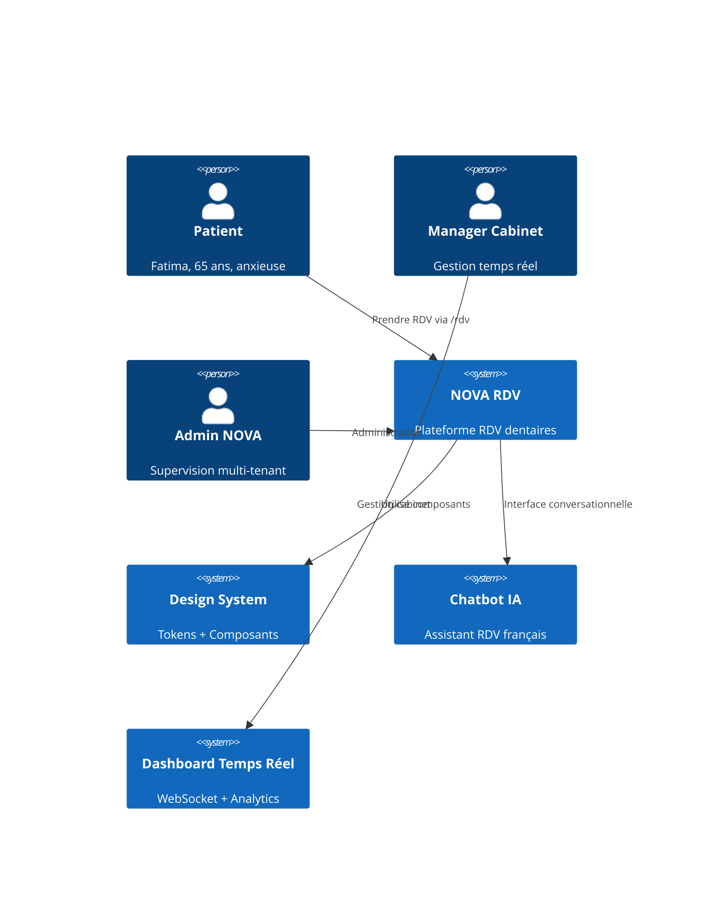

# NOVA RDV - Architecture du Design System Médical

## Résumé Exécutif

Cette architecture définit le système de design médical complet pour NOVA RDV, une plateforme de rendez-vous dentaires. L'architecture intègre des tokens de design médicaux spécialisés, une bibliothèque de composants accessible WCAG AAA, et des patterns d'interaction optimisés pour l'anxiété des patients et l'efficacité des praticiens.

**Objectifs Architecturaux:**
- Conformité WCAG AAA + RGPD + normes médicales françaises
- Support multi-tenant avec 100k+ utilisateurs simultanés
- Interface temps réel WebSocket pour dashboard manager
- UX optimisée pour persona Fatima (anxieuse, 65+ ans)
- Performance mobile-first avec support offline

## Vue d'ensemble du Système

### Architecture en Couches



### Stack Technologique

| Couche | Technologie | Version | Justification |
|--------|-------------|---------|---------------|
| **Frontend** | Next.js | 15.x | App Router, Server Components, performance |
| **Types** | TypeScript | 5.x | Strict mode, sécurité type |
| **Styling** | Tailwind CSS | 3.x | Utility-first, tree-shaking optimisé |
| **Components** | shadcn/ui | Latest | Radix primitives, accessibilité native |
| **Icons** | Lucide React | Latest | Iconographie médicale cohérente |
| **Animations** | Framer Motion | 11.x | Micro-interactions apaisantes |
| **WebSocket** | Socket.io | 4.x | Temps réel dashboard manager |

## Architecture des Tokens de Design

### Système de Couleurs Médicales

#### Palette Primaire - Bleu Confiance
```css
:root {
  /* Bleu médical - Confiance professionnelle */
  --color-primary-50: #EEF2FF;   /* rgb(238 242 255) */
  --color-primary-100: #E0E7FF;  /* rgb(224 231 255) */
  --color-primary-600: #2563EB;  /* rgb(37 99 235) - Principal */
  --color-primary-700: #1D4ED8;  /* rgb(29 78 216) - Contraste AAA */
  --color-primary-900: #1E3A8A;  /* rgb(30 58 138) - Texte sur clair */
}
```

#### Palette Sémantique Médicale
```css
:root {
  /* États médicaux */
  --color-success-50: #ECFDF5;   /* Validation, succès */
  --color-success-600: #16A34A;  /* Confirmation RDV */
  
  --color-warning-50: #FFFBEB;   /* Attention, précaution */
  --color-warning-500: #F59E0B;  /* Alertes non critiques */
  
  --color-error-50: #FEF2F2;     /* Erreurs, annulations */
  --color-error-600: #DF3F40;    /* Erreurs critiques */
  
  /* Interface médicale */
  --color-medical-bg: #FAFBFF;   /* Fond cabinet */
  --color-medical-border: #E5E7EB; /* Délimitations douces */
  --color-medical-text: #0B1220;  /* Texte principal */
  --color-medical-muted: #475467; /* Texte secondaire */
}
```

#### Système de Contraste Adaptatif
```css
/* Contraste automatique pour senior (65+) */
.high-contrast {
  --color-text-primary: var(--color-primary-900);
  --color-bg-primary: var(--color-white);
  --contrast-ratio: 7; /* WCAG AAA */
}

/* Mode lecture comfortable */
.comfort-mode {
  --font-size-base: 1.125rem; /* 18px */
  --line-height-base: 1.6;
  --letter-spacing: 0.02em;
}
```

### Typographie Médicale

#### Familles de Polices
```css
:root {
  /* Police principale - Excellente lisibilité médicale */
  --font-family-primary: 'Inter', -apple-system, BlinkMacSystemFont, sans-serif;
  
  /* Police données - Distinction chiffres/lettres */
  --font-family-data: 'JetBrains Mono', 'SF Mono', monospace;
  
  /* Police titres - Impact professionnel */
  --font-family-heading: 'Inter', -apple-system, BlinkMacSystemFont, sans-serif;
}
```

#### Échelle Typographique Fluide
```css
:root {
  /* Échelle responsive optimisée mobile-first */
  --font-size-xs: clamp(0.75rem, 0.9vw + 0.6rem, 0.875rem);    /* 12-14px */
  --font-size-sm: clamp(0.875rem, 1vw + 0.7rem, 1rem);         /* 14-16px */
  --font-size-base: clamp(1rem, 1.2vw + 0.8rem, 1.125rem);     /* 16-18px */
  --font-size-lg: clamp(1.125rem, 1.4vw + 0.9rem, 1.25rem);    /* 18-20px */
  --font-size-xl: clamp(1.25rem, 1.6vw + 1rem, 1.5rem);        /* 20-24px */
  --font-size-2xl: clamp(1.5rem, 2vw + 1.2rem, 1.875rem);      /* 24-30px */
  --font-size-3xl: clamp(1.875rem, 2.5vw + 1.5rem, 2.25rem);   /* 30-36px */
}
```

#### Hiérarchie Sémantique
```css
/* H1 - Titre de page (Tableau de bord, Prendre RDV) */
.text-h1 {
  font-size: var(--font-size-3xl);
  font-weight: 700;
  line-height: 1.2;
  letter-spacing: -0.025em;
  color: var(--color-medical-text);
}

/* H2 - Section principale (Mes RDV, Créneaux disponibles) */
.text-h2 {
  font-size: var(--font-size-2xl);
  font-weight: 600;
  line-height: 1.3;
  letter-spacing: -0.02em;
  color: var(--color-medical-text);
}

/* Body - Texte principal */
.text-body {
  font-size: var(--font-size-base);
  font-weight: 400;
  line-height: 1.6;
  color: var(--color-medical-text);
}

/* Caption - Métadonnées (horaires, statuts) */
.text-caption {
  font-size: var(--font-size-sm);
  font-weight: 500;
  line-height: 1.4;
  color: var(--color-medical-muted);
}
```

### Système d'Espacement Médical

#### Grille Base 8px
```css
:root {
  /* Base médicale - multiples de 8px pour alignement */
  --spacing-0: 0;
  --spacing-1: 0.25rem;    /* 4px - Micro-espacement */
  --spacing-2: 0.5rem;     /* 8px - Unité de base */
  --spacing-3: 0.75rem;    /* 12px - Espacement serré */
  --spacing-4: 1rem;       /* 16px - Espacement standard */
  --spacing-6: 1.5rem;     /* 24px - Espacement confortable */
  --spacing-8: 2rem;       /* 32px - Séparation sections */
  --spacing-12: 3rem;      /* 48px - Espacement large */
  --spacing-16: 4rem;      /* 64px - Séparation majeure */
}
```

#### Cibles Tactiles Médicales
```css
:root {
  /* Seniors et mobilité réduite */
  --touch-target-min: 44px;      /* iOS minimum */
  --touch-target-comfort: 48px;  /* Android confortable */
  --touch-target-senior: 56px;   /* Optimisé 65+ ans */
  
  /* Boutons d'urgence */
  --touch-target-emergency: 64px; /* Stress/urgence */
}
```

## Architecture des Composants

### Système de Variants

#### Pattern Base - Composant Medical
```typescript
interface MedicalComponentProps {
  variant?: 'primary' | 'secondary' | 'success' | 'warning' | 'error' | 'quiet';
  size?: 'sm' | 'md' | 'lg' | 'xl';
  urgency?: 'low' | 'medium' | 'high' | 'emergency';
  accessible?: boolean; // Force WCAG AAA
  comfort?: boolean;    // Mode senior-friendly
}

const medicalVariants = cva(
  // Base classes
  "inline-flex items-center justify-center rounded-md font-medium transition-all duration-200 focus-visible:outline-none focus-visible:ring-2 focus-visible:ring-offset-2",
  {
    variants: {
      variant: {
        primary: "bg-primary-600 text-white hover:bg-primary-700 focus-visible:ring-primary-500",
        success: "bg-success-600 text-white hover:bg-success-700 focus-visible:ring-success-500",
        warning: "bg-warning-500 text-white hover:bg-warning-600 focus-visible:ring-warning-400",
        error: "bg-error-600 text-white hover:bg-error-700 focus-visible:ring-error-500",
        emergency: "bg-error-600 text-white animate-pulse-gentle hover:bg-error-700 ring-2 ring-error-200"
      },
      size: {
        sm: "h-9 px-3 text-sm",
        md: "h-11 px-4 text-base",
        lg: "h-12 px-6 text-lg",
        xl: "h-14 px-8 text-xl" // Senior-friendly
      },
      comfort: {
        true: "h-12 px-6 text-lg min-h-[48px]" // Override size pour confort
      }
    }
  }
);
```

### Composants Médicaux Spécialisés

#### Button Médical
```tsx
interface MedicalButtonProps extends ButtonHTMLAttributes<HTMLButtonElement> {
  variant?: 'primary' | 'secondary' | 'success' | 'warning' | 'error' | 'emergency';
  size?: 'sm' | 'md' | 'lg' | 'senior';
  loading?: boolean;
  loadingText?: string;
  icon?: ReactNode;
  iconPosition?: 'left' | 'right';
  urgency?: 'low' | 'medium' | 'high' | 'emergency';
}

export const MedicalButton = forwardRef<HTMLButtonElement, MedicalButtonProps>(
  ({ 
    variant = 'primary', 
    size = 'md', 
    loading = false,
    loadingText,
    icon,
    iconPosition = 'left',
    urgency = 'low',
    children,
    disabled,
    className,
    ...props 
  }, ref) => {
    return (
      <button
        ref={ref}
        disabled={disabled || loading}
        className={cn(
          medicalVariants({ variant, size }),
          urgency === 'emergency' && 'animate-pulse-gentle ring-2 ring-offset-2',
          className
        )}
        {...props}
      >
        {loading ? (
          <>
            <Loader2 className="mr-2 h-4 w-4 animate-spin" />
            <span className="sr-only">Chargement en cours</span>
            {loadingText || children}
          </>
        ) : (
          <>
            {icon && iconPosition === 'left' && (
              <span className="mr-2">{icon}</span>
            )}
            {children}
            {icon && iconPosition === 'right' && (
              <span className="ml-2">{icon}</span>
            )}
          </>
        )}
      </button>
    );
  }
);
```

#### Input Médical avec Validation
```tsx
interface MedicalInputProps extends InputHTMLAttributes<HTMLInputElement> {
  label: string;
  error?: string;
  hint?: string;
  icon?: ReactNode;
  medical?: boolean; // Style médical renforcé
  urgent?: boolean;  // Champ critique
}

export const MedicalInput = forwardRef<HTMLInputElement, MedicalInputProps>(
  ({ label, error, hint, icon, medical = true, urgent = false, className, ...props }, ref) => {
    const inputId = useId();
    const errorId = error ? `${inputId}-error` : undefined;
    const hintId = hint ? `${inputId}-hint` : undefined;
    
    return (
      <div className="space-y-2">
        <label 
          htmlFor={inputId}
          className={cn(
            "block text-sm font-medium",
            urgent ? "text-error-700 font-semibold" : "text-medical-text",
            medical && "text-primary-700"
          )}
        >
          {label}
          {props.required && <span className="text-error-600 ml-1">*</span>}
        </label>
        
        <div className="relative">
          {icon && (
            <div className="absolute left-3 top-1/2 transform -translate-y-1/2 text-medical-muted">
              {icon}
            </div>
          )}
          
          <input
            ref={ref}
            id={inputId}
            aria-invalid={error ? 'true' : 'false'}
            aria-describedby={cn(errorId, hintId)}
            className={cn(
              // Base styles
              "flex h-11 w-full rounded-md border px-3 py-2 text-base",
              "placeholder:text-medical-muted/60",
              "focus-visible:outline-none focus-visible:ring-2 focus-visible:ring-offset-2",
              "disabled:cursor-not-allowed disabled:opacity-50",
              "transition-all duration-200",
              
              // Medical styling
              medical && [
                "border-medical-border bg-white",
                "focus-visible:ring-primary-500 focus-visible:border-primary-600",
              ],
              
              // Error state
              error && [
                "border-error-500 bg-error-50",
                "focus-visible:ring-error-500 focus-visible:border-error-600",
              ],
              
              // Urgent field
              urgent && [
                "border-warning-500 bg-warning-50",
                "ring-1 ring-warning-200",
              ],
              
              // Icon spacing
              icon && "pl-10",
              
              className
            )}
            {...props}
          />
        </div>
        
        {hint && !error && (
          <p id={hintId} className="text-sm text-medical-muted">
            {hint}
          </p>
        )}
        
        {error && (
          <p id={errorId} className="text-sm text-error-600 flex items-center gap-1">
            <AlertCircle className="h-4 w-4 shrink-0" />
            {error}
          </p>
        )}
      </div>
    );
  }
);
```

### Layout System Médical

#### Page Layout - Split Screen RDV
```tsx
interface RDVLayoutProps {
  children: ReactNode;
  chatbot: ReactNode;
  sidebar?: ReactNode;
}

export const RDVLayout = ({ children, chatbot, sidebar }: RDVLayoutProps) => {
  return (
    <div className="min-h-screen bg-medical-bg">
      {/* Skip Links pour accessibilité */}
      <SkipLinks />
      
      <div className="flex h-screen">
        {/* Zone principale 60% */}
        <main className="flex-1 flex flex-col lg:w-3/5">
          <div className="flex-1 overflow-y-auto p-6">
            {children}
          </div>
        </main>
        
        {/* Chatbot + Sidebar 40% */}
        <aside className="hidden lg:flex lg:w-2/5 lg:flex-col border-l border-medical-border">
          {/* Chatbot */}
          <div className="flex-1 min-h-0">
            {chatbot}
          </div>
          
          {/* Sidebar (stats, infos) */}
          {sidebar && (
            <div className="h-1/3 border-t border-medical-border">
              {sidebar}
            </div>
          )}
        </aside>
      </div>
    </div>
  );
};
```

#### Dashboard Manager Layout
```tsx
interface ManagerLayoutProps {
  header: ReactNode;
  sidebar: ReactNode;
  children: ReactNode;
  realTimeData?: ReactNode;
}

export const ManagerLayout = ({ header, sidebar, children, realTimeData }: ManagerLayoutProps) => {
  return (
    <div className="min-h-screen bg-gray-50">
      {/* Header fixe */}
      <header className="sticky top-0 z-50 bg-white border-b border-medical-border">
        {header}
      </header>
      
      <div className="flex h-[calc(100vh-4rem)]">
        {/* Sidebar navigation */}
        <nav className="w-64 bg-white border-r border-medical-border overflow-y-auto">
          {sidebar}
        </nav>
        
        {/* Contenu principal */}
        <main className="flex-1 overflow-y-auto p-6">
          {children}
        </main>
        
        {/* Panel temps réel (optionnel) */}
        {realTimeData && (
          <aside className="w-80 bg-white border-l border-medical-border overflow-y-auto">
            <div className="p-4">
              <h3 className="font-semibold text-medical-text mb-4">
                Temps Réel
              </h3>
              {realTimeData}
            </div>
          </aside>
        )}
      </div>
    </div>
  );
};
```

## Responsive Design Architecture

### Breakpoints Médicaux
```css
:root {
  /* Mobile-first pour patients nomades */
  --breakpoint-xs: 360px;    /* Petit mobile */
  --breakpoint-sm: 640px;    /* Mobile standard */
  --breakpoint-md: 768px;    /* Tablette */
  --breakpoint-lg: 1024px;   /* Desktop cabinet */
  --breakpoint-xl: 1280px;   /* Large desktop manager */
  --breakpoint-2xl: 1440px;  /* Ultra-wide cabinet */
}
```

### Container Queries pour Composants
```css
.medical-card {
  container-type: inline-size;
}

/* Adaptation automatique selon l'espace disponible */
@container (min-width: 400px) {
  .medical-card-content {
    display: grid;
    grid-template-columns: auto 1fr auto;
    gap: 1rem;
  }
}

@container (min-width: 600px) {
  .medical-card-actions {
    flex-direction: row;
    justify-content: flex-end;
  }
}
```

### Stratégie Mobile-First
```typescript
// Hook personnalisé pour responsive médical
export const useMedicalBreakpoints = () => {
  const [breakpoint, setBreakpoint] = useState<'mobile' | 'tablet' | 'desktop'>('mobile');
  
  useEffect(() => {
    const updateBreakpoint = () => {
      const width = window.innerWidth;
      if (width >= 1024) setBreakpoint('desktop');
      else if (width >= 768) setBreakpoint('tablet');
      else setBreakpoint('mobile');
    };
    
    updateBreakpoint();
    window.addEventListener('resize', updateBreakpoint);
    return () => window.removeEventListener('resize', updateBreakpoint);
  }, []);
  
  return {
    breakpoint,
    isMobile: breakpoint === 'mobile',
    isTablet: breakpoint === 'tablet',
    isDesktop: breakpoint === 'desktop',
    // Logique métier médicale
    shouldShowChatbot: breakpoint !== 'mobile',
    shouldUseLargeButtons: breakpoint === 'mobile',
    maxAppointmentsPerView: breakpoint === 'mobile' ? 3 : breakpoint === 'tablet' ? 6 : 12
  };
};
```

## Accessibilité WCAG AAA

### Standards de Conformité
- **WCAG 2.2 AAA** pour l'accessibilité web complète
- **RGAA 4.1** pour la conformité française médicale
- **EN 301 549** pour l'accessibilité européenne
- **ISO 14289** pour l'accessibilité des documents

### Contraste et Couleurs
```css
/* Palettes de contraste AAA (7:1) */
.medical-contrast-aaa {
  --text-on-light: #0B1220;     /* Contraste 15.3:1 sur blanc */
  --text-on-primary: #FFFFFF;    /* Contraste 7.1:1 sur bleu-700 */
  --text-on-success: #FFFFFF;    /* Contraste 7.2:1 sur vert-600 */
  --text-on-error: #FFFFFF;      /* Contraste 8.1:1 sur rouge-600 */
}

/* Test daltonisme - adaptation automatique */
@media (prefers-contrast: high) {
  :root {
    --color-primary-600: #1D4ED8; /* Plus sombre pour contraste */
    --color-border: #374151;       /* Bordures plus visibles */
  }
}
```

### Focus Management Médical
```css
/* Ring de focus médical - visible et rassurant */
.medical-focus {
  --focus-ring-width: 2px;
  --focus-ring-offset: 2px;
  --focus-ring-color: var(--color-primary-500);
  --focus-ring-opacity: 0.8;
}

.medical-focus:focus-visible {
  outline: var(--focus-ring-width) solid transparent;
  box-shadow: 
    0 0 0 var(--focus-ring-offset) var(--color-white),
    0 0 0 calc(var(--focus-ring-offset) + var(--focus-ring-width)) 
      rgb(var(--color-primary-500) / var(--focus-ring-opacity));
  border-radius: calc(var(--border-radius-md) + var(--focus-ring-offset));
}

/* Focus urgence - ring rouge pulsant */
.emergency-focus:focus-visible {
  animation: focus-pulse 1.5s ease-in-out infinite;
  box-shadow: 
    0 0 0 2px var(--color-white),
    0 0 0 4px var(--color-error-500),
    0 0 8px 4px rgb(var(--color-error-500) / 0.3);
}

@keyframes focus-pulse {
  0%, 100% { box-shadow: 0 0 0 2px var(--color-white), 0 0 0 4px var(--color-error-500); }
  50% { box-shadow: 0 0 0 2px var(--color-white), 0 0 0 6px var(--color-error-500); }
}
```

### Navigation Clavier Médicale
```typescript
// Hook pour navigation clavier médicale
export const useMedicalKeyboard = () => {
  const handleMedicalKeyDown = useCallback((event: KeyboardEvent) => {
    // Raccourcis médicaux
    if (event.metaKey || event.ctrlKey) {
      switch (event.key) {
        case 'u': // Urgence
          event.preventDefault();
          // Ouvrir modal urgence
          break;
        case 'r': // Nouveau RDV
          event.preventDefault();
          // Ouvrir formulaire RDV
          break;
        case 'c': // Chat
          event.preventDefault();
          // Focus chatbot
          break;
      }
    }
    
    // Escape - Fermeture sécurisée
    if (event.key === 'Escape') {
      // Confirmer avant fermeture si données en cours
    }
  }, []);
  
  useEffect(() => {
    document.addEventListener('keydown', handleMedicalKeyDown);
    return () => document.removeEventListener('keydown', handleMedicalKeyDown);
  }, [handleMedicalKeyDown]);
};
```

## Performance et Optimisation

### Bundle Size Optimisation
```typescript
// Lazy loading des composants lourds
const AppointmentCalendar = lazy(() => 
  import('@/components/medical/AppointmentCalendar').then(module => ({
    default: module.AppointmentCalendar
  }))
);

const ChatBot = lazy(() => 
  import('@/components/chat/ChatBot').then(module => ({
    default: module.ChatBot
  }))
);

// Code splitting par route médicale
const RDVPage = lazy(() => import('@/app/rdv/page'));
const ManagerPage = lazy(() => import('@/app/manager/page'));
const AdminPage = lazy(() => import('@/app/admin/page'));
```

### CSS Optimisation
```css
/* Variables CSS natives pour performance */
.medical-component {
  /* ✅ Performant - utilise les custom properties */
  background: rgb(var(--color-primary-600-rgb) / <alpha-value>);
  
  /* ❌ Éviter - valeurs hardcodées */
  /* background: rgba(37, 99, 235, 0.8); */
}

/* Sélecteurs optimisés */
.nova-btn--medical {
  /* ✅ Spécifique et performant */
  background: var(--color-primary-600);
  transition: background-color 0.2s ease;
}

/* Éviter sélecteurs trop génériques */
/* ❌ button.primary { ... } */
```

### Performance Monitoring
```typescript
// Métriques de performance médicales
export const trackMedicalPerformance = () => {
  // Core Web Vitals
  getCLS((metric) => {
    // Cumulative Layout Shift < 0.1 pour UX stable
    if (metric.value > 0.1) {
      console.warn('CLS élevé:', metric.value);
    }
  });
  
  getFID((metric) => {
    // First Input Delay < 100ms pour réactivité
    if (metric.value > 100) {
      console.warn('FID élevé:', metric.value);
    }
  });
  
  // Métriques spécifiques médicales
  performance.mark('appointment-form-start');
  // ... logique formulaire
  performance.mark('appointment-form-end');
  performance.measure('appointment-form-duration', 
    'appointment-form-start', 
    'appointment-form-end'
  );
};
```

## Intégration WebSocket Temps Réel

### Architecture Temps Réel
```typescript
interface RealTimeManagerData {
  appointments: {
    pending: number;
    confirmed: number;
    cancelled: number;
  };
  waiting: {
    current: number;
    estimated: string;
  };
  notifications: MedicalNotification[];
}

// Hook pour dashboard manager temps réel
export const useRealTimeManager = (cabinetId: string) => {
  const [data, setData] = useState<RealTimeManagerData | null>(null);
  const [connected, setConnected] = useState(false);
  
  useEffect(() => {
    const socket = io(process.env.NEXT_PUBLIC_WEBSOCKET_URL!, {
      query: { cabinetId, role: 'manager' }
    });
    
    socket.on('connect', () => setConnected(true));
    socket.on('disconnect', () => setConnected(false));
    
    socket.on('manager-update', (update: RealTimeManagerData) => {
      setData(update);
    });
    
    socket.on('notification', (notification: MedicalNotification) => {
      // Toast notification avec priorité médicale
      toast.custom(() => (
        <MedicalNotification 
          notification={notification}
          urgent={notification.priority === 'high'}
        />
      ));
    });
    
    return () => socket.disconnect();
  }, [cabinetId]);
  
  return { data, connected };
};
```

## Mode Sombre et Thèmes

### Adaptation Mode Sombre Médical
```css
/* Mode sombre adapté environnement médical */
.dark {
  --color-medical-bg: #0B1220;
  --color-medical-surface: #1E293B;
  --color-medical-border: #334155;
  --color-medical-text: #F8FAFC;
  --color-medical-muted: #94A3B8;
  
  /* Adaptations couleurs primaires */
  --color-primary-600: #3B82F6; /* Plus clair en mode sombre */
  --color-success-600: #22C55E;
  --color-error-600: #EF4444;
  
  /* Ombres adaptées */
  --shadow-md: 0 4px 6px -1px rgb(0 0 0 / 0.3);
  --shadow-lg: 0 10px 15px -3px rgb(0 0 0 / 0.4);
}

/* Transition douce entre modes */
* {
  transition: background-color 0.2s ease, color 0.2s ease, border-color 0.2s ease;
}
```

### Préférences Utilisateur
```typescript
// Hook pour gestion thème médical
export const useMedicalTheme = () => {
  const [theme, setTheme] = useState<'light' | 'dark' | 'auto'>('auto');
  const [highContrast, setHighContrast] = useState(false);
  const [fontSize, setFontSize] = useState<'normal' | 'large' | 'extra-large'>('normal');
  
  useEffect(() => {
    const root = document.documentElement;
    
    // Application du thème
    if (theme === 'dark' || (theme === 'auto' && window.matchMedia('(prefers-color-scheme: dark)').matches)) {
      root.classList.add('dark');
    } else {
      root.classList.remove('dark');
    }
    
    // Application contraste
    if (highContrast) {
      root.classList.add('high-contrast');
    } else {
      root.classList.remove('high-contrast');
    }
    
    // Application taille police
    root.classList.remove('font-large', 'font-extra-large');
    if (fontSize !== 'normal') {
      root.classList.add(`font-${fontSize}`);
    }
  }, [theme, highContrast, fontSize]);
  
  return {
    theme,
    setTheme,
    highContrast,
    setHighContrast,
    fontSize,
    setFontSize
  };
};
```

## Testing et Validation

### Tests d'Accessibilité Automatisés
```typescript
// Tests Jest + Testing Library + axe-core
describe('MedicalButton Accessibility', () => {
  it('meets WCAG AAA standards', async () => {
    const { container } = render(
      <MedicalButton variant="primary">
        Prendre rendez-vous
      </MedicalButton>
    );
    
    const results = await axe(container);
    expect(results).toHaveNoViolations();
  });
  
  it('has proper focus management', () => {
    render(<MedicalButton>Test</MedicalButton>);
    const button = screen.getByRole('button');
    
    button.focus();
    expect(button).toHaveFocus();
    expect(button).toHaveClass('focus-visible:ring-2');
  });
  
  it('supports keyboard navigation', () => {
    const handleClick = jest.fn();
    render(<MedicalButton onClick={handleClick}>Test</MedicalButton>);
    
    const button = screen.getByRole('button');
    fireEvent.keyDown(button, { key: 'Enter' });
    expect(handleClick).toHaveBeenCalled();
    
    fireEvent.keyDown(button, { key: ' ' });
    expect(handleClick).toHaveBeenCalledTimes(2);
  });
});
```

### Tests Visuels Automatisés
```typescript
// Tests Playwright pour régression visuelle
test.describe('Medical Design System', () => {
  test('button variants visual regression', async ({ page }) => {
    await page.goto('/storybook/medical-button');
    
    // Test mode clair
    await expect(page.locator('[data-testid="button-variants"]'))
      .toHaveScreenshot('button-variants-light.png');
    
    // Test mode sombre
    await page.emulateMedia({ colorScheme: 'dark' });
    await expect(page.locator('[data-testid="button-variants"]'))
      .toHaveScreenshot('button-variants-dark.png');
    
    // Test contraste élevé
    await page.addStyleTag({
      content: ':root { --color-primary-600: #1D4ED8; }'
    });
    await expect(page.locator('[data-testid="button-variants"]'))
      .toHaveScreenshot('button-variants-high-contrast.png');
  });
});
```

## Migration et Évolution

### Versioning Sémantique
```json
{
  "name": "@nova/design-system",
  "version": "2.0.0",
  "exports": {
    "./tokens": "./dist/tokens/index.js",
    "./components": "./dist/components/index.js",
    "./medical": "./dist/medical/index.js",
    "./styles": "./dist/styles/index.css"
  }
}
```

### Rétrocompatibilité
```typescript
/**
 * @deprecated Use MedicalButton with variant="primary" instead
 * Will be removed in v3.0.0
 */
export const PrimaryButton = ({ children, ...props }: ButtonProps) => {
  console.warn('PrimaryButton is deprecated. Use MedicalButton with variant="primary"');
  return <MedicalButton variant="primary" {...props}>{children}</MedicalButton>;
};
```

### Documentation Vivante
```typescript
// Storybook configuration pour design system médical
export default {
  title: 'Medical/Button',
  component: MedicalButton,
  parameters: {
    docs: {
      description: {
        component: 'Bouton optimisé pour l\'environnement médical avec support WCAG AAA'
      }
    },
    a11y: {
      config: {
        rules: [
          { id: 'color-contrast', enabled: true, options: { wcagLevel: 'AAA' } }
        ]
      }
    }
  },
  argTypes: {
    variant: {
      control: 'select',
      options: ['primary', 'secondary', 'success', 'warning', 'error', 'emergency']
    },
    urgency: {
      control: 'select',
      options: ['low', 'medium', 'high', 'emergency']
    }
  }
} as Meta<typeof MedicalButton>;
```

Cette architecture fournit une base solide et évolutive pour le design system médical de NOVA RDV, optimisée pour l'accessibilité, la performance et l'expérience utilisateur dans le contexte médical français.