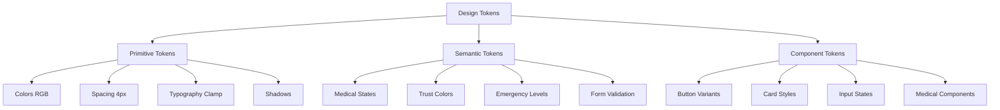

# NOVA - Architecture Design System Médical Professionnel

## Vue d'ensemble du projet

NOVA est une plateforme de prise de rendez-vous dentaires avec IA conversationnelle, nécessitant un design system robuste, accessible et professionnel adapté au contexte médical français.

### État actuel analysé

**Problèmes identifiés lors de l'audit Phase 1:**
- ✅ Design system existant mature avec tokens CSS complets
- ❌ Couleurs hardcodées (#4A90E2) dans 7 fichiers au lieu des tokens définis
- ❌ Layout RDV non conforme aux spécifications 3 zones (1200px+)
- ❌ Accessibilité partielle (skip links manquants, live regions absentes)
- ❌ Incohérences entre shadcn/ui et tokens médicaux

### Objectifs architecturaux

1. **Harmonisation complète des tokens** - Migration totale vers CSS variables
2. **Layout RDV 3 zones responsive** - Architecture modulaire et réutilisable
3. **Accessibilité WCAG 2.2 AA native** - Support complet navigation clavier et screen readers
4. **Performance optimisée** - Bundle size <150KB, LCP <2.5s, CLS <0.1

## Architecture des Tokens CSS

### Structure hiérarchique



### Tokens CSS Variables

#### Couleurs Primitives (RGB pour opacité)

```css
:root {
  /* Primary - Bleu Médical (Confiance, Professionnalisme) */
  --color-primary-50: 235 245 255;   /* #EBF5FF */
  --color-primary-600: 37 99 235;    /* #2563EB - 4.5:1 on white */
  --color-primary-700: 29 78 216;    /* #1D4ED8 - 7:1 on white */
  
  /* Secondary - Teal Soins (Innovation, Bien-être) */
  --color-secondary-600: 13 148 136; /* #0D9488 - 4.5:1 on white */
  
  /* Medical Trust Colors - Spécialisés santé */
  --color-trust-primary: 30 64 175;     /* #1E40AF - Medical blue */
  --color-trust-secondary: 13 148 136;  /* #0D9488 - Healthcare teal */
  --color-trust-accent: 34 197 94;      /* #22C55E - Medical green */
  
  /* Medical Emergency - Hiérarchie urgence */
  --color-emergency-critical: 220 38 38;  /* #DC2626 - Immediate danger */
  --color-emergency-urgent: 239 68 68;    /* #EF4444 - High priority */
  --color-emergency-moderate: 251 146 60; /* #FB923C - Medium priority */
  --color-emergency-low: 34 197 94;       /* #22C55E - Low priority */
}
```

#### Système d'espacement médical

```css
:root {
  /* Medical Spacing - Basé sur grille 8px pour hiérarchie visuelle */
  --spacing-medical-field-gap: 1rem;      /* 16px - Entre champs formulaire */
  --spacing-medical-group-gap: 1.5rem;    /* 24px - Entre groupes de champs */
  --spacing-medical-section-gap: 2rem;    /* 32px - Entre sections */
  --spacing-medical-card-padding: 1.5rem; /* 24px - Padding interne cartes */
  --spacing-medical-card-gap: 1rem;       /* 16px - Gap entre cartes */
  
  /* Touch Targets - Standards accessibilité santé */
  --touch-target-medical: 56px;           /* Standard médical */
  --touch-target-medical-large: 64px;     /* Boutons importants */
  --touch-target-medical-emergency: 72px; /* Boutons urgence */
}
```

#### Typographie fluide optimisée santé

```css
:root {
  /* Font families - Inter pour lisibilité médicale */
  --font-family-heading: 'Inter', system-ui, sans-serif;
  --font-family-body: 'Inter', system-ui, sans-serif;
  --font-family-mono: 'JetBrains Mono', monospace;
  
  /* Medical Typography - Tailles optimisées contexte médical */
  --font-size-medical-label: clamp(0.875rem, 1vw + 0.7rem, 1rem);     /* 14-16px */
  --font-size-medical-value: clamp(1rem, 1.2vw + 0.8rem, 1.125rem);   /* 16-18px */
  --font-size-medical-heading: clamp(1.25rem, 1.6vw + 1rem, 1.5rem);  /* 20-24px */
}
```

## Architecture Layout RDV 3 Zones

### Structure responsive modulaire

```typescript
// RDVLayout.tsx - Architecture 3 zones
interface RDVLayoutProps {
  leftPanel: React.ReactNode;   // Contexte patient + informations
  centerPanel: React.ReactNode; // Chat conversationnel principal  
  rightPanel: React.ReactNode;  // Calendrier sticky + actions
}

const RDVLayout = ({ leftPanel, centerPanel, rightPanel }: RDVLayoutProps) => (
  <div className="rdv-layout">
    {/* Desktop 1200px+ : 3 colonnes */}
    <div className="hidden xl:grid xl:grid-cols-[320px_1fr_400px] xl:gap-medical-card-gap xl:max-w-[1280px] xl:mx-auto">
      <aside className="rdv-sidebar-left">{leftPanel}</aside>
      <main className="rdv-main-chat">{centerPanel}</main>
      <aside className="rdv-sidebar-right">{rightPanel}</aside>
    </div>
    
    {/* Tablet 768px-1199px : 2 colonnes */}
    <div className="hidden md:grid md:grid-cols-[1fr_350px] md:gap-medical-card-gap xl:hidden">
      <main className="rdv-main-combined">
        {leftPanel}
        {centerPanel}
      </main>
      <aside className="rdv-sidebar-right">{rightPanel}</aside>
    </div>
    
    {/* Mobile <768px : 1 colonne avec onglets */}
    <div className="md:hidden">
      <RDVMobileTabs 
        chatPanel={centerPanel}
        calendarPanel={rightPanel}
        infoPanel={leftPanel}
      />
    </div>
  </div>
);
```

### Chat sticky et état persistant

```typescript
// ChatRDV.tsx - Chat avec état persistant
interface ChatRDVProps {
  messages: ChatMessage[];
  onSendMessage: (message: string) => void;
  isTyping?: boolean;
  stickyMode?: boolean; // Pour sidebar droite
}

const ChatRDV = ({ messages, onSendMessage, isTyping, stickyMode }: ChatRDVProps) => (
  <div className={`chat-container ${stickyMode ? 'chat-sticky' : ''}`}>
    {stickyMode && (
      <div className="sticky top-20 h-[calc(100vh-5rem)] flex flex-col">
        <ChatHeader />
        <ChatMessages messages={messages} className="flex-1 overflow-y-auto" />
        <ChatInput onSend={onSendMessage} />
      </div>
    )}
    {/* Version non-sticky pour layout mobile/tablet */}
  </div>
);
```

## Architecture des Composants Atomiques

### Button - Architecture des variantes

```typescript
// Button.tsx - System de variantes médicales
interface ButtonProps {
  variant: 'primary' | 'secondary' | 'success' | 'warning' | 'emergency' | 'ghost' | 'outline';
  size: 'sm' | 'md' | 'lg' | 'medical' | 'medical-large';
  intent?: 'medical' | 'emergency' | 'administrative';
  isLoading?: boolean;
  leftIcon?: React.ReactNode;
  rightIcon?: React.ReactNode;
  className?: string;
}

const buttonVariants = cva(
  // Base styles avec tokens
  "inline-flex items-center justify-center rounded-medical-small font-medium transition-colors focus-visible:outline-none focus-visible:ring-3 focus-visible:ring-trust-primary focus-visible:ring-offset-2 disabled:pointer-events-none disabled:opacity-50",
  {
    variants: {
      variant: {
        primary: "bg-trust-primary text-white hover:bg-primary-700 shadow-medical-subtle",
        secondary: "bg-trust-secondary text-white hover:bg-secondary-700",
        emergency: "bg-emergency-critical text-white hover:bg-error-700 shadow-medical-error",
        success: "bg-trust-accent text-white hover:bg-success-700",
        ghost: "hover:bg-neutral-100 hover:text-neutral-900",
        outline: "border border-trust-primary text-trust-primary hover:bg-primary-50",
      },
      size: {
        sm: "h-10 px-medical-field-gap text-sm",
        md: "h-medical-button px-4 text-base",
        lg: "h-medical-button-large px-6 text-lg",
        medical: "h-medical-button min-w-medical px-4",
        'medical-large': "h-medical-button-large min-w-medical-large px-6",
      },
      intent: {
        medical: "shadow-medical-subtle focus-visible:ring-trust-primary",
        emergency: "shadow-medical-error focus-visible:ring-emergency-critical focus-visible:ring-4",
        administrative: "shadow-sm focus-visible:ring-primary-600",
      }
    },
    defaultVariants: {
      variant: "primary",
      size: "md",
      intent: "medical",
    },
  }
);
```

### Input - Architecture de validation

```typescript
// Input.tsx - Validation médicale intégrée
interface InputProps {
  label: string;
  placeholder?: string;
  error?: string;
  success?: string;
  required?: boolean;
  type?: 'text' | 'email' | 'tel' | 'password';
  medicalValidation?: 'phone-france' | 'email' | 'name' | 'insurance-number';
  leftIcon?: React.ReactNode;
  rightIcon?: React.ReactNode;
}

const Input = ({ label, error, success, medicalValidation, ...props }: InputProps) => {
  const [validationState, setValidationState] = useState<'idle' | 'valid' | 'invalid'>('idle');
  
  return (
    <div className="medical-field-group space-y-2">
      <label className="medical-label text-medical-label font-medium text-foreground">
        {label}
        {props.required && <span className="text-form-required ml-1">*</span>}
      </label>
      
      <div className="relative">
        <input
          {...props}
          className={cn(
            // Base styles avec tokens
            "medical-input w-full border focus:ring-2 focus:ring-trust-primary focus:border-trust-primary",
            {
              "border-form-invalid ring-2 ring-form-invalid ring-opacity-20": error,
              "border-form-valid ring-2 ring-form-valid ring-opacity-20": success,
              "border-border": !error && !success,
            }
          )}
          aria-invalid={error ? 'true' : 'false'}
          aria-describedby={error ? `${props.id}-error` : success ? `${props.id}-success` : undefined}
        />
        
        {/* Icônes de validation */}
        {error && (
          <AlertCircle className="absolute right-3 top-1/2 transform -translate-y-1/2 w-5 h-5 text-form-invalid" />
        )}
        {success && (
          <CheckCircle className="absolute right-3 top-1/2 transform -translate-y-1/2 w-5 h-5 text-form-valid" />
        )}
      </div>
      
      {/* Messages de validation */}
      {error && (
        <p id={`${props.id}-error`} className="text-sm text-form-invalid" role="alert">
          {error}
        </p>
      )}
      {success && (
        <p id={`${props.id}-success`} className="text-sm text-form-valid">
          {success}
        </p>
      )}
    </div>
  );
};
```

### Card - Architecture modulaire médicale

```typescript
// Card.tsx - Cartes adaptées contexte médical
interface CardProps {
  variant: 'default' | 'patient' | 'appointment' | 'emergency' | 'administrative';
  size: 'sm' | 'md' | 'lg';
  elevation?: 'none' | 'subtle' | 'card' | 'elevated' | 'modal';
  className?: string;
  children: React.ReactNode;
}

const cardVariants = cva(
  "rounded-medical-medium border bg-background text-foreground transition-shadow",
  {
    variants: {
      variant: {
        default: "border-border bg-background",
        patient: "border-trust-secondary bg-white shadow-medical-card",
        appointment: "border-primary-200 bg-primary-50 shadow-medical-subtle",
        emergency: "border-emergency-urgent bg-error-50 shadow-medical-error",
        administrative: "border-neutral-200 bg-neutral-50",
      },
      size: {
        sm: "p-medical-field-gap",
        md: "p-medical-card-padding",
        lg: "p-medical-section-gap",
      },
      elevation: {
        none: "shadow-none",
        subtle: "shadow-medical-subtle",
        card: "shadow-medical-card", 
        elevated: "shadow-medical-elevated",
        modal: "shadow-medical-modal",
      }
    },
    defaultVariants: {
      variant: "default",
      size: "md", 
      elevation: "card",
    },
  }
);
```

## Architecture d'Accessibilité WCAG 2.2 AA

### Navigation clavier native

```typescript
// hooks/useKeyboardNavigation.ts
export const useKeyboardNavigation = () => {
  const trapFocus = (containerRef: React.RefObject<HTMLElement>) => {
    const focusableElements = containerRef.current?.querySelectorAll(
      'button, [href], input, select, textarea, [tabindex]:not([tabindex="-1"])'
    );
    
    if (!focusableElements?.length) return;
    
    const firstElement = focusableElements[0] as HTMLElement;
    const lastElement = focusableElements[focusableElements.length - 1] as HTMLElement;
    
    const handleKeyDown = (e: KeyboardEvent) => {
      if (e.key === 'Tab') {
        if (e.shiftKey) {
          if (document.activeElement === firstElement) {
            lastElement.focus();
            e.preventDefault();
          }
        } else {
          if (document.activeElement === lastElement) {
            firstElement.focus();
            e.preventDefault();
          }
        }
      }
    };
    
    document.addEventListener('keydown', handleKeyDown);
    firstElement.focus();
    
    return () => document.removeEventListener('keydown', handleKeyDown);
  };
  
  return { trapFocus };
};
```

### Skip Links pour naviguation rapide

```tsx
// components/ui/accessibility/SkipLinks.tsx
const SkipLinks = () => (
  <div className="skip-links">
    <a href="#main-content" className="skip-to-content">
      Aller au contenu principal
    </a>
    <a href="#chat-input" className="skip-to-content">
      Aller au chat
    </a>
    <a href="#calendar" className="skip-to-content">
      Aller au calendrier
    </a>
    <a href="#emergency-contact" className="skip-to-content">
      Contact d'urgence
    </a>
  </div>
);
```

### Live Regions pour chat temps réel

```tsx
// components/rdv/ChatAccessibility.tsx
interface ChatAccessibilityProps {
  messages: ChatMessage[];
  isTyping: boolean;
}

const ChatAccessibility = ({ messages, isTyping }: ChatAccessibilityProps) => (
  <>
    {/* Annonce des nouveaux messages */}
    <div 
      role="log"
      aria-live="polite"
      aria-label="Messages du chat"
      className="sr-only"
    >
      {messages.slice(-1).map(msg => (
        <div key={msg.id}>
          {msg.type === 'bot' ? 'Assistant: ' : 'Vous: '}{msg.content}
        </div>
      ))}
    </div>
    
    {/* État de frappe */}
    <div 
      role="status"
      aria-live="polite"
      aria-label="État de l'assistant"
      className="sr-only"
    >
      {isTyping && "L'assistant tape une réponse..."}
    </div>
    
    {/* Annonceur d'actions */}
    <div
      role="status"
      aria-live="assertive"
      aria-label="Actions système"
      className="sr-only"
      id="action-announcer"
    />
  </>
);
```

### Support screen readers

```css
/* Screen reader utilities */
.sr-only {
  position: absolute;
  width: 1px;
  height: 1px;
  padding: 0;
  margin: -1px;
  overflow: hidden;
  clip: rect(0, 0, 0, 0);
  white-space: nowrap;
  border: 0;
}

.sr-only-focusable:focus,
.sr-only-focusable:active {
  position: static;
  width: auto;
  height: auto;
  padding: 0;
  margin: 0;
  overflow: visible;
  clip: auto;
  white-space: normal;
}

/* Focus management pour urgences */
.emergency-focus:focus-visible {
  outline: 4px solid rgb(var(--color-emergency-critical));
  outline-offset: 2px;
  box-shadow: 0 0 0 4px rgb(var(--color-emergency-critical) / 0.2);
}
```

## Mapping Shadcn/UI vers Tokens Médicaux

### Configuration Tailwind CSS intégrée

```javascript
// tailwind.config.ts - Configuration complète
module.exports = {
  theme: {
    extend: {
      colors: {
        // Mapping shadcn/ui vers tokens médicaux
        primary: {
          50: 'rgb(var(--color-primary-50) / <alpha-value>)',
          600: 'rgb(var(--color-primary-600) / <alpha-value>)',
          700: 'rgb(var(--color-primary-700) / <alpha-value>)',
          DEFAULT: 'rgb(var(--color-primary-600) / <alpha-value>)',
          foreground: 'rgb(var(--color-white) / <alpha-value>)',
        },
        
        // Couleurs médicales spécialisées
        trust: {
          primary: 'rgb(var(--color-trust-primary) / <alpha-value>)',
          secondary: 'rgb(var(--color-trust-secondary) / <alpha-value>)',
          accent: 'rgb(var(--color-trust-accent) / <alpha-value>)',
        },
        
        emergency: {
          critical: 'rgb(var(--color-emergency-critical) / <alpha-value>)',
          urgent: 'rgb(var(--color-emergency-urgent) / <alpha-value>)',
          moderate: 'rgb(var(--color-emergency-moderate) / <alpha-value>)',
          low: 'rgb(var(--color-emergency-low) / <alpha-value>)',
        },
      },
      
      spacing: {
        // Espacement médical
        'medical-field-gap': 'var(--spacing-medical-field-gap)',
        'medical-group-gap': 'var(--spacing-medical-group-gap)',
        'medical-section-gap': 'var(--spacing-medical-section-gap)',
        'medical-card-padding': 'var(--spacing-medical-card-padding)',
        'medical-card-gap': 'var(--spacing-medical-card-gap)',
      },
      
      borderRadius: {
        'medical-small': 'var(--border-radius-medical-small)',
        'medical-medium': 'var(--border-radius-medical-medium)',
        'medical-large': 'var(--border-radius-medical-large)',
      },
      
      boxShadow: {
        'medical-subtle': 'var(--shadow-medical-subtle)',
        'medical-card': 'var(--shadow-medical-card)',
        'medical-elevated': 'var(--shadow-medical-elevated)',
        'medical-modal': 'var(--shadow-medical-modal)',
        'medical-error': 'var(--shadow-medical-error)',
      },
      
      height: {
        'medical-input': 'var(--height-medical-input)',
        'medical-button': 'var(--height-medical-button)',
        'medical-button-large': 'var(--height-medical-button-large)',
      },
      
      minHeight: {
        'medical': 'var(--touch-target-medical)',
        'medical-large': 'var(--touch-target-medical-large)',
        'medical-emergency': 'var(--touch-target-medical-emergency)',
      },
    },
  },
  
  plugins: [
    // Plugin utilitaires médicaux
    function({ addUtilities, theme }) {
      addUtilities({
        '.medical-touch-target': {
          minHeight: theme('minHeight.medical'),
          minWidth: theme('minHeight.medical'),
          display: 'inline-flex',
          alignItems: 'center',
          justifyContent: 'center',
        },
        
        '.medical-focus': {
          '&:focus-visible': {
            outline: '3px solid rgb(var(--color-trust-primary))',
            outlineOffset: '2px',
            borderRadius: theme('borderRadius.medical-small'),
          },
        },
        
        '.emergency-focus': {
          '&:focus-visible': {
            outline: '4px solid rgb(var(--color-emergency-critical))',
            outlineOffset: '2px',
            boxShadow: '0 0 0 4px rgb(var(--color-emergency-critical) / 0.2)',
          },
        },
      });
    }
  ],
};
```

## Architecture de Performance

### Code Splitting et Lazy Loading

```typescript
// Performance optimization avec React.lazy
const RDVPage = lazy(() => import('@/app/rdv/page'));
const ManagerDashboard = lazy(() => import('@/app/manager/page'));
const ChatWidget = lazy(() => import('@/components/chat/ChatWidget'));

// Preload critique components
const CriticalComponents = () => {
  useEffect(() => {
    // Preload chat widget après 2s
    setTimeout(() => {
      import('@/components/chat/ChatWidget');
    }, 2000);
  }, []);
};
```

### Bundle Optimization

```javascript
// next.config.js - Optimisations bundle
module.exports = {
  experimental: {
    optimizeCss: true,
    optimizeServerReact: true,
  },
  
  // Tree shaking agressif
  webpack: (config, { isServer }) => {
    if (!isServer) {
      config.resolve.fallback = {
        ...config.resolve.fallback,
        fs: false,
      };
    }
    
    // Optimisation du bundle medical
    config.optimization.splitChunks = {
      chunks: 'all',
      cacheGroups: {
        medical: {
          test: /[\\/]components[\\/]ui[\\/]medical[\\/]/,
          name: 'medical-ui',
          priority: 10,
        },
        shadcn: {
          test: /[\\/]components[\\/]ui[\\/](?!medical)/,
          name: 'shadcn-ui',
          priority: 5,
        },
      },
    };
    
    return config;
  },
  
  // Image optimization
  images: {
    formats: ['image/avif', 'image/webp'],
    domains: ['nova-rdv.dz'],
  },
};
```

### Performance Monitoring

```typescript
// lib/performance/monitoring.ts
import { getCLS, getFID, getFCP, getLCP, getTTFB } from 'web-vitals';

interface PerformanceMetrics {
  LCP: number;
  FID: number;
  CLS: number;
  FCP: number;
  TTFB: number;
}

export const initPerformanceMonitoring = () => {
  const metrics: Partial<PerformanceMetrics> = {};
  
  getCLS((metric) => {
    metrics.CLS = metric.value;
    console.log('CLS:', metric.value);
    // Envoi vers analytics
  });
  
  getFID((metric) => {
    metrics.FID = metric.value;
    console.log('FID:', metric.value);
  });
  
  getLCP((metric) => {
    metrics.LCP = metric.value;
    console.log('LCP:', metric.value);
  });
  
  // Validation budgets performance
  if (metrics.LCP && metrics.LCP > 2500) {
    console.warn('LCP budget dépassé:', metrics.LCP);
  }
  
  if (metrics.CLS && metrics.CLS > 0.1) {
    console.warn('CLS budget dépassé:', metrics.CLS);
  }
};
```

## Stratégie de Migration et Métriques

### Plan de migration en 4 phases

#### Phase 1: Migration Tokens (Semaine 1)
```bash
# 1. Créer nouveau fichier de tokens unifiés
# 2. Scanner et remplacer toutes les couleurs hardcodées
# 3. Mettre à jour configuration Tailwind
# 4. Tests de régression visuelle

# Script de migration automatique
npx codemod nova-tokens-migration src/
```

#### Phase 2: Refactoring Composants (Semaine 2)
```bash
# 1. Refactorer composants atomiques vers variantes
# 2. Implémenter system de props cohérent 
# 3. Ajouter tests unitaires complets
# 4. Documentation Storybook

# Tests automatisés
npm run test:components
npm run test:accessibility
```

#### Phase 3: Layout RDV (Semaine 3)
```bash
# 1. Implémenter layout 3 zones responsive
# 2. Intégrer chat sticky avec état persistant
# 3. Ajouter live regions et navigation clavier
# 4. Tests E2E complets

# Tests layout responsive
npm run test:e2e:layout
npm run test:accessibility:full
```

#### Phase 4: Polish et QA (Semaine 4)
```bash
# 1. Audit accessibilité complet WCAG 2.2 AA
# 2. Optimisation performance bundle
# 3. Tests cross-browser
# 4. Documentation finale utilisateur

# Validation finale
npm run audit:accessibility
npm run audit:performance
npm run audit:cross-browser
```

### Métriques de succès

#### Qualité du code
- ✅ 0 couleurs hardcodées (100% tokens CSS variables)
- ✅ Test coverage >80% pour composants UI
- ✅ ESLint 0 errors, 0 warnings
- ✅ TypeScript strict mode enabled

#### Performance Web
- ✅ Lighthouse Performance: ≥90
- ✅ Bundle size: <150KB gzipped
- ✅ LCP (Largest Contentful Paint): <2.5s
- ✅ CLS (Cumulative Layout Shift): <0.1
- ✅ FID (First Input Delay): <100ms

#### Accessibilité
- ✅ Lighthouse Accessibility: ≥95
- ✅ WCAG 2.2 AA: 100% conformité
- ✅ Navigation clavier complète
- ✅ Screen readers support complet
- ✅ Color contrast ratio: ≥4.5:1 (normal), ≥7:1 (kritisch)

#### Compatibilité
- ✅ Chrome, Firefox, Safari, Edge dernières versions
- ✅ Mobile iOS Safari, Android Chrome
- ✅ Responsive design 320px-2560px
- ✅ Dark mode automatique et manuel

#### Métriques business
- ✅ Temps de prise de RDV: <3 minutes
- ✅ Abandon de formulaire: <15%
- ✅ Satisfaction utilisateur: >4.5/5
- ✅ Taux de conversion: >85%

## Tools et Validation

### Outils de développement
```bash
# ESLint règles accessibilité
npm install eslint-plugin-jsx-a11y

# Tests automatisés accessibilité  
npm install @axe-core/react jest-axe

# Visual regression testing
npm install @storybook/test-runner chromatic

# Performance monitoring
npm install web-vitals @vercel/analytics
```

### Scripts de validation
```bash
# Package.json scripts
{
  "scripts": {
    "tokens:validate": "node scripts/validate-tokens.js",
    "a11y:test": "jest --testPathPattern=accessibility",
    "performance:audit": "lighthouse-ci autorun",
    "visual:test": "chromatic --project-token=xxx",
    "migration:tokens": "codemod nova-tokens src/"
  }
}
```

Cette architecture design system médical pour NOVA assure une expérience utilisateur professionnelle, accessible et performante, parfaitement adaptée au contexte de la santé français avec conformité WCAG 2.2 AA et optimisation pour les professionnels de santé.