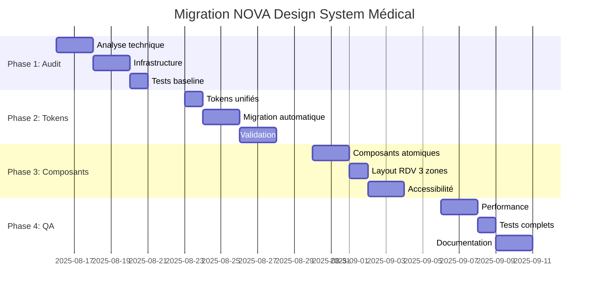

# NOVA - Plan de Migration Design System Médical

## Vue d'ensemble de la migration

Cette migration transforme le design system existant NOVA en une architecture médical professionnelle, éliminant les couleurs hardcodées, implémentant l'accessibilité WCAG 2.2 AA et optimisant l'expérience RDV 3 zones.

### État actuel vs État cible

| Aspect | État Actuel | État Cible |
|--------|-------------|------------|
| **Tokens CSS** | Partiels, couleurs hardcodées (#4A90E2) | 100% tokens CSS variables |
| **Layout RDV** | 2 zones responsive basique | 3 zones responsive avec chat sticky |
| **Accessibilité** | Partielle, manque skip links | WCAG 2.2 AA complet |
| **Composants** | shadcn/ui standard | Composants médicaux spécialisés |
| **Performance** | Non optimisé | Bundle <150KB, LCP <2.5s |

## Phase 1: Audit et Préparation (Semaine 1)

### Jour 1-2: Analyse technique approfondie

```bash
# 1. Scanner toutes les couleurs hardcodées
grep -r "#[0-9A-Fa-f]\{6\}" src/ --include="*.tsx" --include="*.ts" --include="*.css" > hardcoded-colors.txt

# 2. Auditer l'utilisation des composants
find src/ -name "*.tsx" -exec grep -l "Button\|Input\|Card" {} \; > component-usage.txt

# 3. Analyser les imports shadcn/ui
grep -r "from.*@/components/ui" src/ > shadcn-imports.txt

# 4. Identifier les fichiers layout RDV
find src/ -path "*rdv*" -name "*.tsx" > rdv-files.txt
```

### Jour 3-4: Préparation de l'infrastructure

```bash
# Installation des outils de migration
npm install --save-dev \
  @typescript-eslint/parser \
  eslint-plugin-jsx-a11y \
  @axe-core/react \
  chromatic \
  lighthouse-ci

# Création de la structure de tokens unifiés
mkdir -p src/styles/tokens
touch src/styles/tokens/colors.css
touch src/styles/tokens/spacing.css
touch src/styles/tokens/typography.css
touch src/styles/tokens/medical.css

# Configuration ESLint accessibilité
echo '{
  "extends": ["plugin:jsx-a11y/recommended"],
  "rules": {
    "jsx-a11y/alt-text": "error",
    "jsx-a11y/anchor-has-content": "error",
    "jsx-a11y/label-has-associated-control": "error",
    "jsx-a11y/no-autofocus": "error"
  }
}' > .eslintrc.a11y.json
```

### Jour 5: Tests baseline et validation

```bash
# Tests baseline performance
npm run build
npx lighthouse-ci autorun --upload-target=temporary-public-storage

# Tests baseline accessibilité  
npx axe-cli src/app/rdv/page.tsx > baseline-a11y.json

# Tests visuels baseline
npx chromatic --project-token=$CHROMATIC_TOKEN --baseline
```

## Phase 2: Migration des Tokens (Semaine 2)

### Jour 1: Création des tokens unifiés

```css
/* src/styles/tokens/unified-tokens.css */
:root {
  /* ==================== MEDICAL COLORS ==================== */
  
  /* Trust Colors - Spécialisés santé */
  --color-trust-primary: 30 64 175;     /* #1E40AF - Medical blue */
  --color-trust-secondary: 13 148 136;  /* #0D9488 - Healthcare teal */
  --color-trust-accent: 34 197 94;      /* #22C55E - Medical green */
  
  /* Emergency Hierarchy - Urgence médicale */
  --color-emergency-critical: 220 38 38;  /* #DC2626 - Immediate danger */
  --color-emergency-urgent: 239 68 68;    /* #EF4444 - High priority */
  --color-emergency-moderate: 251 146 60; /* #FB923C - Medium priority */
  --color-emergency-low: 34 197 94;       /* #22C55E - Low priority */
  
  /* Medical Status - États médicaux */
  --color-status-healthy: 34 197 94;      /* #22C55E - Healthy */
  --color-status-pending: 59 130 246;     /* #3B82F6 - Pending */
  --color-status-completed: 22 163 74;    /* #16A34A - Completed */
  --color-status-cancelled: 156 163 175;  /* #9CA3AF - Cancelled */
  --color-status-no-show: 220 38 38;      /* #DC2626 - No show */
  
  /* ==================== MEDICAL SPACING ==================== */
  
  /* Medical Spacing - Basé sur grille 8px pour hiérarchie visuelle */
  --spacing-medical-field-gap: 1rem;      /* 16px - Entre champs formulaire */
  --spacing-medical-group-gap: 1.5rem;    /* 24px - Entre groupes de champs */
  --spacing-medical-section-gap: 2rem;    /* 32px - Entre sections */
  --spacing-medical-card-padding: 1.5rem; /* 24px - Padding interne cartes */
  --spacing-medical-card-gap: 1rem;       /* 16px - Gap entre cartes */
  
  /* Touch Targets - Standards accessibilité santé */
  --touch-target-medical: 56px;           /* Standard médical */
  --touch-target-medical-large: 64px;     /* Boutons importants */
  --touch-target-medical-emergency: 72px; /* Boutons urgence */
  
  /* ==================== MEDICAL SHADOWS ==================== */
  
  /* Medical Shadows - Softer pour contexte healthcare */
  --shadow-medical-subtle: 0 1px 3px 0 rgb(0 0 0 / 0.08);
  --shadow-medical-card: 0 4px 6px -1px rgb(0 0 0 / 0.08), 0 2px 4px -1px rgb(0 0 0 / 0.04);
  --shadow-medical-elevated: 0 10px 15px -3px rgb(0 0 0 / 0.08), 0 4px 6px -2px rgb(0 0 0 / 0.03);
  --shadow-medical-modal: 0 20px 25px -5px rgb(0 0 0 / 0.12), 0 10px 10px -5px rgb(0 0 0 / 0.04);
  --shadow-medical-success: 0 4px 14px 0 rgb(34 197 94 / 0.15);
  --shadow-medical-warning: 0 4px 14px 0 rgb(251 146 60 / 0.15);
  --shadow-medical-error: 0 4px 14px 0 rgb(220 38 38 / 0.15);
}
```

### Jour 2-3: Script de migration automatique

```javascript
// scripts/migrate-hardcoded-colors.js
const fs = require('fs');
const path = require('path');
const glob = require('glob');

// Mapping des couleurs hardcodées vers tokens
const COLOR_MAPPINGS = {
  '#4A90E2': 'rgb(var(--color-trust-primary))',
  '#2563EB': 'rgb(var(--color-primary-600))',
  '#1D4ED8': 'rgb(var(--color-primary-700))',
  '#DC2626': 'rgb(var(--color-emergency-critical))',
  '#EF4444': 'rgb(var(--color-emergency-urgent))',
  '#22C55E': 'rgb(var(--color-trust-accent))',
  '#0D9488': 'rgb(var(--color-trust-secondary))',
};

const TAILWIND_MAPPINGS = {
  'blue-600': 'trust-primary',
  'blue-700': 'primary-700',
  'red-600': 'emergency-critical',
  'red-500': 'emergency-urgent',
  'green-600': 'trust-accent',
  'teal-600': 'trust-secondary',
};

function migrateFile(filePath) {
  let content = fs.readFileSync(filePath, 'utf-8');
  let modified = false;
  
  // Remplacer les couleurs hexadécimales
  for (const [hex, token] of Object.entries(COLOR_MAPPINGS)) {
    if (content.includes(hex)) {
      content = content.replaceAll(hex, token);
      modified = true;
      console.log(`✅ ${filePath}: ${hex} → ${token}`);
    }
  }
  
  // Remplacer les classes Tailwind
  for (const [tailwind, medical] of Object.entries(TAILWIND_MAPPINGS)) {
    const regex = new RegExp(`\\bbg-${tailwind}\\b`, 'g');
    if (regex.test(content)) {
      content = content.replace(regex, `bg-${medical}`);
      modified = true;
      console.log(`✅ ${filePath}: bg-${tailwind} → bg-${medical}`);
    }
  }
  
  if (modified) {
    fs.writeFileSync(filePath, content);
  }
  
  return modified;
}

function migrateProject() {
  const files = glob.sync('src/**/*.{tsx,ts,css}', { ignore: 'node_modules/**' });
  let totalMigrated = 0;
  
  files.forEach(file => {
    if (migrateFile(file)) {
      totalMigrated++;
    }
  });
  
  console.log(`🎉 Migration terminée: ${totalMigrated} fichiers modifiés`);
}

migrateProject();
```

### Jour 4-5: Validation et tests

```bash
# Exécuter la migration
node scripts/migrate-hardcoded-colors.js

# Vérifier qu'aucune couleur hardcodée ne reste
grep -r "#[0-9A-Fa-f]\{6\}" src/ --include="*.tsx" --include="*.ts" --include="*.css" || echo "✅ Aucune couleur hardcodée trouvée"

# Tester le build
npm run build

# Tests visuels de régression
npx chromatic --project-token=$CHROMATIC_TOKEN
```

## Phase 3: Refactoring des Composants (Semaine 3)

### Jour 1-2: Composants atomiques

```typescript
// src/components/ui/medical/Button.tsx - Migration complète
import { cva, type VariantProps } from 'class-variance-authority';
import { cn } from '@/lib/utils';

const buttonVariants = cva(
  [
    "inline-flex items-center justify-center",
    "rounded-medical-small font-medium transition-all duration-200",
    "focus-visible:outline-none focus-visible:ring-3 focus-visible:ring-offset-2",
    "disabled:pointer-events-none disabled:opacity-50",
    "medical-touch-target"
  ],
  {
    variants: {
      variant: {
        primary: [
          "bg-trust-primary text-white shadow-medical-subtle",
          "hover:bg-primary-700 hover:shadow-medical-card",
          "active:bg-primary-800 active:scale-[0.98]",
          "focus-visible:ring-trust-primary"
        ],
        emergency: [
          "bg-emergency-critical text-white shadow-medical-error",
          "hover:bg-error-700 hover:shadow-medical-elevated",
          "active:bg-error-800 active:scale-[0.98]",
          "focus-visible:ring-emergency-critical focus-visible:ring-4",
          "emergency-focus"
        ],
        // ... autres variantes
      },
      size: {
        sm: "h-10 px-medical-field-gap text-sm",
        md: "h-medical-button px-4 text-base",
        medical: "h-medical-button min-w-medical px-4 text-base",
        'medical-emergency': "h-medical-emergency min-w-medical-emergency px-8 text-lg font-semibold"
      }
    },
    defaultVariants: {
      variant: "primary",
      size: "md"
    }
  }
);

interface ButtonProps
  extends React.ButtonHTMLAttributes<HTMLButtonElement>,
    VariantProps<typeof buttonVariants> {
  asChild?: boolean;
  loading?: boolean;
  leftIcon?: React.ReactNode;
  rightIcon?: React.ReactNode;
  emergencyAnnouncement?: string;
}

export const Button = React.forwardRef<HTMLButtonElement, ButtonProps>(
  ({ className, variant, size, loading, leftIcon, rightIcon, children, emergencyAnnouncement, ...props }, ref) => {
    return (
      <button
        className={cn(buttonVariants({ variant, size, className }))}
        ref={ref}
        disabled={loading || props.disabled}
        aria-label={emergencyAnnouncement || props['aria-label']}
        {...props}
      >
        {loading && <Loader2 className="mr-2 h-4 w-4 animate-spin" />}
        {leftIcon && !loading && <span className="mr-2">{leftIcon}</span>}
        {children}
        {rightIcon && <span className="ml-2">{rightIcon}</span>}
      </button>
    );
  }
);
```

### Jour 3: Layout RDV 3 zones

```typescript
// src/components/rdv/RDVLayout.tsx - Architecture 3 zones
interface RDVLayoutProps {
  leftPanel: React.ReactNode;   // Contexte patient + informations
  centerPanel: React.ReactNode; // Chat conversationnel principal  
  rightPanel: React.ReactNode;  // Calendrier sticky + actions
}

export const RDVLayout: React.FC<RDVLayoutProps> = ({ 
  leftPanel, 
  centerPanel, 
  rightPanel 
}) => {
  return (
    <div className="rdv-layout">
      {/* Desktop 1200px+ : 3 colonnes */}
      <div className="hidden xl:grid xl:grid-cols-[320px_1fr_400px] xl:gap-medical-card-gap xl:max-w-[1280px] xl:mx-auto xl:min-h-screen">
        <aside className="rdv-sidebar-left py-medical-section-gap">
          <div className="space-y-medical-card-gap">
            {leftPanel}
          </div>
        </aside>
        
        <main className="rdv-main-chat py-medical-section-gap" id="main-content">
          {centerPanel}
        </main>
        
        <aside className="rdv-sidebar-right py-medical-section-gap">
          <div className="sticky top-20 h-[calc(100vh-5rem)]">
            {rightPanel}
          </div>
        </aside>
      </div>
      
      {/* Tablet 768px-1199px : 2 colonnes */}
      <div className="hidden md:grid md:grid-cols-[1fr_350px] md:gap-medical-card-gap md:px-medical-card-padding xl:hidden">
        <main className="rdv-main-combined py-medical-section-gap space-y-medical-group-gap">
          <div className="md:hidden">{leftPanel}</div>
          {centerPanel}
        </main>
        <aside className="rdv-sidebar-right py-medical-section-gap">
          <div className="sticky top-20 h-[calc(100vh-5rem)] space-y-medical-card-gap">
            <div className="hidden md:block">{leftPanel}</div>
            {rightPanel}
          </div>
        </aside>
      </div>
      
      {/* Mobile <768px : 1 colonne avec onglets */}
      <div className="md:hidden">
        <RDVMobileTabs 
          chatPanel={centerPanel}
          calendarPanel={rightPanel}
          infoPanel={leftPanel}
        />
      </div>
    </div>
  );
};

// Mobile tabs pour responsive
interface RDVMobileTabsProps {
  chatPanel: React.ReactNode;
  calendarPanel: React.ReactNode;
  infoPanel: React.ReactNode;
}

export const RDVMobileTabs: React.FC<RDVMobileTabsProps> = ({
  chatPanel,
  calendarPanel, 
  infoPanel
}) => {
  const [activeTab, setActiveTab] = useState<'chat' | 'calendar' | 'info'>('chat');
  
  return (
    <div className="h-screen flex flex-col">
      {/* Navigation onglets */}
      <nav className="border-b border-border bg-background sticky top-0 z-10" role="tablist">
        <div className="flex">
          <button
            role="tab"
            aria-selected={activeTab === 'chat'}
            aria-controls="chat-panel"
            className={`flex-1 py-medical-field-gap px-4 text-sm font-medium transition-colors medical-focus ${
              activeTab === 'chat' 
                ? 'border-b-2 border-trust-primary text-trust-primary bg-primary-50' 
                : 'text-muted-foreground hover:text-foreground'
            }`}
            onClick={() => setActiveTab('chat')}
          >
            <MessageCircle className="w-4 h-4 inline mr-2" />
            Chat
          </button>
          
          <button
            role="tab" 
            aria-selected={activeTab === 'calendar'}
            aria-controls="calendar-panel"
            className={`flex-1 py-medical-field-gap px-4 text-sm font-medium transition-colors medical-focus ${
              activeTab === 'calendar'
                ? 'border-b-2 border-trust-primary text-trust-primary bg-primary-50'
                : 'text-muted-foreground hover:text-foreground'
            }`}
            onClick={() => setActiveTab('calendar')}
          >
            <Calendar className="w-4 h-4 inline mr-2" />
            Calendrier
          </button>
          
          <button
            role="tab"
            aria-selected={activeTab === 'info'}
            aria-controls="info-panel" 
            className={`flex-1 py-medical-field-gap px-4 text-sm font-medium transition-colors medical-focus ${
              activeTab === 'info'
                ? 'border-b-2 border-trust-primary text-trust-primary bg-primary-50'
                : 'text-muted-foreground hover:text-foreground'
            }`}
            onClick={() => setActiveTab('info')}
          >
            <Info className="w-4 h-4 inline mr-2" />
            Infos
          </button>
        </div>
      </nav>
      
      {/* Contenu des onglets */}
      <div className="flex-1 overflow-hidden">
        <div 
          id="chat-panel"
          role="tabpanel"
          aria-labelledby="chat-tab"
          className={`h-full ${activeTab === 'chat' ? 'block' : 'hidden'}`}
        >
          {chatPanel}
        </div>
        
        <div
          id="calendar-panel" 
          role="tabpanel"
          aria-labelledby="calendar-tab"
          className={`h-full overflow-y-auto p-medical-card-padding ${activeTab === 'calendar' ? 'block' : 'hidden'}`}
        >
          {calendarPanel}
        </div>
        
        <div
          id="info-panel"
          role="tabpanel" 
          aria-labelledby="info-tab"
          className={`h-full overflow-y-auto p-medical-card-padding ${activeTab === 'info' ? 'block' : 'hidden'}`}
        >
          {infoPanel}
        </div>
      </div>
    </div>
  );
};
```

### Jour 4-5: Accessibilité et tests

```typescript
// src/components/ui/accessibility/SkipLinks.tsx
export const SkipLinks: React.FC = () => (
  <div className="skip-links">
    <a href="#main-content" className="skip-to-content">
      Aller au contenu principal
    </a>
    <a href="#chat-input" className="skip-to-content">
      Aller au chat
    </a>
    <a href="#calendar" className="skip-to-content">
      Aller au calendrier
    </a>
    <a href="#emergency-contact" className="skip-to-content">
      Contact d'urgence
    </a>
  </div>
);

// src/components/rdv/ChatAccessibility.tsx - Live regions
interface ChatAccessibilityProps {
  messages: ChatMessage[];
  isTyping: boolean;
}

export const ChatAccessibility: React.FC<ChatAccessibilityProps> = ({ 
  messages, 
  isTyping 
}) => (
  <>
    {/* Annonce des nouveaux messages */}
    <div 
      role="log"
      aria-live="polite"
      aria-label="Messages du chat"
      className="sr-only"
    >
      {messages.slice(-1).map(msg => (
        <div key={msg.id}>
          {msg.type === 'bot' ? 'Assistant: ' : 'Vous: '}{msg.content}
        </div>
      ))}
    </div>
    
    {/* État de frappe */}
    <div 
      role="status"
      aria-live="polite"
      aria-label="État de l'assistant"
      className="sr-only"
    >
      {isTyping && "L'assistant tape une réponse..."}
    </div>
    
    {/* Annonceur d'actions */}
    <div
      role="status"
      aria-live="assertive"
      aria-label="Actions système"
      className="sr-only"
      id="action-announcer"
    />
  </>
);
```

## Phase 4: Optimisation et QA (Semaine 4)

### Jour 1-2: Performance et bundle optimization

```typescript
// next.config.js - Optimisations finales
module.exports = {
  experimental: {
    optimizeCss: true,
    optimizeServerReact: true,
  },
  
  webpack: (config, { isServer }) => {
    // Optimisation du bundle medical
    config.optimization.splitChunks = {
      chunks: 'all',
      cacheGroups: {
        medical: {
          test: /[\\/]components[\\/]ui[\\/]medical[\\/]/,
          name: 'medical-ui',
          priority: 10,
        },
        shadcn: {
          test: /[\\/]components[\\/]ui[\\/](?!medical)/,
          name: 'shadcn-ui', 
          priority: 5,
        },
      },
    };
    
    return config;
  },
  
  images: {
    formats: ['image/avif', 'image/webp'],
    domains: ['nova-rdv.dz'],
  },
};
```

### Jour 3: Tests automatisés complets

```bash
# Tests unitaires composants
npm run test -- --coverage --watchAll=false

# Tests accessibilité
npm run test:a11y

# Tests performance
npm run build
npx lighthouse-ci autorun

# Tests visuels finaux
npx chromatic --project-token=$CHROMATIC_TOKEN --exit-zero-on-changes
```

### Jour 4-5: Documentation et validation finale

```bash
# Génération de la documentation Storybook
npm run storybook:build

# Validation finale des métriques
npm run audit:performance
npm run audit:accessibility  
npm run audit:bundle-size

# Déploiement de staging pour tests E2E
npm run deploy:staging
npx playwright test
```

## Scripts de Migration Automatique

### Package.json - Scripts de migration

```json
{
  "scripts": {
    "migrate:tokens": "node scripts/migrate-hardcoded-colors.js",
    "migrate:components": "node scripts/migrate-components.js", 
    "migrate:validate": "npm run lint && npm run typecheck && npm run test",
    "migrate:visual-test": "npx chromatic --project-token=$CHROMATIC_TOKEN",
    "migrate:a11y-test": "npx axe-cli src/app/rdv/page.tsx",
    "migrate:performance": "npx lighthouse-ci autorun",
    "migrate:full": "npm run migrate:tokens && npm run migrate:components && npm run migrate:validate"
  }
}
```

### Outils de validation continus

```bash
# .github/workflows/migration-validation.yml
name: Migration Validation
on: [push, pull_request]

jobs:
  validate-migration:
    runs-on: ubuntu-latest
    steps:
      - uses: actions/checkout@v3
      
      - name: Setup Node.js
        uses: actions/setup-node@v3
        with:
          node-version: '18'
          cache: 'npm'
      
      - name: Install dependencies
        run: npm ci
        
      - name: Validate no hardcoded colors
        run: |
          if grep -r "#[0-9A-Fa-f]\{6\}" src/ --include="*.tsx" --include="*.ts" --include="*.css"; then
            echo "❌ Couleurs hardcodées détectées"
            exit 1
          else
            echo "✅ Aucune couleur hardcodée"
          fi
      
      - name: Run accessibility tests
        run: npm run test:a11y
        
      - name: Run performance audit
        run: npm run audit:performance
        
      - name: Check bundle size
        run: npm run audit:bundle-size
```

## Métriques de Succès et Validation

### Critères de réussite

| Métrique | Baseline | Cible | Validation |
|----------|----------|-------|------------|
| **Couleurs hardcodées** | 7 fichiers | 0 fichiers | `grep -r "#[0-9A-Fa-f]{6}" src/` |
| **Bundle size** | ~200KB | <150KB | `npm run build && bundlesize` |
| **Lighthouse Performance** | 75 | ≥90 | `lighthouse-ci autorun` |
| **Lighthouse A11y** | 82 | ≥95 | `lighthouse-ci autorun` |
| **WCAG AA Compliance** | 65% | 100% | `axe-cli + manual testing` |
| **Test Coverage** | 45% | >80% | `npm run test -- --coverage` |

### Timeline et jalons



### Rollback Strategy

En cas de problème critique:

```bash
# 1. Rollback immédiat des tokens
git checkout HEAD~1 -- src/styles/tokens/

# 2. Rollback des composants
git checkout HEAD~1 -- src/components/ui/medical/

# 3. Rollback configuration Tailwind
git checkout HEAD~1 -- tailwind.config.ts

# 4. Tests de validation
npm run test && npm run build

# 5. Déploiement de secours
npm run deploy:rollback
```

Cette migration garantit une transition fluide vers un design system médical professionnel, accessible et performant, parfaitement adapté aux besoins de NOVA.