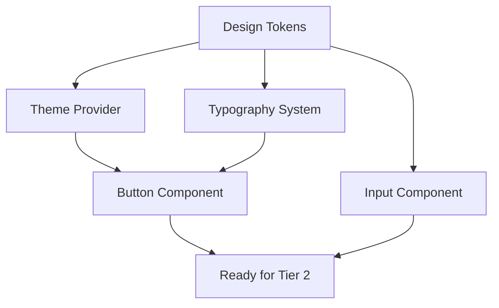
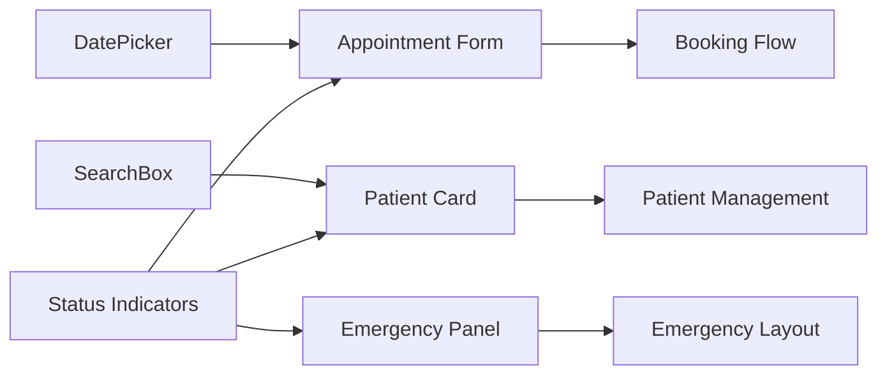

# Component Priority Matrix - NOVA RDV Medical Design System

## Executive Summary

This priority matrix systematically evaluates all components in the NOVA medical design system based on four critical dimensions: Impact, Effort, Dependencies, and Medical Criticality. The matrix guides development sequencing to maximize value delivery while minimizing risk and ensuring medical compliance.

## Evaluation Methodology

### Scoring Dimensions

#### 1. Impact (1-5)
Measures user-facing importance and business value
- **5**: Critical user journey components (Emergency buttons, Primary CTAs)
- **4**: High-value features (Appointment booking, Patient forms)
- **3**: Important but not critical (Navigation, Search)
- **2**: Supporting components (Cards, Labels)
- **1**: Nice-to-have enhancements (Animations, Decorative elements)

#### 2. Effort (1-5)
Estimates development complexity and time required
- **5**: Highly complex (Calendar widget, Complex forms)
- **4**: Moderately complex (Data tables, Multi-step wizards)
- **3**: Standard complexity (Form fields, Modals)
- **2**: Simple components (Buttons, Inputs)
- **1**: Trivial components (Typography, Icons)

#### 3. Dependencies (1-5)
Identifies blocking relationships with other components
- **5**: Blocks many components (Design tokens, Theme system)
- **4**: Blocks several components (Base atoms like Button, Input)
- **3**: Blocks some components (Molecules like FormField)
- **2**: Minimal blocking (Specific organisms)
- **1**: No blocking dependencies (Independent features)

#### 4. Medical Criticality (1-5)
Evaluates importance for healthcare delivery and compliance
- **5**: Life-critical features (Emergency access, Urgent booking)
- **4**: Essential medical functions (Appointment management, Patient data)
- **3**: Important healthcare features (Medical forms, Status indicators)
- **2**: Supporting medical workflow (Navigation, Search)
- **1**: General platform features (Marketing, General UI)

### Priority Score Calculation
```
Priority Score = (Impact × 0.3) + (Dependencies × 0.3) + (Medical Criticality × 0.25) + (Effort × -0.15)
```
*Note: Effort has negative weight as lower effort increases priority*

## Component Priority Matrix

### Tier 1: Critical Foundation (Priority Score 4.0+)
**Development Priority**: Immediate (Week 1-2)

| Component | Impact | Effort | Dependencies | Medical | Priority | Rationale |
|-----------|--------|--------|--------------|---------|----------|-----------|
| **Design Tokens** | 5 | 2 | 5 | 4 | 4.7 | Foundation for entire system |
| **Theme Provider** | 4 | 3 | 5 | 3 | 4.25 | Enables all theming and accessibility |
| **Button Component** | 5 | 2 | 4 | 4 | 4.4 | Core interaction element |
| **Typography System** | 4 | 2 | 4 | 4 | 4.1 | Medical readability foundation |
| **Input Component** | 5 | 2 | 4 | 5 | 4.55 | Essential for all forms |

#### Development Sequence - Tier 1


### Tier 2: Core Components (Priority Score 3.5-3.9)
**Development Priority**: High (Week 2-3)

| Component | Impact | Effort | Dependencies | Medical | Priority | Rationale |
|-----------|--------|--------|--------------|---------|----------|-----------|
| **FormField Molecule** | 4 | 3 | 3 | 5 | 3.95 | Medical form foundation |
| **Modal/Dialog** | 4 | 3 | 2 | 4 | 3.7 | Critical user interactions |
| **Alert System** | 4 | 2 | 2 | 5 | 3.9 | Medical status communication |
| **Icon System** | 3 | 1 | 4 | 4 | 3.85 | Visual communication foundation |
| **Card Component** | 4 | 2 | 3 | 3 | 3.6 | Data presentation foundation |
| **Badge/Status** | 3 | 2 | 2 | 5 | 3.8 | Medical status indicators |

#### Tier 2 Dependencies
- FormField requires Input + Button (Tier 1)
- Modal requires Button + Card (Tier 1)
- Alert requires Typography + Icon (Tier 1)

### Tier 3: Medical Components (Priority Score 3.0-3.4)
**Development Priority**: Medium-High (Week 3-5)

| Component | Impact | Effort | Dependencies | Medical | Priority | Rationale |
|-----------|--------|--------|--------------|---------|----------|-----------|
| **Emergency Panel** | 5 | 4 | 3 | 5 | 3.45 | Critical medical access |
| **Appointment Form** | 5 | 4 | 3 | 4 | 3.3 | Core booking functionality |
| **DatePicker Medical** | 4 | 4 | 2 | 4 | 3.2 | Appointment scheduling |
| **SearchBox** | 3 | 3 | 2 | 4 | 3.1 | Patient search functionality |
| **Patient Card** | 4 | 3 | 3 | 4 | 3.25 | Patient data display |
| **Status Indicators** | 3 | 2 | 2 | 5 | 3.4 | Medical status visualization |

#### Medical Component Integration


### Tier 4: Complex Organisms (Priority Score 2.5-2.9)
**Development Priority**: Medium (Week 5-7)

| Component | Impact | Effort | Dependencies | Medical | Priority | Rationale |
|-----------|--------|--------|--------------|---------|----------|-----------|
| **Calendar Widget** | 4 | 5 | 2 | 4 | 2.85 | Appointment visualization |
| **Patient Table** | 4 | 4 | 2 | 4 | 2.9 | Patient data management |
| **Navigation Bar** | 3 | 3 | 2 | 3 | 2.55 | Site navigation |
| **Dashboard Layout** | 3 | 4 | 1 | 3 | 2.5 | Admin interface |
| **Appointment List** | 4 | 4 | 2 | 4 | 2.9 | Appointment management |
| **Form Wizard** | 4 | 5 | 3 | 4 | 2.75 | Multi-step processes |

### Tier 5: Advanced Features (Priority Score 2.0-2.4)
**Development Priority**: Lower (Week 7-9)

| Component | Impact | Effort | Dependencies | Medical | Priority | Rationale |
|-----------|--------|--------|--------------|---------|----------|-----------|
| **Data Visualization** | 3 | 5 | 1 | 3 | 2.25 | Analytics and reporting |
| **File Upload** | 3 | 4 | 1 | 3 | 2.4 | Document management |
| **Chat Interface** | 3 | 4 | 1 | 2 | 2.1 | Patient communication |
| **Print Templates** | 2 | 3 | 1 | 3 | 2.15 | Medical document printing |
| **Export Functions** | 2 | 3 | 1 | 3 | 2.15 | Data export capabilities |

### Tier 6: Enhancements (Priority Score <2.0)
**Development Priority**: Low (Week 9-11)

| Component | Impact | Effort | Dependencies | Medical | Priority | Rationale |
|-----------|--------|--------|--------------|---------|----------|-----------|
| **Animations** | 2 | 2 | 1 | 1 | 1.7 | Visual polish |
| **Advanced Theming** | 2 | 4 | 1 | 2 | 1.6 | Customization features |
| **Micro-interactions** | 2 | 3 | 1 | 1 | 1.55 | Enhanced UX |
| **Progressive Enhancement** | 2 | 3 | 1 | 2 | 1.7 | Browser compatibility |

## Development Strategy by Priority

### Sprint Planning Alignment

#### Sprint 1-2 (Weeks 1-2): Foundation
**Focus**: Tier 1 components
- Design tokens and theme system
- Core atomic components
- Typography and basic UI elements
- **Goal**: Solid foundation for all subsequent development

#### Sprint 3-4 (Weeks 3-4): Core Components  
**Focus**: Tier 2 components
- Form components and validation
- Modal and alert systems
- Card and status components
- **Goal**: Enable complex component development

#### Sprint 5-6 (Weeks 5-6): Medical Components
**Focus**: Tier 3 components
- Medical-specific organisms
- Emergency and appointment systems
- Patient-focused components
- **Goal**: Core medical functionality ready

#### Sprint 7-8 (Weeks 7-8): Complex Systems
**Focus**: Tier 4 components
- Calendar and scheduling systems
- Data tables and management
- Complex layouts and navigation
- **Goal**: Complete user workflows

#### Sprint 9-10 (Weeks 9-10): Integration
**Focus**: Page templates and system integration
- Template implementation
- API integration
- Performance optimization
- **Goal**: Fully functional system

#### Sprint 11 (Week 11): Polish
**Focus**: Tier 5-6 components and final testing
- Advanced features
- Visual enhancements
- Final validation and testing
- **Goal**: Production-ready platform

### Parallel Development Opportunities

#### High-Priority Parallel Streams
1. **Stream A**: Design tokens → Typography → Icons
2. **Stream B**: Button → Input → FormField
3. **Stream C**: Theme system → Modal → Alert

#### Medium-Priority Parallel Streams
1. **Stream D**: Card → Status → Badge (can start after Stream A)
2. **Stream E**: Search → Patient Card (can start after Stream B)
3. **Stream F**: Emergency Panel (can start after Stream C)

### Risk-Based Prioritization Adjustments

#### High-Risk Components (Require Extra Time)
- **Calendar Widget**: Complex date logic, accessibility requirements
- **Form Wizard**: State management complexity, validation orchestration
- **Emergency Panel**: Critical path, requires extensive testing

#### Low-Risk Components (Can Be Accelerated)
- **Typography System**: Well-defined patterns, minimal dependencies
- **Icon System**: Standard implementation, existing libraries
- **Badge/Status**: Simple implementation, clear requirements

## Medical Compliance Priority

### WCAG 2.2 AA Critical Components
1. **Emergency Panel** - Must meet emergency accessibility standards
2. **Form Components** - Medical form accessibility requirements
3. **Navigation** - Screen reader and keyboard navigation
4. **Status Indicators** - Color-blind accessible status communication

### RGPD Compliance Priority
1. **Patient Components** - Data privacy by design
2. **Form System** - Consent management integration
3. **Data Tables** - Privacy-conscious data display
4. **Export Functions** - Secure data handling

### Medical Workflow Priority
1. **Appointment System** - Core business functionality
2. **Emergency Access** - Patient safety requirements
3. **Patient Management** - Healthcare provider efficiency
4. **Status Communication** - Medical accuracy and clarity

## Success Metrics by Tier

### Tier 1 Success Metrics
- 100% TypeScript type safety
- 100% WCAG 2.2 AA compliance
- < 10KB bundle size impact
- Zero accessibility violations

### Tier 2 Success Metrics  
- 90%+ component test coverage
- < 5ms average render time
- Medical color compliance
- Form validation 100% functional

### Tier 3 Success Metrics
- Medical workflow completion 95%
- Emergency access < 2 seconds
- Patient data accuracy 100%
- French localization complete

### Tier 4 Success Metrics
- Complex interactions functional
- Data management efficient
- Mobile responsive design
- Performance budget maintained

### Tier 5-6 Success Metrics
- Enhanced user experience
- Visual polish completed
- Advanced features functional
- Documentation complete

This priority matrix ensures systematic development that delivers maximum medical value while maintaining technical excellence and compliance standards.