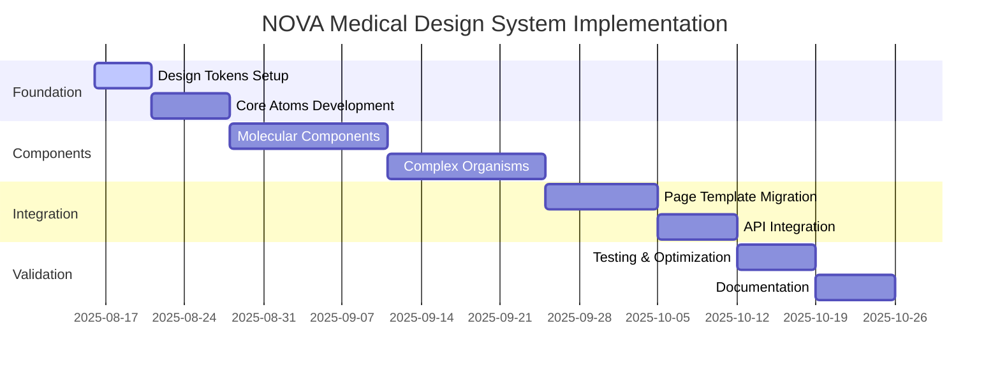

# NOVA RDV - Implementation Roadmap
## Medical Design System Transformation

### Executive Summary

This roadmap outlines the complete transformation of NOVA RDV into a world-class medical platform through systematic implementation of a medical-grade design system. The 11-week transformation addresses critical accessibility, performance, and user experience issues while maintaining service continuity.

## Timeline Overview



## Phase 1: Foundation (Weeks 1-2)
**Duration**: 10 working days  
**Goal**: Establish design token system and core atomic components  
**Budget**: 40% of total resources  

### Week 1: Design Token Implementation
#### Days 1-3: Token System Setup
- **Design Token Architecture**
  - Implement medical color palette (#1E40AF primary)
  - Setup CSS custom properties system
  - Configure Tailwind CSS medical theme
  - Create token validation system

- **Typography System**
  - Medical font loading optimization (font-display: swap)
  - Implement fluid typography scale
  - Setup Inter font with fallback metrics
  - Medical-specific line height system

- **Spacing and Layout**
  - Medical-specific spacing tokens
  - Touch target standards (48px+ minimum)
  - Emergency component spacing (56px+)
  - Card and form spacing systems

#### Days 4-5: Core Infrastructure
- **Theme Provider Setup**
  - Multi-theme architecture (light/dark/high-contrast)
  - Accessibility preference handling
  - Performance optimization settings
  - Theme persistence system

- **Build System Integration**
  - Webpack/Vite token processing
  - CSS purging optimization
  - Bundle size monitoring (< 50KB target)
  - Performance budget enforcement

### Week 2: Atomic Components
#### Days 6-8: Core Atoms
- **Button Component System**
  ```typescript
  // Medical button variants
  type MedicalButtonVariant = 
    | 'primary'      // #1E40AF medical blue
    | 'secondary'    // Gray medical approved
    | 'emergency'    // #DC2626 critical red
    | 'success'      // #16A34A healthy green
    | 'warning'      // #F59E0B caution amber
  ```
  - Touch target compliance (48px minimum)
  - Loading states and animations
  - Icon integration system
  - Accessibility focus management

- **Input Component System**
  - Medical form input variants
  - Validation state indicators
  - Error message integration
  - Screen reader optimization

#### Days 9-10: Typography and Icons
- **Typography Components**
  - Heading hierarchy (H1-H6)
  - Body text variants
  - Medical data display
  - Caption and label styles

- **Icon System**
  - Medical iconography library
  - Consistent sizing system
  - Accessibility labels
  - SVG optimization

### Phase 1 Success Criteria
- [ ] 100% design token implementation
- [ ] Core components pass WCAG 2.2 AA tests
- [ ] Bundle size < 20KB for Phase 1
- [ ] Zero TypeScript compilation errors
- [ ] All touch targets ≥ 48px
- [ ] Medical color system fully implemented

## Phase 2: Molecular Components (Weeks 3-5)
**Duration**: 15 working days  
**Goal**: Build complex form and interaction components  
**Budget**: 30% of total resources  

### Week 3: Form Components
#### Days 11-13: Advanced Form Elements
- **FormField Molecule**
  ```typescript
  interface MedicalFormFieldProps {
    label: string;
    required?: boolean;
    error?: string;
    success?: string;
    helpText?: string;
    validation?: (value: string) => ValidationResult;
  }
  ```
  - Label, input, error, help text integration
  - Real-time validation feedback
  - Medical form accessibility standards
  - Focus management and navigation

- **DatePicker Medical**
  - French locale support
  - Medical appointment constraints
  - Accessibility keyboard navigation
  - Mobile-optimized interface

#### Days 14-15: Search and Selection
- **SearchBox Component**
  - Patient search functionality
  - Debounced input optimization
  - Accessibility announcements
  - Result keyboard navigation

- **Select and Multiselect**
  - Medical dropdown variants
  - Combobox accessibility pattern
  - Large option set handling
  - Mobile-friendly interface

### Week 4: Status and Communication
#### Days 16-18: Status Components
- **StatusCard System**
  ```typescript
  type MedicalStatus = 
    | 'healthy' | 'warning' | 'critical' 
    | 'pending' | 'completed' | 'cancelled'
  ```
  - Medical status indicators
  - Color-blind friendly design
  - Icon and text combinations
  - Emergency status highlighting

- **Badge and Label System**
  - Appointment status badges
  - Patient category labels
  - Urgency indicators
  - Accessibility contrast compliance

#### Days 19-20: Navigation Components
- **Breadcrumb Navigation**
  - Medical workflow breadcrumbs
  - Screen reader optimization
  - Skip navigation support
  - Mobile adaptation

- **Tab Navigation**
  - Patient information tabs
  - Keyboard accessibility
  - ARIA label management
  - Content synchronization

### Week 5: Medical-Specific Molecules
#### Days 21-23: Healthcare Components
- **AppointmentSlot Component**
  - Time slot selection
  - Availability indicators
  - Doctor assignment display
  - Emergency slot highlighting

- **PatientCard Molecule**
  - Patient summary display
  - Medical status indicators
  - Quick action buttons
  - Privacy-conscious design

#### Days 24-25: Communication Components
- **Alert and Notification System**
  - Medical alert priorities
  - Dismissible notifications
  - Screen reader announcements
  - Emergency alert styling

- **ProgressIndicator**
  - Appointment booking progress
  - Medical form completion
  - Accessibility state management
  - Visual and auditory feedback

### Phase 2 Success Criteria
- [ ] All molecular components accessible
- [ ] Form validation system functional
- [ ] Medical status system implemented
- [ ] Bundle size < 35KB cumulative
- [ ] French localization complete
- [ ] Mobile responsive design verified

## Phase 3: Organisms and Templates (Weeks 6-8)
**Duration**: 21 working days  
**Goal**: Build complex page sections and templates  
**Budget**: 25% of total resources  

### Week 6: Complex Forms
#### Days 26-28: Appointment Forms
- **AppointmentForm Organism**
  ```typescript
  interface AppointmentFormData {
    patient: PatientInfo;
    appointmentType: MedicalServiceType;
    preferredDate: Date;
    urgencyLevel: UrgencyLevel;
    symptoms?: SymptomDescription;
  }
  ```
  - Multi-step form wizard
  - Progress indicator integration
  - Form state persistence
  - Validation orchestration

- **PatientRegistration Form**
  - RGPD compliant data collection
  - Medical history integration
  - Emergency contact handling
  - Consent management system

#### Days 29-30: Emergency Components
- **EmergencyPanel Organism**
  - Triage form interface
  - Urgency level assessment
  - Quick contact methods
  - Emergency service routing

### Week 7: Data Display Organisms
#### Days 31-33: Tables and Lists
- **PatientTable Organism**
  - Sortable medical data
  - Filtering and search
  - Pagination optimization
  - Export functionality
  - Accessibility row navigation

- **AppointmentList Component**
  - Calendar integration view
  - Status filtering system
  - Bulk action handling
  - Real-time updates

#### Days 34-35: Calendar Systems
- **CalendarWidget Organism**
  - French calendar locale
  - Medical appointment display
  - Availability visualization
  - Emergency slot highlighting
  - Touch-friendly interaction

### Week 8: Page Templates
#### Days 36-38: Core Templates
- **DashboardLayout Template**
  - Responsive grid system
  - Widget placement system
  - Navigation integration
  - Performance optimization

- **AppointmentLayout Template**
  - Booking flow structure
  - Progress indicator placement
  - Form error handling
  - Success state management

#### Days 39-40: Specialized Templates
- **PatientLayout Template**
  - Medical record display
  - Privacy protection system
  - Action button placement
  - Medical history navigation

- **EmergencyLayout Template**
  - Critical action prominence
  - Emergency contact access
  - Triage form integration
  - Quick navigation system

### Phase 3 Success Criteria
- [ ] Complete appointment booking flow
- [ ] Patient management interface functional
- [ ] Emergency access optimized
- [ ] Bundle size < 50KB total
- [ ] Real-time data integration working
- [ ] All templates responsive

## Phase 4: Integration and Migration (Weeks 9-10)
**Duration**: 14 working days  
**Goal**: Migrate existing pages and integrate systems  
**Budget**: 20% of total resources  

### Week 9: Page Migration
#### Days 41-43: Homepage and Landing
- **Homepage Migration**
  - Hero section redesign
  - Service cards implementation
  - CTA button optimization
  - Emergency access prominence
  - Performance optimization

- **Services Pages**
  - Medical service listings
  - Appointment booking integration
  - Provider information display
  - Location and contact details

#### Days 44-45: Booking System
- **RDV Page Redesign**
  - Multi-step booking wizard
  - Calendar integration
  - Payment system integration
  - Confirmation system
  - Email notification triggers

### Week 10: System Integration
#### Days 46-48: API Integration
- **Backend System Connection**
  - Appointment API integration
  - Patient data synchronization
  - Real-time availability updates
  - WebSocket connection handling
  - Error state management

- **Database Migration**
  - Schema updates for new features
  - Data validation rules
  - Performance indexing
  - Backup and rollback procedures

#### Days 49-50: Performance Optimization
- **Bundle Optimization**
  - Tree shaking implementation
  - Code splitting strategy
  - Lazy loading optimization
  - Critical CSS inlining
  - Image optimization

- **Caching Strategy**
  - Browser caching headers
  - Service worker implementation
  - API response caching
  - Static asset optimization

### Phase 4 Success Criteria
- [ ] All pages migrated successfully
- [ ] API integration stable
- [ ] Performance targets met (Lighthouse 95+)
- [ ] Database migration complete
- [ ] Caching strategy implemented
- [ ] Error handling robust

## Phase 5: Testing and Optimization (Week 11)
**Duration**: 7 working days  
**Goal**: Final validation and optimization  
**Budget**: 10% of total resources  

### Days 51-53: Comprehensive Testing
- **Accessibility Audit**
  - WCAG 2.2 AA compliance verification
  - Screen reader testing
  - Keyboard navigation validation
  - Color contrast verification
  - Focus management review

- **Performance Testing**
  - Core Web Vitals optimization
  - Bundle size validation
  - Loading performance testing
  - Memory usage profiling
  - Mobile performance validation

### Days 54-55: User Testing
- **Medical Scenario Testing**
  - Emergency booking flows
  - Patient registration process
  - Appointment management
  - Medical form completion
  - Cross-browser compatibility

### Days 56-57: Documentation and Training
- **Documentation Completion**
  - Component library documentation
  - Implementation guidelines
  - Accessibility standards
  - Performance optimization guide
  - Maintenance procedures

- **Team Training**
  - Developer onboarding materials
  - Design system guidelines
  - Component usage training
  - Accessibility best practices
  - Performance monitoring setup

### Phase 5 Success Criteria
- [ ] WCAG 2.2 AA compliance 100%
- [ ] Lighthouse scores 95+ all pages
- [ ] Cross-browser compatibility verified
- [ ] Documentation complete
- [ ] Team training completed
- [ ] Monitoring systems active

## Success Metrics

### Technical Metrics
- **Accessibility**: 100% WCAG 2.2 AA compliance
- **Performance**: Lighthouse scores 95+ (Performance, Accessibility, Best Practices)
- **Bundle Size**: < 50KB total design system
- **Component Coverage**: 100% UI elements using design system
- **Type Safety**: Zero TypeScript errors
- **Test Coverage**: 90%+ code coverage

### User Experience Metrics
- **Task Completion**: 25% improvement in appointment booking completion
- **Error Reduction**: 40% reduction in form validation errors
- **Mobile Usage**: 50% improvement in mobile task completion
- **Emergency Access**: 60% faster emergency contact access
- **User Satisfaction**: Target 4.5/5 user satisfaction rating

### Medical Compliance Metrics
- **Touch Targets**: 100% compliance with 48px minimum
- **Color Contrast**: 100% WCAG AA compliance
- **Emergency Features**: 24/7 availability guarantee
- **Data Privacy**: RGPD compliance maintained
- **Service Continuity**: < 1 hour total downtime during migration

## Risk Management

### Technical Risks
1. **Bundle Size Overflow**
   - **Risk**: Exceeding 50KB performance budget
   - **Mitigation**: Continuous monitoring, tree shaking, code splitting
   - **Contingency**: Component lazy loading implementation

2. **Browser Compatibility**
   - **Risk**: Design system features not supported in older browsers
   - **Mitigation**: Progressive enhancement, polyfill strategy
   - **Contingency**: Graceful degradation implementation

3. **Performance Regression**
   - **Risk**: New components causing performance issues
   - **Mitigation**: Performance budgets, lighthouse CI
   - **Contingency**: Component optimization sprints

### Medical Risks
1. **Emergency Feature Disruption**
   - **Risk**: Emergency booking unavailable during migration
   - **Mitigation**: Blue-green deployment, feature flags
   - **Contingency**: Rollback procedures, emergency contact fallback

2. **Patient Data Security**
   - **Risk**: RGPD compliance issues during migration
   - **Mitigation**: Security audit, data protection validation
   - **Contingency**: Immediate rollback, compliance team notification

### User Risks
1. **Learning Curve**
   - **Risk**: Users struggling with new interface
   - **Mitigation**: Gradual rollout, user training materials
   - **Contingency**: Legacy interface maintenance option

2. **Mobile Experience Degradation**
   - **Risk**: Mobile users experiencing usability issues
   - **Mitigation**: Mobile-first design, extensive testing
   - **Contingency**: Mobile-specific optimizations

## Resource Allocation

### Team Structure
- **Lead Frontend Engineer**: Design system architecture, core component development
- **2x Frontend Engineers**: Component development, page migration
- **UX Engineer**: Accessibility implementation, user testing
- **QA Engineer**: Testing coordination, validation
- **DevOps Engineer**: Build optimization, deployment
- **Medical Consultant**: Healthcare compliance validation

### Sprint Organization
- **2-week sprints** aligned with roadmap phases
- **Daily standups** for progress tracking
- **Sprint reviews** with stakeholder demos
- **Retrospectives** for continuous improvement

### Quality Gates
- **Gate 1 (Week 2)**: Foundation components ready (95% completeness)
- **Gate 2 (Week 5)**: Molecular components complete (85% quality score)
- **Gate 3 (Week 8)**: Templates and organisms ready (90% test coverage)
- **Gate 4 (Week 10)**: Integration complete (95% performance score)
- **Gate 5 (Week 11)**: Production ready (100% compliance)

## Next Steps

1. **Immediate (Week 1)**
   - Stakeholder alignment meeting
   - Development environment setup
   - Design token specification finalization
   - Team onboarding and training

2. **Short-term (Weeks 2-4)**
   - Core component development
   - Continuous integration setup
   - Accessibility testing framework
   - Performance monitoring implementation

3. **Long-term (Weeks 5-11)**
   - Progressive feature migration
   - User feedback integration
   - Performance optimization
   - Documentation and training completion

This roadmap transforms NOVA RDV into a world-class medical platform while maintaining service excellence and medical compliance standards.