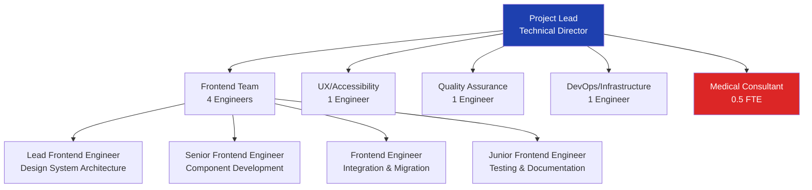

# Resource Allocation Plan - NOVA RDV Medical Design System

## Executive Summary

This resource allocation plan optimizes team structure, skill allocation, and workload distribution for the 11-week NOVA RDV medical platform transformation. The plan balances medical expertise requirements, technical complexity, and development efficiency while ensuring knowledge transfer and reducing single points of failure.

## Team Structure Overview

### Core Team Composition (8 FTE)


### Specialized Skill Requirements

#### Medical Domain Expertise
- **Healthcare Workflow Understanding**: 40% of total effort
- **RGPD/Medical Compliance Knowledge**: 20% of total effort
- **Emergency Systems Experience**: 15% of total effort
- **French Healthcare Regulations**: 10% of total effort

#### Technical Specializations
- **Design System Architecture**: 25% of total effort
- **Accessibility Engineering**: 20% of total effort
- **Performance Optimization**: 15% of total effort
- **React/TypeScript Expertise**: 30% of total effort
- **Testing & QA Automation**: 10% of total effort

## Detailed Resource Allocation

### Lead Frontend Engineer (1.0 FTE)
**Primary Responsibilities**: Design system architecture, technical leadership, critical component development

#### Weekly Allocation by Phase
| Phase | Week | Architecture | Development | Review | Leadership | Medical |
|-------|------|-------------|-------------|--------|------------|---------|
| 1 | 1-2 | 60% | 25% | 10% | 5% | - |
| 2 | 3-5 | 40% | 35% | 15% | 10% | - |
| 3 | 6-8 | 25% | 45% | 20% | 10% | - |
| 4 | 9-10 | 15% | 35% | 30% | 15% | 5% |
| 5 | 11 | 10% | 20% | 40% | 25% | 5% |

#### Key Deliverables by Phase
```typescript
const leadEngineerDeliverables = {
  phase1: [
    'Design token architecture specification',
    'Theme provider system implementation',
    'Component interface design',
    'TypeScript architecture setup',
    'Performance budget definition'
  ],
  
  phase2: [
    'Core atomic components (Button, Input, Typography)',
    'Component composition patterns',
    'Accessibility framework implementation',
    'Medical compliance validation system',
    'Code review guidelines establishment'
  ],
  
  phase3: [
    'Complex organism components',
    'Medical workflow components',
    'Emergency system components',
    'Integration architecture',
    'Performance optimization implementation'
  ],
  
  phase4: [
    'System integration oversight',
    'API integration architecture',
    'Migration strategy execution',
    'Performance monitoring setup',
    'Technical documentation'
  ],
  
  phase5: [
    'Final system validation',
    'Performance optimization',
    'Team knowledge transfer',
    'Production deployment oversight',
    'Maintenance documentation'
  ]
};
```

### Senior Frontend Engineer (1.0 FTE)
**Primary Responsibilities**: Component development, molecular components, medical workflows

#### Skill Allocation
- **React/TypeScript Development**: 70%
- **Medical Domain Understanding**: 15%
- **Accessibility Implementation**: 10%
- **Testing & Documentation**: 5%

#### Weekly Focus Areas
| Phase | Primary Focus | Secondary Focus | Medical Validation |
|-------|---------------|-----------------|-------------------|
| 1-2 | Atomic component development | Token implementation | Form validation rules |
| 3-5 | Molecular components | Medical form systems | Patient data handling |
| 6-8 | Organism components | Calendar systems | Appointment workflows |
| 9-10 | Page integration | API connections | Real-time updates |
| 11 | Testing & optimization | Documentation | User training |

#### Component Ownership Matrix
```typescript
const seniorEngineerComponents = {
  atoms: ['Button', 'Input', 'Typography', 'Icon', 'Badge'],
  molecules: ['FormField', 'SearchBox', 'DatePicker', 'StatusCard'],
  organisms: ['AppointmentForm', 'PatientTable', 'CalendarWidget'],
  medical: ['EmergencyPanel', 'TriageForm', 'MedicalHistory'],
  integration: ['AppointmentAPI', 'PatientAPI', 'NotificationSystem']
};
```

### Frontend Engineer (1.0 FTE)
**Primary Responsibilities**: Integration, migration, page templates

#### Skill Development Track
- **Week 1-2**: Medical domain onboarding (20 hours)
- **Week 3-4**: Accessibility training (16 hours)
- **Week 5-6**: Advanced React patterns (12 hours)
- **Week 7-8**: Testing methodologies (8 hours)
- **Week 9-11**: Performance optimization (12 hours)

#### Migration Responsibilities
```typescript
const migrationPlan = {
  pages: [
    { name: 'Homepage', complexity: 'high', effort: '16h', week: 9 },
    { name: 'Appointment Booking', complexity: 'critical', effort: '20h', week: 9 },
    { name: 'Patient Dashboard', complexity: 'medium', effort: '12h', week: 10 },
    { name: 'Emergency Page', complexity: 'critical', effort: '16h', week: 10 },
    { name: 'Services Pages', complexity: 'low', effort: '8h', week: 10 }
  ],
  
  templates: [
    'DashboardLayout', 'AppointmentLayout', 'PatientLayout', 
    'EmergencyLayout', 'AuthLayout'
  ],
  
  integration: [
    'WebSocket real-time updates',
    'Email notification system',
    'SMS appointment reminders',
    'Calendar synchronization'
  ]
};
```

### Junior Frontend Engineer (1.0 FTE)
**Primary Responsibilities**: Testing, documentation, component maintenance

#### Learning & Development Path
```typescript
const juniorDevelopmentPath = {
  week1: {
    learning: ['React basics', 'TypeScript fundamentals', 'Testing principles'],
    tasks: ['Simple component tests', 'Documentation setup'],
    mentoring: '50% of time with senior engineer'
  },
  
  week3: {
    learning: ['Accessibility fundamentals', 'Medical domain basics'],
    tasks: ['Accessibility testing', 'Component documentation'],
    mentoring: '30% of time with UX engineer'
  },
  
  week6: {
    learning: ['Advanced testing patterns', 'Performance monitoring'],
    tasks: ['Integration tests', 'Performance test setup'],
    mentoring: '20% of time with QA engineer'
  },
  
  week9: {
    learning: ['Deployment processes', 'Monitoring systems'],
    tasks: ['Migration testing', 'User documentation'],
    mentoring: '10% of time with DevOps engineer'
  }
};
```

#### Testing Ownership
- **Unit Testing**: 60% of component test coverage
- **Documentation**: 80% of component documentation
- **Visual Regression**: 100% of visual test setup
- **Accessibility Testing**: 40% of accessibility validation

### UX/Accessibility Engineer (1.0 FTE)
**Primary Responsibilities**: Accessibility compliance, user experience validation, medical UX patterns

#### Accessibility Specialization
```typescript
const accessibilityFocus = {
  expertise: {
    wcag: 'WCAG 2.2 AA compliance expert',
    medical: 'Healthcare accessibility standards',
    french: 'RGAA 4.1 French accessibility guidelines',
    testing: 'Screen reader and assistive technology testing'
  },
  
  deliverables: {
    week1: 'Accessibility audit of existing system',
    week2: 'Medical accessibility requirements specification',
    week4: 'Accessibility testing framework setup',
    week6: 'Mid-project accessibility validation',
    week8: 'Complex component accessibility review',
    week10: 'Pre-launch accessibility audit',
    week11: 'Final compliance certification'
  },
  
  medical: {
    emergency: 'Emergency access optimization for disabled users',
    forms: 'Medical form accessibility for various disabilities',
    data: 'Medical data presentation accessibility',
    workflow: 'Healthcare workflow accessibility validation'
  }
};
```

#### User Testing Coordination
- **Week 3**: Baseline usability testing with medical professionals
- **Week 6**: Mid-implementation user feedback collection
- **Week 9**: Pre-launch user acceptance testing
- **Week 11**: Final accessibility user testing

### Quality Assurance Engineer (1.0 FTE)
**Primary Responsibilities**: Test automation, quality gates, medical compliance validation

#### Testing Strategy Implementation
```typescript
const qaResponsibilities = {
  automation: {
    unit: 'Jest/Vitest test suite maintenance',
    integration: 'React Testing Library integration tests',
    e2e: 'Playwright end-to-end test development',
    accessibility: 'Axe-core automated accessibility testing',
    performance: 'Lighthouse CI performance testing'
  },
  
  medical: {
    workflows: 'Medical workflow validation testing',
    compliance: 'RGPD compliance verification',
    emergency: 'Emergency system stress testing',
    data: 'Medical data integrity validation',
    security: 'Healthcare security testing'
  },
  
  quality: {
    gates: 'CI/CD quality gate implementation',
    metrics: 'Quality metrics tracking and reporting',
    regression: 'Regression testing automation',
    crossBrowser: 'Cross-browser compatibility validation',
    mobile: 'Mobile device testing coordination'
  }
};
```

#### Quality Metrics Ownership
- **Test Coverage**: Maintain 90%+ code coverage
- **Accessibility**: Ensure 100% WCAG 2.2 AA compliance
- **Performance**: Monitor Core Web Vitals < targets
- **Medical Compliance**: Validate 100% medical workflow accuracy
- **Cross-browser**: Test 4 major browsers + mobile

### DevOps/Infrastructure Engineer (1.0 FTE)
**Primary Responsibilities**: CI/CD, deployment, monitoring, performance optimization

#### Infrastructure Focus Areas
```typescript
const devopsResponsibilities = {
  deployment: {
    strategy: 'Blue-green deployment implementation',
    automation: 'CI/CD pipeline optimization',
    monitoring: 'Real-time deployment monitoring',
    rollback: 'Automated rollback procedures',
    security: 'Infrastructure security hardening'
  },
  
  performance: {
    optimization: 'Bundle size optimization',
    caching: 'CDN and caching strategy',
    monitoring: 'Performance monitoring setup',
    budgets: 'Performance budget enforcement',
    alerts: 'Performance degradation alerting'
  },
  
  medical: {
    uptime: '99.99% uptime requirement management',
    backup: 'Medical data backup automation',
    disaster: 'Disaster recovery procedures',
    compliance: 'Infrastructure compliance validation',
    security: 'Healthcare data security implementation'
  }
};
```

#### Medical Infrastructure Requirements
- **Uptime**: 99.99% availability for emergency features
- **Backup**: Real-time medical data replication
- **Security**: End-to-end encryption for patient data
- **Compliance**: RGPD-compliant infrastructure
- **Monitoring**: 24/7 system health monitoring

### Medical Consultant (0.5 FTE)
**Primary Responsibilities**: Medical domain validation, healthcare compliance, workflow optimization

#### Consultation Schedule
```typescript
const medicalConsultation = {
  regular: {
    frequency: '2 sessions per week',
    duration: '2 hours per session',
    focus: 'Medical workflow validation and compliance review'
  },
  
  critical: {
    emergency: 'Emergency workflow validation',
    compliance: 'RGPD and healthcare regulation compliance',
    safety: 'Patient safety protocol validation',
    training: 'Medical professional user training'
  },
  
  deliverables: {
    week2: 'Medical workflow requirements validation',
    week4: 'Emergency system medical approval',
    week6: 'Patient data handling compliance review',
    week8: 'Medical professional usability validation',
    week10: 'Pre-launch medical compliance certification',
    week11: 'Final medical system approval'
  }
};
```

## Resource Optimization Strategies

### Cross-Training Matrix
```typescript
const crossTraining = {
  primary: {
    'Design Systems': ['Lead Engineer', 'Senior Engineer'],
    'Medical Domain': ['Medical Consultant', 'UX Engineer', 'QA Engineer'],
    'Accessibility': ['UX Engineer', 'Junior Engineer', 'QA Engineer'],
    'Testing': ['QA Engineer', 'Junior Engineer', 'DevOps Engineer'],
    'Performance': ['Lead Engineer', 'DevOps Engineer'],
    'French Localization': ['UX Engineer', 'Frontend Engineer']
  },
  
  backup: {
    'Component Development': 'Any frontend engineer',
    'Medical Validation': 'UX Engineer with medical consultant',
    'Accessibility Testing': 'QA Engineer with UX engineer',
    'Deployment': 'Lead Engineer with DevOps engineer'
  }
};
```

### Parallel Work Streams
```typescript
const parallelStreams = {
  week1: {
    stream1: 'Design tokens (Lead + Senior)',
    stream2: 'Development environment (DevOps + Junior)',
    stream3: 'Medical requirements (Medical Consultant + UX)'
  },
  
  week3: {
    stream1: 'Atomic components (Lead + Senior)',
    stream2: 'Testing framework (QA + Junior)',
    stream3: 'Accessibility foundation (UX + Frontend)'
  },
  
  week6: {
    stream1: 'Organism components (Senior + Frontend)',
    stream2: 'Page templates (Frontend + Junior)',
    stream3: 'Integration testing (QA + DevOps)'
  }
};
```

### Knowledge Transfer Plan
```typescript
const knowledgeTransfer = {
  documentation: {
    architecture: 'Lead Engineer → All team members',
    medical: 'Medical Consultant → Frontend team',
    accessibility: 'UX Engineer → All developers',
    testing: 'QA Engineer → All developers',
    deployment: 'DevOps Engineer → Lead Engineer'
  },
  
  training: {
    week2: 'Medical domain training for all developers',
    week4: 'Accessibility training for all team members',
    week6: 'Testing methodology training',
    week8: 'Performance optimization training',
    week10: 'Deployment and monitoring training'
  },
  
  shadowing: {
    junior: 'Shadow senior developers 50% of time weeks 1-4',
    medical: 'All engineers shadow medical consultant weekly',
    accessibility: 'All engineers accessibility session with UX engineer',
    testing: 'All engineers testing session with QA engineer'
  }
};
```

## Risk Mitigation through Resource Planning

### Single Point of Failure Prevention
```typescript
const redundancy = {
  critical: {
    'Design System Architecture': ['Lead Engineer', 'Senior Engineer'],
    'Medical Domain Knowledge': ['Medical Consultant', 'UX Engineer'],
    'Accessibility Expertise': ['UX Engineer', 'QA Engineer'],
    'Deployment Knowledge': ['DevOps Engineer', 'Lead Engineer']
  },
  
  documentation: {
    architecture: 'Comprehensive technical documentation',
    medical: 'Medical domain knowledge base',
    processes: 'Step-by-step process documentation',
    emergency: 'Emergency procedure documentation'
  },
  
  backup: {
    availability: 'Cross-trained team members for all critical skills',
    external: 'External consultant contacts for emergency support',
    vendor: 'Vendor support contracts for critical tools'
  }
};
```

### Workload Balancing
```typescript
const workloadOptimization = {
  monitoring: {
    capacity: 'Weekly capacity planning reviews',
    burnout: 'Developer wellness monitoring',
    velocity: 'Sprint velocity tracking',
    quality: 'Code quality metrics monitoring'
  },
  
  adjustment: {
    redistribution: 'Dynamic task redistribution based on capacity',
    external: 'External contractor engagement for overflow',
    scope: 'Scope adjustment for capacity constraints',
    timeline: 'Timeline adjustment for quality maintenance'
  },
  
  medical: {
    priority: 'Medical critical features take priority',
    emergency: 'Emergency system features cannot be delayed',
    compliance: 'Compliance requirements are non-negotiable',
    safety: 'Patient safety features require extra resources'
  }
};
```

## Success Metrics and Performance Indicators

### Team Performance Metrics
```typescript
const teamMetrics = {
  velocity: {
    target: '40 story points per sprint',
    measurement: 'Completed story points per 2-week sprint',
    quality: 'Story points completed without rework'
  },
  
  quality: {
    bugRate: 'Target: < 2 bugs per 100 story points',
    testCoverage: 'Target: > 90% code coverage',
    accessibility: 'Target: 100% WCAG 2.2 AA compliance',
    performance: 'Target: Lighthouse scores > 95'
  },
  
  medical: {
    compliance: 'Target: 100% medical workflow validation',
    safety: 'Target: Zero patient safety incidents',
    emergency: 'Target: < 2 second emergency access time',
    uptime: 'Target: 99.99% availability for critical features'
  },
  
  efficiency: {
    rework: 'Target: < 10% rework rate',
    knowledge: 'Target: All team members can work on any component',
    training: 'Target: New team member productive within 1 week',
    documentation: 'Target: 100% component documentation coverage'
  }
};
```

### Resource Utilization Tracking
```typescript
const utilizationTracking = {
  weekly: {
    capacity: 'Planned vs actual hours worked',
    focus: 'Time spent on different work types',
    blockers: 'Time lost to blockers and dependencies',
    learning: 'Time invested in skill development'
  },
  
  monthly: {
    efficiency: 'Output per person-hour',
    quality: 'Rework hours as percentage of total',
    satisfaction: 'Team satisfaction and engagement scores',
    medical: 'Medical domain knowledge assessment'
  },
  
  project: {
    delivery: 'On-time delivery rate',
    scope: 'Scope creep measurement',
    budget: 'Budget variance tracking',
    risk: 'Risk mitigation effectiveness'
  }
};
```

This comprehensive resource allocation plan ensures optimal team performance while maintaining the highest standards of medical platform development, accessibility compliance, and service continuity throughout the NOVA RDV transformation.