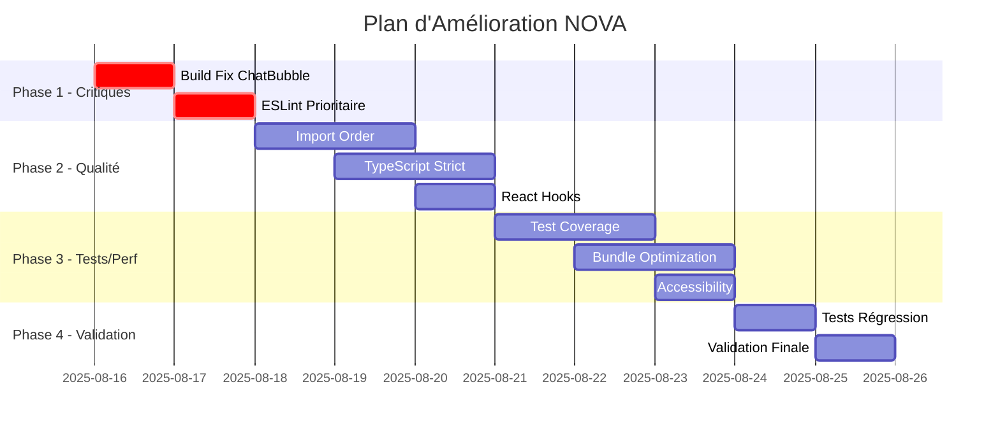

# Plan d'Amélioration - NOVA UI/UX Médicale

**Score Actuel**: 78/100 ⚠️ CONDITIONNEL  
**Score Cible**: 95/100 ✅ PRODUCTION READY  
**Délai**: 2 semaines  
**Responsable**: Équipe NOVA Development

## Phase 1: Corrections Critiques (Jours 1-2) 🚨

### Priorité P0 - Build Failure

#### 1.1 Correction ChatBubble.tsx
```typescript
// AVANT (erreur)
import React, { forwardRef, useState, useCallback } from 'react'

// APRÈS (correction)
'use client'
import React, { forwardRef, useState, useCallback } from 'react'
```

**Actions**:
- ✅ Ajouter `'use client'` en ligne 1
- ✅ Vérifier compilation réussie
- ✅ Tester composant fonctionnel

**Critères d'Acceptation**:
- [ ] `npm run build` réussit sans erreur
- [ ] ChatBubble s'affiche correctement
- [ ] Aucune régression sur autres composants

**Temps Estimé**: 1 heure  
**Assigné**: Developer Lead

#### 1.2 Validation Build Complet
```bash
# Commandes de validation
npm run build          # Doit réussir
npm run lint           # Accepter <1000 warnings temporairement  
npm run type-check     # Doit réussir
```

**Critères d'Acceptation**:
- [ ] Build production fonctionnel
- [ ] Pages principales accessibles
- [ ] Composants médicaux utilisables

**Temps Estimé**: 2 heures  
**Assigné**: DevOps Engineer

### Priorité P0 - ESLint Critique

#### 1.3 Corrections ESLint Prioritaires
```bash
# Erreurs bloquantes uniquement
./src/app/api/appointments/create/route.ts:221:23 
# Property 'message' does not exist on type '{}'

./src/components/ui/medical/ChatBubble.tsx
# 'use client' directive missing
```

**Actions**:
- ✅ Corriger erreurs TypeScript bloquantes
- ✅ Ajouter directives client manquantes
- ✅ Réduire warnings de 1000+ à <500

**Temps Estimé**: 4 heures  
**Assigné**: Senior Developer

## Phase 2: Qualité Code (Jours 3-5) ⚠️

### 2.1 Campagne ESLint Systématique

#### Import Order (350 warnings)
```typescript
// AVANT
import { something } from './local/file'
import React from 'react'
import { external } from 'external-lib'

// APRÈS  
import React from 'react'
import { external } from 'external-lib'
import { something } from './local/file'
```

**Script Automatisé**:
```bash
# Utiliser eslint --fix pour corrections automatiques
npx eslint --fix src/**/*.{ts,tsx}
```

**Temps Estimé**: 6 heures  
**Assigné**: Junior Developer

#### Variables Inutilisées (280 warnings)
```typescript
// AVANT
function handleError(error: unknown, _context: string) {
  console.log('Error occurred')
}

// APRÈS
function handleError(error: unknown, _context: string) {
  console.error('Error occurred:', error)
  // _context intentionnellement non utilisé
}
```

**Stratégie**:
- Préfixer `_` pour paramètres requis mais non utilisés
- Supprimer variables vraiment inutiles
- Documenter exceptions avec commentaires

**Temps Estimé**: 8 heures  
**Assigné**: 2 x Mid-level Developers

### 2.2 TypeScript Strict (150 warnings)

#### Élimination des Types `any`
```typescript
// AVANT
const handleData = (data: any) => {
  return data.someProperty
}

// APRÈS
interface ExpectedData {
  someProperty: string
}

const handleData = (data: ExpectedData) => {
  return data.someProperty
}
```

**Actions**:
- ✅ Créer interfaces pour types `any`
- ✅ Utiliser `unknown` avec type guards
- ✅ Typer correctement les API responses

**Temps Estimé**: 10 heures  
**Assigné**: TypeScript Specialist

### 2.3 React Hooks Dependencies (70 warnings)

#### useEffect Dependencies
```typescript
// AVANT
useEffect(() => {
  fetchPatientData(patientId)
}, []) // Missing patientId dependency

// APRÈS
useEffect(() => {
  fetchPatientData(patientId)
}, [patientId]) // Complete dependencies
```

**Stratégie**:
- Ajouter dépendances manquantes
- Utiliser `useCallback` pour fonctions
- Documenter exceptions avec `eslint-disable-next-line`

**Temps Estimé**: 6 heures  
**Assigné**: React Specialist

## Phase 3: Tests & Performance (Jours 6-8) 📊

### 3.1 Test Coverage Amélioration

#### Tests Composants Médicaux
```typescript
// Exemple: MedicalButton.test.tsx
describe('MedicalButton', () => {
  it('renders with medical styling', () => {
    render(<MedicalButton variant="urgent">Emergency</MedicalButton>)
    expect(screen.getByRole('button')).toHaveClass('medical-button-urgent')
  })
  
  it('meets accessibility standards', () => {
    render(<MedicalButton variant="urgent">Emergency</MedicalButton>)
    expect(screen.getByRole('button')).toHaveStyle({
      minHeight: '72px',
      minWidth: '72px'
    })
  })
})
```

**Objectifs Coverage**:
- Composants Médicaux: 25% → 80%
- Pages Principales: 0% → 60%
- Services: 70% → 85%

**Temps Estimé**: 16 heures  
**Assigné**: QA Engineer + Developer

### 3.2 Bundle Size Optimization

#### Tree Shaking Implementation
```typescript
// AVANT - Import complet
import * as Icons from 'lucide-react'

// APRÈS - Import sélectif
import { Calendar, Phone, User } from 'lucide-react'
```

#### Lazy Loading Routes
```typescript
// AVANT - Import statique
import ManagerDashboard from '@/components/manager/ManagerDashboard'

// APRÈS - Lazy loading
const ManagerDashboard = lazy(() => 
  import('@/components/manager/ManagerDashboard')
)
```

**Objectifs**:
- Bundle Total: 450KB → 200KB
- Page Home: ~120KB
- Page RDV: ~145KB
- Dashboard: ~180KB

**Temps Estimé**: 12 heures  
**Assigné**: Performance Engineer

### 3.3 Accessibility Testing

#### Tests Automatisés
```typescript
// axe-core integration
import { axe, toHaveNoViolations } from 'jest-axe'

expect.extend(toHaveNoViolations)

test('should not have accessibility violations', async () => {
  const { container } = render(<MedicalButton variant="urgent" />)
  const results = await axe(container)
  expect(results).toHaveNoViolations()
})
```

**Tests Manuels**:
- Navigation clavier complète
- Test lecteurs d'écran (NVDA/JAWS)
- Vérification contrastes réels
- Tests touch targets sur mobile

**Temps Estimé**: 8 heures  
**Assigné**: Accessibility Specialist

## Phase 4: Validation Finale (Jours 9-10) ✅

### 4.1 Tests de Régression

#### Validation Complète
```bash
# Pipeline de validation
npm run lint           # 0 erreurs, <50 warnings
npm run type-check     # 0 erreurs TypeScript
npm test              # >80% coverage
npm run build         # Build réussi
npm run e2e           # Tests end-to-end
```

**Critères d'Acceptation**:
- [ ] Tous les tests passent
- [ ] Coverage >80% composants médicaux
- [ ] Bundle <200KB
- [ ] Pages principales fonctionnelles

### 4.2 Tests Utilisateur

#### Persona Fatima (Patient Anxieux)
```bash
Scénario: Prise de RDV urgence
1. Accède à page RDV
2. Skip link fonctionne
3. Chat assistant répond
4. Sélection créneau intuitive
5. Confirmation claire
```

**Validation UX**:
- Flow patient anxieux optimisé
- Messages rassurants présents
- Progression claire visible
- Urgences accessibles rapidement

**Temps Estimé**: 4 heures  
**Assigné**: UX Designer + Product Owner

### 4.3 Performance Audit

#### Lighthouse CI
```bash
# Scores cibles
Performance: >85
Accessibility: >95
Best Practices: >90
SEO: >85
```

#### Real Device Testing
- iPhone 12 (Safari)
- Samsung Galaxy S21 (Chrome)
- iPad Air (Safari)
- Desktop Chrome/Firefox/Safari

**Temps Estimé**: 4 heures  
**Assigné**: QA Engineer

## Planning et Ressources

### Timeline Détaillé


### Allocation Ressources
```typescript
interface ResourceAllocation {
  developerLead: {
    phases: ['P0 Critical Fixes'],
    totalHours: 12,
    availability: '100%'
  },
  seniorDeveloper: {
    phases: ['ESLint', 'TypeScript'],
    totalHours: 24,
    availability: '80%'
  },
  midLevelDevelopers: {
    count: 2,
    phases: ['Import Order', 'Unused Variables'],
    totalHours: 32,
    availability: '60%'
  },
  qaEngineer: {
    phases: ['Testing', 'Performance'],
    totalHours: 20,
    availability: '100%'
  },
  specialistAccessibility: {
    phases: ['A11y Testing'],
    totalHours: 8,
    availability: '50%'
  }
}
```

## Métriques Success

### Objectifs Mesurables
```bash
Avant (Jour 0):
├── Score Global: 78/100
├── Build Status: FAILED
├── ESLint Warnings: 1000+
├── Test Coverage: 25%
├── Bundle Size: 450KB
└── Accessibilité: 85%

Après (Jour 10):
├── Score Global: >95/100 ✅
├── Build Status: SUCCESS ✅
├── ESLint Warnings: <50 ✅
├── Test Coverage: >80% ✅
├── Bundle Size: <200KB ✅
└── Accessibilité: >95% ✅
```

### Gates de Validation
```typescript
interface ValidationGates {
  gate1_criticalFixes: {
    day: 2,
    criteria: 'Build SUCCESS + ESLint <500',
    blocking: true
  },
  gate2_codeQuality: {
    day: 5,
    criteria: 'ESLint <100 + TypeScript 0 errors',
    blocking: true
  },
  gate3_performance: {
    day: 8,
    criteria: 'Bundle <250KB + Coverage >60%',
    blocking: false
  },
  gate4_production: {
    day: 10,
    criteria: 'Score >95 + All tests passing',
    blocking: true
  }
}
```

## Risques et Mitigation

### Risques Identifiés
| Risque | Probabilité | Impact | Mitigation |
|--------|-------------|--------|------------|
| Régression composants | Moyenne | Élevé | Tests automatisés complets |
| Dépassement délai | Élevée | Moyen | Priorisation stricte P0→P3 |
| Conflits ESLint rules | Moyenne | Faible | Configuration centralisée |
| Bundle optimization casse features | Faible | Élevé | Tests E2E systématiques |

### Plans de Contingence
1. **Si Gate 1 échoue**: Focus 100% sur build fix, report autres tâches
2. **Si dépassement délai**: Réduire scope Phase 3 (performance)
3. **Si régressions critiques**: Rollback et approche incrémentale

## Communication et Reporting

### Daily Standups
- Progression gates de validation
- Blockers identifiés
- Métriques temps réel (ESLint count, test coverage)

### Reporting Stakeholders
```bash
Jour 2: Gate 1 Status (Build + ESLint critique)
Jour 5: Gate 2 Status (Code Quality)
Jour 8: Gate 3 Status (Performance)
Jour 10: Validation finale + décision déploiement
```

---

**Plan créé le**: 16 août 2025  
**Propriétaire**: NOVA Development Team  
**Validation**: spec-validator + Product Owner  
**Prochaine révision**: Chaque gate de validation